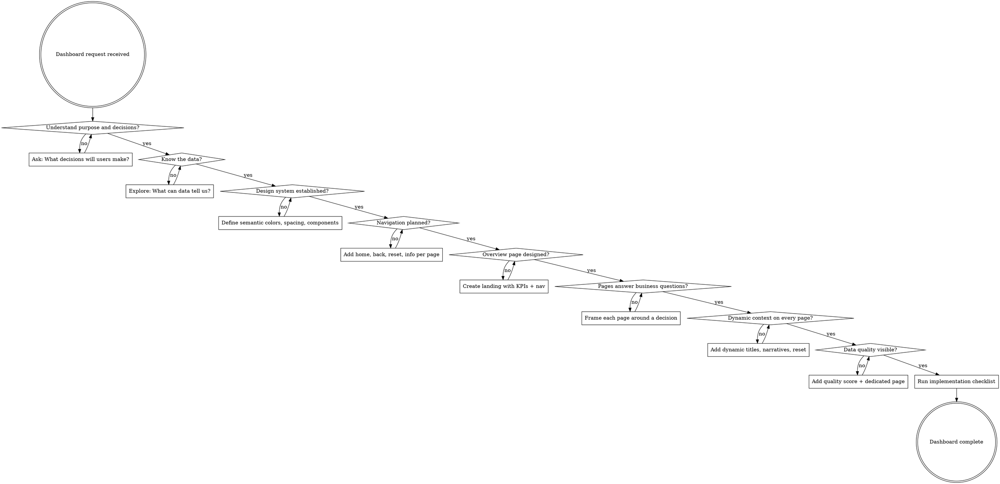

# Dashboard Design

## Overview

A dashboard exists to help someone make a decision. Every element earns its place by answering a business question or it gets removed. Design for the _audience and their decisions_ first, then pick visuals — never the reverse.

**Core principle:** Keep it appropriate for your audience. Simple for executives. Dense for analysts. Never complexity for its own sake, never simplicity that hides critical information.

## When to Use

- Building any dashboard, analytics page, or data visualization UI
- Designing KPI displays, admin panels, monitoring screens
- Creating reporting interfaces or business intelligence views
- Reviewing or improving existing dashboard implementations

## Design Process

Follow these steps IN ORDER. Do not skip to visuals.



### Step 1: Understand the Ask

Before touching any UI, answer these questions:

| Question                             | Why It Matters                                                              |
| ------------------------------------ | --------------------------------------------------------------------------- |
| Who is the audience?                 | Executives need summaries; analysts need drill-downs                        |
| What type of dashboard?              | Corporate reporting vs live monitoring vs predictive vs interactive what-if |
| What decisions will they make?       | Every page must enable a specific decision                                  |
| What actions follow those decisions? | Invest, cut, investigate, escalate — know the output                        |

**Do not design pages by data domain** (sales page, customer page). **Design pages by business question** ("Should we invest in category X?", "Which region needs intervention?").

```
Bad:  "Category & Product" page
Good: "Product Investment Decisions" page — shows category growth, margin trends,
      inventory turnover, and market comparison to answer "Should we invest more?"
```

### Step 2: Know the Data

Once you understand the decisions, explore the data BEFORE designing visuals:

- **What does the data tell you?** Raw metrics, trends, distributions
- **What COULD it tell you?** Derived metrics, ratios, comparisons
- **What data can you join for insight?** Costs + sales together, staffing levels vs service delays, customer retention vs on-time delivery

The best dashboard insights come from combining data that lives in separate systems. A standalone revenue chart is table stakes. Revenue overlaid with marketing spend, customer acquisition cost, and seasonal staffing — that enables decisions.

### Step 3: Visual Design System

Establish a design system ONCE, then apply it everywhere. Consistency means SEMANTIC consistency — colors carry meaning, not just aesthetics.

**Semantic Color Mapping:**

```
Assign meaning to colors and NEVER break the mapping:
- If blue = revenue, blue is ALWAYS revenue across every page
- If terracotta = cost, terracotta is ALWAYS cost
- If green = positive delta, green is ALWAYS positive
- Use the same color for the same concept in every chart, card, and table
```

**Visual Consistency Rules:**

- Rounded corners, shadows, fonts, spacing — pick once, apply everywhere
- If slicers sit on the right, they sit on the right on EVERY page
- If a slicer turns green when selected, ALL slicers turn green when selected
- If field parameters behave differently from slicers, make them VISUALLY DISTINCT
- Standard gaps between cards, consistent card sizes, aligned grids

**Colorblind Safety:**

- Never use red/green as primary success/failure pair (~8% of men are red-green colorblind)
- Use a colorblind-safe palette (Okabe-Ito or similar)
- Combine color with shape/pattern/position for all critical distinctions

### Step 4: Navigation

For large-audience dashboards, every page should have:

| Control               | Purpose                                                                                 |
| --------------------- | --------------------------------------------------------------------------------------- |
| **Home**              | Return to overview/landing page                                                         |
| **Back**              | Previous page in navigation stack                                                       |
| **Reset All Filters** | Clear all selections to defaults — prevents users getting stuck in unknown filter state |
| **Info/Help**         | Pop-up explaining what's on this page and how to read the charts                        |

The more a dashboard behaves like a website, the more comfortable non-technical users will be. Consistent navigation placement on every page. Don't make users learn a new interface paradigm.

**URL State:** Filters, tabs, pagination, expanded panels — all reflected in query params. Links are shareable, back button works, users can bookmark specific views.

### Step 5: Overview / Landing Page

The entry point everyone shares. Contains:

- **KPI cards** with key metrics, delta indicators, and sparklines
- **Navigation cards** or buttons linking to each detail page
- **Enough context** to answer "how are we doing?" at a glance
- **No configuration required** — loads with sensible defaults (current period vs prior, all regions)

The overview is where executives live. Others pass through to detail pages. Design it so someone can glance at it for 10 seconds and know the state of the business.

### Step 6: Page Purpose

Every page answers one or more specific business questions. Nothing appears by accident or as filler.

```
For each page, state explicitly:
- "This page answers: Should we invest more in [X]?"
- "This page answers: Which [Y] needs intervention?"
- "This page answers: How does [A] affect [B]?"
```

Pages may contain more content than some experts recommend. That is fine IF everything has purpose. Dense pages for technical audiences are appropriate. Sparse pages for executive audiences are appropriate. Match the page to its audience and question.

### Step 7: Never Lose the Audience

**Dynamic Titles:** Page titles update to reflect the current filter state.

```
Static:  "Regional Sales Performance"
Dynamic: "Regional Sales Performance — Southeast, Q4 2024"
```

**Smart Narratives:** A text block on EVERY page that summarizes key findings in plain words. Not everyone reads charts fluently. A sentence saying "Revenue up 20% in footwear, ENT has the longest average waits" reaches audiences that charts alone cannot.

**Reset Affordance:** Visible "Reset Filters" button on every page. Users WILL get lost in filter states they don't remember setting.

**Progressive Disclosure:** Show the summary first. Let users choose to drill deeper. Never force complexity on someone who needs a headline.

### Step 8: Data Quality — Tell the Truth

**This is non-negotiable for important dashboards.** People blindly trust dashboard data. If the input data is incomplete, late, or incorrect, users will make wrong decisions.

**Required elements:**

1. **Data Quality Score:** A percentage, gauge, or indicator visible on every page showing how complete/reliable the underlying data is for the current view
2. **Dedicated Data Quality Page:** Linked from every quality score indicator. Shows:
   - Which data sources are late (e.g., "Asia sales are a week behind")
   - Which fields have low completeness (e.g., "Only 60% of patient visits captured")
   - Which rules were broken for which key fields
   - Timeliness, completeness, and correctness scores
3. **Transparent Estimates:** When missing data is estimated/backfilled, mark it clearly (dashed lines, hatched patterns, "(estimated)" labels)

```
Data Quality Score: 87%
├── Completeness: 92% (14 of 200 stores not yet reported)
├── Timeliness: 78% (Asia data 7 days behind)
└── Correctness: 91% (customer IDs matched at 91%)
```

---

## Implementation Checklist

After the design process, verify every element against these rules. Group by file, use `file:line` format.

### Accessibility

- Icon-only buttons need `aria-label`
- Form controls (filters, date pickers) need `<label>` or `aria-label`
- Interactive elements need keyboard handlers (`onKeyDown`/`onKeyUp`)
- `<button>` for actions, `<a>`/`<Link>` for navigation (not `<div onClick>`)
- Images/icons: `alt` text or `alt=""` if decorative, `aria-hidden="true"` for decorative icons
- Async updates (data loading, filter changes) need `aria-live="polite"`
- Semantic HTML first (`<button>`, `<a>`, `<label>`, `<table>`), ARIA second
- Headings hierarchical `<h1>`-`<h6>`; include skip link for main content
- `scroll-margin-top` on heading anchors

### Focus States

- Visible focus: `focus-visible:ring-*` or equivalent on all interactive elements
- Never `outline-none` without focus replacement
- Use `:focus-visible` over `:focus` (avoid focus ring on click)
- `:focus-within` for compound controls (filter groups, date range pickers)

### Filters & Forms

- Inputs need `autocomplete` and meaningful `name`
- Use correct `type` (`email`, `tel`, `url`, `number`) and `inputmode`
- Never block paste
- Labels clickable (`htmlFor` or wrapping control)
- Submit/apply button stays enabled until request starts; spinner during request
- Errors inline next to fields; focus first error on submit
- Placeholders end with `...` and show example pattern
- Warn before navigation with unsaved filter changes if applicable

### Animation

- Honor `prefers-reduced-motion` (provide reduced variant or disable)
- Animate `transform`/`opacity` only (compositor-friendly)
- Never `transition: all` — list properties explicitly
- Chart entrance animations (line draws, bar grows) disabled for reduced-motion users
- Animations interruptible — respond to user input mid-animation

### Typography

- Use `…` (single ellipsis character) not `...` (three periods)
- `font-variant-numeric: tabular-nums` on ALL number displays — KPIs, tables, axes, deltas
- `text-wrap: balance` on headings and KPI labels (prevents widows)
- Loading states end with `…`: "Loading…", "Refreshing…"
- Curly quotes `"` `"` not straight `"` in user-facing text

### Content & Copy

- **Chart titles are conclusions, not descriptions:** "Southeast leads growth" not "Revenue by Region"
- Active voice: "Select a region" not "A region should be selected"
- Title Case for headings/buttons
- Numerals for counts: "8 stores" not "eight stores"
- Specific button labels: "Export Sales Report" not "Download"
- Error messages include fix/next step, not just the problem
- KPI labels in plain English, not abbreviations (unless space-constrained with tooltip)

### Performance

- Large lists (>50 rows): virtualize with TanStack Virtual or `content-visibility: auto`
- No layout reads in render (`getBoundingClientRect`, `offsetHeight`)
- Lazy-load charts below the fold (Intersection Observer)
- Skeleton placeholders during data fetch — never empty space
- Pre-compute common filter combinations server-side
- Route-level code splitting — chart libraries loaded only when needed
- `<link rel="preconnect">` for API/CDN domains
- Critical fonts: `<link rel="preload" as="font">` with `font-display: swap`

### Navigation & State

- URL reflects ALL filter state — filters, tabs, pagination, expanded panels in query params
- Links use `<a>`/`<Link>` (Cmd/Ctrl+click, middle-click support)
- Deep-link all stateful UI (if it uses `useState`, consider URL sync via `nuqs` or similar)
- Destructive actions (delete report, clear all data) need confirmation modal or undo window

### Touch & Layout

- `touch-action: manipulation` (prevents double-tap zoom delay)
- `overscroll-behavior: contain` in modals, drawers, filter panels
- `env(safe-area-inset-*)` for full-bleed layouts with notches
- Avoid unwanted scrollbars: check content overflow
- Flex/grid over JS measurement for layout

### Dark Mode

- `color-scheme: dark` on `<html>` for dark themes
- `<meta name="theme-color">` matches page background
- Semantic colors must maintain contrast ratios in both modes
- Data visualization colors tested for readability in dark mode

### Numbers & Dates

- Dates/times: `Intl.DateTimeFormat` not hardcoded formats
- Numbers/currency: `Intl.NumberFormat` not hardcoded formats
- Detect language via `Accept-Language` / `navigator.languages`, not IP

### Anti-Patterns (flag these immediately)

- `user-scalable=no` or `maximum-scale=1` (disabling zoom)
- `transition: all`
- `outline-none` without `focus-visible` replacement
- `<div onClick>` for navigation or actions
- Images/charts without dimensions (causes CLS)
- Large data arrays `.map()` without virtualization
- Filter inputs without labels
- Icon buttons without `aria-label`
- Hardcoded date/number formats
- Charts without data quality indicator
- Pages without dynamic title reflecting filter state
- Missing "Reset Filters" affordance

---

## Quick Reference

| Step             | Key Question                                               | Output                          |
| ---------------- | ---------------------------------------------------------- | ------------------------------- |
| 1. Understand    | What decisions will users make?                            | Decision map per audience       |
| 2. Know Data     | What can the data tell us when combined?                   | Data relationship map           |
| 3. Design System | Is blue always sales?                                      | Semantic color + component spec |
| 4. Navigation    | Can users always get home/back/reset/help?                 | Consistent nav on every page    |
| 5. Overview      | Can an executive glance for 10 seconds and know the state? | KPI landing page                |
| 6. Page Purpose  | What business question does this page answer?              | Decision-framed pages           |
| 7. Context       | Does the user always know what they're looking at?         | Dynamic titles + narratives     |
| 8. Data Quality  | How trustworthy is what they're seeing?                    | Quality score + dedicated page  |

## Common Mistakes

| Mistake                                                 | Fix                                                                          |
| ------------------------------------------------------- | ---------------------------------------------------------------------------- |
| Designing pages by data domain ("Sales", "Customers")   | Design by business question ("Should we invest in X?")                       |
| Jumping to visual design before understanding decisions | Steps 1-2 FIRST. Visuals come at Step 3                                      |
| Building a color palette without semantic meaning       | Blue = revenue EVERYWHERE. Color carries meaning                             |
| Smart narratives only on overview page                  | Every page gets a narrative summary                                          |
| No data quality indicator                               | Add quality score visible on every page                                      |
| "Keep it simple" as universal rule                      | Keep it APPROPRIATE. Dense is fine for technical audiences                   |
| Navigation only in sidebar/header                       | Add home, back, reset, info buttons ON each page                             |
| Static page titles                                      | Dynamic titles reflecting current filter state                               |
| Filters without reset button                            | Always provide "Reset All Filters"                                           |
| Estimated/backfilled data shown as real data            | Mark estimates visually distinct (dashed, hatched, labeled)                  |
| Using 500 chart libraries                               | 90%+ achievable with standard visuals. Exotic visuals for specific jobs only |

## Choosing Visuals

**Default to standard components:** Cards, bar charts, line charts, area charts, tables, KPI indicators. These cover 90%+ of dashboard needs.

**Specialized visuals for specific jobs:**

- Sankey diagrams: flow/conversion paths
- Gauges: single-metric health indicators (data quality score)
- Heatmaps: time-based density patterns
- Treemaps: hierarchical proportions
- Sparklines: inline trend context in KPI cards

**Avoid unless justified:**

- 3D charts (distort perception)
- Pie charts for >5 categories (use bar charts)
- Paid/exotic chart components (cause deployment friction in most environments)

The right visual answers the business question most directly. If a table answers it better than a chart, use a table.
