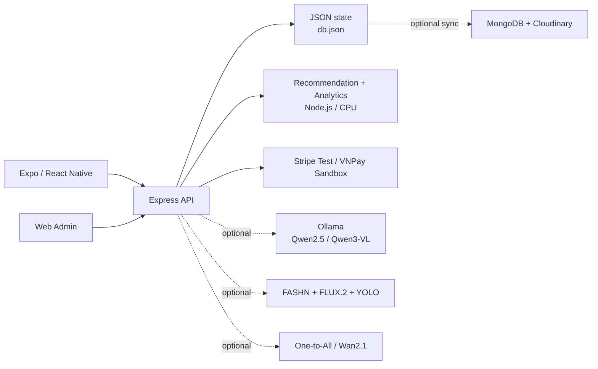

# JAPANO

Nền tảng thương mại điện tử thời trang Nhật Bản gồm ứng dụng mobile, Web Admin, backend API, recommendation engine, trợ lý mua sắm và pipeline thử đồ AI cục bộ.


> [!IMPORTANT]
>  Stripe chỉ chạy Test Mode, VNPay dùng Sandbox.

## Mục lục

- [Tổng quan](#tổng-quan)
- [Điểm nổi bật](#điểm-nổi-bật)
- [Kiến trúc hệ thống](#kiến-trúc-hệ-thống)
- [Chức năng](#chức-năng)
- [Model và thuật toán](#model-và-thuật-toán)
- [Yêu cầu hệ thống](#yêu-cầu-hệ-thống)
- [Cài đặt và chạy dự án](#cài-đặt-và-chạy-dự-án)
- [Cấu hình môi trường](#cấu-hình-môi-trường)
- [Scripts](#scripts)
- [API chính](#api-chính)
- [Cấu trúc thư mục](#cấu-trúc-thư-mục)
- [Kiểm thử](#kiểm-thử)
- [Giới hạn hiện tại](#giới-hạn-hiện-tại)

## Tổng quan

JAPANO là npm monorepo gồm ba ứng dụng chính:

| Thành phần | Công nghệ | Vai trò |
|---|---|---|
| Mobile | React Native 0.74, Expo SDK 51, Expo Router, TypeScript | Trải nghiệm mua sắm, thanh toán, thử đồ, botchat và khám phá Nhật Bản |
| Backend | Node.js 20+, Express 4 | REST API, dữ liệu, thanh toán, recommendation, analytics và điều phối AI |
| Web Admin | HTML, CSS, JavaScript thuần | Quản trị thương mại, nội dung, thanh toán và báo cáo model |

Backend phục vụ đồng thời API và Web Admin:

- Admin: <http://localhost:4100>
- API: <http://localhost:4100/api>
- Health: <http://localhost:4100/api/health>
- AI health: <http://localhost:4100/api/ai/health>

Lần chạy đầu, backend tự tạo catalog và dữ liệu demo nếu chưa có `backend/data/db.json`.

## Điểm nổi bật

- Recommendation hybrid theo hành vi thật: Selective SSM, graph propagation, next-item transition, pairwise ranker và các retrieval expert.
- Botchat Ori có memory nhiều lượt, semantic routing, catalog-grounded response và Ollama rewrite tùy chọn.
- Virtual try-on bằng FASHN VTON 1.5, adaptive FLUX.2 pose transfer, accessory refinement và quality gate.
- Tạo “Ảnh sống” bằng One-to-All Animation 1.3B-v2 trên nền Wan2.1, chỉ nạp CUDA khi người dùng yêu cầu.
- Dashboard quản trị có dự báo doanh thu, nhu cầu/tồn kho, phân khúc, churn heuristic, market basket và model telemetry.
- Thanh toán COD, Stripe Test Mode và VNPay Sandbox; có reconcile, return và refund workflow.
- Loyalty riêng của JAPANO: VIP theo doanh số tháng và bộ sưu tập 7 Flagcard địa danh Nhật Bản.
- Review verified-purchase, moderation chống lách từ nhạy cảm, reaction hữu ích/không hữu ích và media tùy chọn.
- Dữ liệu hành chính Việt Nam gồm 34 tỉnh/thành và 3.321 phường/xã.
- Core backend, Admin, recommendation và bot fallback chạy được không cần GPU.

## Kiến trúc hệ thống



Luồng recommendation:

```text
view · search · wishlist · cart · try-on · chat · purchase
                           │
            ┌──────────────┼─────────────────┐
            ▼              ▼                 ▼
      Selective SSM   LightGCN-style   Next-item transition
            └──────────────┼─────────────────┘
                           ▼
        Retrieval experts + adaptive MoE weighting
                           ▼
             Pairwise stacked final ranking
                           ▼
        Negative feedback · diversity · exploration
```

## Chức năng

### Ứng dụng mobile

| Nhóm | Chức năng |
|---|---|
| Catalog | Trang chủ, danh mục, tìm kiếm, lọc/sắp xếp, gallery ảnh/video, sản phẩm liên quan |
| Sản phẩm | Màu, size, tồn kho, giá khuyến mãi, đánh giá và verified-purchase |
| Mua sắm | Wishlist, giỏ hàng đa biến thể, voucher, địa chỉ, checkout và lịch sử đơn |
| Thanh toán | COD, Stripe Card/Checkout Test Mode, VNPay Sandbox trong WebView |
| Hậu mãi | Theo dõi timeline đơn, yêu cầu trả hàng và trạng thái hoàn tiền |
| Trợ lý Ori | Botchat nổi và màn chat đầy đủ; hỏi giá, voucher, đơn hàng, size, phối đồ và xu hướng |
| Stylist AI | Phân tích màu chủ đạo, hồ sơ phong cách, tư vấn size và gợi ý outfit |
| Thử đồ AI | Virtual try-on, phụ kiện theo pose, quality gate và video “Ảnh sống” tùy chọn |
| Mục tiêu | Kế hoạch tiết kiệm mua sản phẩm, SMART goals và wellness guardrails |
| Nhật Bản | Địa danh, review cộng đồng, gợi ý trải nghiệm, văn hóa và nội dung hằng ngày |
| Loyalty | JAPANO VIP, Flagcard, voucher cá nhân và thông báo trong ứng dụng |

### Web Admin

| Nhóm | Chức năng |
|---|---|
| Dashboard | KPI trực tiếp, doanh thu, đơn hàng, tồn kho, khách hàng và commerce activity |
| Analytics | Forecast 3 tháng, DemandScore, inventory risk, K-Means, RFM churn và market basket |
| Model observability | Trạng thái SSM/GNN/next-item/ranker, graph edges, training pairs, coverage và bot telemetry |
| Commerce | Quản lý đơn, sản phẩm, biến thể, danh mục, người dùng và giỏ hàng đang hoạt động |
| Payment | Tra cứu giao dịch Stripe/VNPay, reconcile, return và refund |
| Content | Review moderation, Japan community, banners, notifications và voucher |
| Loyalty | Cấu hình/cấp Flagcard, bộ sưu tập và theo dõi VIP |
| Integrations | Health của API, database, Cloudinary, payment gateway và các AI service |

### Backend

- REST API chia theo domain trong [`backend/routes`](backend/routes).
- Giá, voucher, payment promotion và VIP discount được tính lại phía server.
- Log hành vi nuôi recommendation gồm view, search, wishlist, cart, try-on, chat, goal và purchase.
- Cache recommendation tách theo state, TTL 60 giây và invalidation khi dữ liệu thay đổi.
- Health endpoint riêng cho core service và AI pipeline.

### Chức năng đặc biệt

#### Recommendation có feedback âm

Event bỏ giỏ/bỏ yêu thích với `value=0` được lưu thành tín hiệu âm. Impression do bot tự hiển thị không được coi là sở thích dương, giúp giảm feedback loop.

#### Botchat catalog-grounded

Ori truy hồi sản phẩm, giá, voucher và đơn hàng từ state thật trước khi tạo câu trả lời. Qwen2.5 chỉ được phép viết lại bản nháp đã grounded; khi Ollama tắt, timeout hoặc GPU bận, bot vẫn trả local response.

#### GPU hand-off

FASHN, FLUX.2, Ollama và motion model không giữ VRAM đồng thời. Pipeline có GPU lock, tuần tự nạp/nhả model, low-memory mode và giới hạn tài nguyên cho video.

#### Loyalty

- Tổng tiền hàng hợp lệ trong tháng đạt `5.000.000₫`: mở VIP 30 ngày.
- VIP giảm 10% cho một đơn vị sản phẩm tự chọn trong mỗi đơn.
- Đơn đủ `5.000.000₫`: nhận một Flagcard.
- Đủ 7 Flagcard: nhận voucher cá nhân giảm 50%, một lượt, hiệu lực 90 ngày.

## Model và thuật toán

> [!NOTE]
> Không có họ model nào mặc nhiên “mạnh hơn Transformer” cho mọi bài toán. Các khối SSM, LightGCN và mLSTM bên dưới là implementation nhỏ **inspired/style** chạy online bằng JavaScript; không phải checkpoint Mamba, LightGCN, xLSTM hoặc HSTU chính thức.

### LLM và Vision-Language qua Ollama

| Model | Chức năng | Điều kiện/Fallback |
|---|---|---|
| `qwen2.5:7b` | Semantic review moderation | Local anti-evasion rules vẫn hoạt động khi Ollama offline |
| `qwen2.5:7b` | Viết lại câu trả lời grounded của Ori | Chỉ bật khi `JAPANO_OLLAMA_CHAT=1`; mặc định tắt |
| `qwen2.5:7b` | Diễn đạt coaching cho shopping/wellness goals | Công thức ngân sách và safety rules luôn chạy cục bộ |
| `qwen3-vl:8b` | Phân tích ảnh sản phẩm và sinh mô tả | Có catalog-grounded fallback, không tự suy đoán chất liệu |
| `qwen3-vl:8b` | Ước lượng mood/age range và style tags từ ảnh | Có neutral fallback; kết quả chỉ mang tính tham khảo |

Ollama và model weights không được cài bởi `npm install`:

```bash
ollama pull qwen2.5:7b
ollama pull qwen3-vl:8b
```

### Computer Vision và Generative AI

| Model/Pipeline | Vai trò | Trạng thái mặc định |
|---|---|---|
| FASHN VTON 1.5 | Engine virtual try-on chính | Cần external repository, Python environment và weights |
| FLUX.2 Klein 4B | Pose transfer khi detector thấy ảnh khó; accessory multi-reference refinement | Repose thích ứng; có thể ép bằng `JAPANO_FORCE_REPOSE=1` |
| YOLOv8n-pose | Chọn main subject, keypoints, pose/accessory placement và quality checks | Weight nhỏ nằm trong repo; cần Python/OpenCV/Ultralytics |
| CatVTON | Try-on fallback | Tắt mặc định; cần bật cả service và route fallback |
| Wan2.1-T2V-1.3B + One-to-All `1.3b_2` | Tạo video chuyển động từ ảnh try-on | Tùy chọn, CUDA-only, không có CPU/legacy fallback |
| YOLOv10m ONNX + ViTPose ONNX | Pose/control và kiểm tra action cho motion | Đi cùng external One-to-All installation |

[`backend/pose_reposer.py`](backend/pose_reposer.py) còn có capability Stable Diffusion 1.5 + ControlNet OpenPose cho direct CatVTON service, nhưng app route chính hiện không kích hoạt nhánh repose này.

### Recommendation và Botchat chạy CPU

| Thành phần | Implementation hiện tại |
|---|---|
| Selective SSM | State 12 chiều, gate theo event, tối đa 64 hành vi/user; Mamba-inspired |
| LightGCN-style | Graph propagation hai lớp trên quan hệ user–item |
| Next-item expert | Phân phối Markov bậc một theo session, gap tối đa 72 giờ |
| Pairwise ranker | Logistic SGD, 4 features, 12 epoch, chronological leave-last-positive-out |
| Adaptive MoE | Đổi trọng số expert theo độ dài lịch sử; không phải neural learned MoE |
| Matrix Factorization | SGD, 8 latent dimensions, 25 epoch |
| Item-CF | Cosine similarity trên co-interaction, tối đa 12 neighbor |
| Content retrieval | Tag, category, price bucket và style profile |
| Market basket | Pairwise association rules với support, confidence và lift |
| Trending | DemandScore và time decay với half-life 14 ngày |
| Bot semantic router | Feature hashing 48 chiều: word, bigram và character trigram |
| Bot memory | mLSTM-style outer-product matrix memory, tối đa 12 lượt |
| Bot MoE router | Exact rules + semantic prototype + memory signal |

API trả model provenance và diagnostics tại:

- `GET /api/recommendations/home`
- `GET /api/analytics`
- `GET /api/ai/health`

Offline ranking evaluation chưa được triển khai; `NDCG@10` và `Recall@10` hiện được báo là `not-measured`, không có số accuracy giả.

### Analytics

| Bài toán | Phương pháp |
|---|---|
| Dự báo doanh thu | OLS + Holt double exponential smoothing + Weighted Moving Average, blend theo inverse MAE |
| Dự báo nhu cầu/tồn kho | DemandScore đa tín hiệu + momentum 30/60 ngày |
| Phân khúc khách hàng | K-Means `k ≤ 3`, chuẩn hóa z-score |
| Churn prioritization | RFM heuristic: Recency 62% + Frequency 23% + Monetary 15% |
| Mua kèm | Pairwise association rules |
| Outfit | HSL color harmony + tag cosine + trending |
| Tư vấn size | Expert thresholds từ số đo hoặc chiều cao/cân nặng |

DemandScore, inventory risk và churn là heuristic minh bạch, không phải supervised classifier hay xác suất đã calibration.

## Yêu cầu hệ thống

### Chạy core

- Node.js `>= 20`
- npm
- Khoảng trống đủ cho `node_modules`

Core gồm Backend, Admin, JSON database, analytics, recommendation và local bot fallback; không yêu cầu Python, MongoDB, Ollama hoặc GPU.

### Chạy mobile

- Android Studio + Android SDK Platform-Tools (`adb`)
- JDK 17 cho Android native development build
- Android emulator hoặc thiết bị thật
- iOS cần macOS + Xcode

### Chạy full AI

- Linux/Bash được khuyến nghị cho `start-all.sh`
- Python environment riêng cho từng external model repository
- NVIDIA CUDA GPU; cấu hình hiện tại được thiết kế cho khoảng 16 GB VRAM
- Motion service yêu cầu CUDA ONNX provider, mặc định cần khoảng 13,5 GB VRAM trống và 14 GB RAM hệ thống khả dụng
- `curl`, `awk`, `grep`, `adb` và `nvidia-smi`

Repo không có một `requirements.txt` chung cho toàn bộ AI stack. FASHN, FLUX.2, CatVTON và One-to-All phải được chuẩn bị trong environment của repository gốc tương ứng.

## Cài đặt và chạy dự án

### 1. Cài dependencies

Từ thư mục gốc:

```bash
npm ci
```

`npm ci` dùng root lockfile, cài cả hai workspace và chạy postinstall cần thiết cho Stripe native.

### 2. Tạo file cấu hình riêng

```bash
cp .env.example .env.server
```

Chỉnh các placeholder và đường dẫn theo máy. Backend tự load `.env.server`; tuyệt đối không đưa file này lên GitHub.

### 3. Chạy Backend và Web Admin

```bash
npm run backend
```

Hoặc đổi cổng:

```bash
PORT=4200 npm run backend
```

Sau khi chạy:

- Admin: <http://localhost:4100>
- API: <http://localhost:4100/api>
- API health: <http://localhost:4100/api/health>

Lần đầu backend tự seed dữ liệu demo. Có thể chạy backend riêng bằng:

```bash
./start-backend.sh
```

Trên Windows:

```bat
start-backend.bat
```

### 4. Chạy Android

Khởi động backend ở terminal thứ nhất, sau đó tại terminal thứ hai:

```bash
EXPO_USE_METRO_WORKSPACE_ROOT=1 \
EXPO_PUBLIC_API_URL=http://10.0.2.2:4100 \
npm --workspace mobile run android -- --localhost
```

Với thiết bị thật, dùng `adb reverse`:

```bash
adb reverse tcp:4100 tcp:4100
adb reverse tcp:8081 tcp:8081
```

Hoặc dùng IP LAN:

```bash
EXPO_PUBLIC_API_URL=http://192.168.1.10:4100 \
npm --workspace mobile run android
```

### 5. Chạy toàn bộ Android bằng một lệnh

Full AI stack:

```bash
./start-all.sh
```

Chỉ chạy core, không yêu cầu FASHN/motion:

```bash
JAPANO_SKIP_FASHN=1 JAPANO_SKIP_MOTION=1 ./start-all.sh
```

Một số tùy chọn:

```bash
# Chọn thiết bị
JAPANO_ANDROID_SERIAL=emulator-5554 ./start-all.sh

# Xóa Metro cache
JAPANO_EXPO_CLEAR=1 ./start-all.sh

# Đổi cổng
PORT=4200 ./start-all.sh
```

`start-all.sh` sẽ:

1. Kiểm tra/cài Node dependencies khi cần.
2. Khởi động FASHN + FLUX.2 nếu không skip.
3. Khởi động One-to-All khi installation có sẵn.
4. Bỏ qua CatVTON theo mặc định.
5. Khởi động Backend + Admin.
6. Chọn Android device, thiết lập `adb reverse` và mở Expo/native development client.
7. Dừng các process do script tạo khi nhận `Ctrl+C`.

### 6. Chạy Web hoặc iOS

Web preview:

```bash
EXPO_PUBLIC_API_URL=http://localhost:4100 npm run mobile:web
```

iOS trên macOS:

```bash
EXPO_PUBLIC_API_URL=http://localhost:4100 npm --workspace mobile run ios
```

Các tính năng native payment/try-on nên được kiểm tra trên Android/iOS development build.

## Cấu hình môi trường

Xem toàn bộ biến tham khảo trong [`.env.example`](.env.example).

### Core và mobile

| Biến | Mặc định | Mục đích |
|---|---|---|
| `PORT` | `4100` | Cổng Backend/Admin |
| `JAPANO_DATA_FILE` | `backend/data/db.json` | Đổi file JSON source of truth |
| `EXPO_PUBLIC_API_URL` | Tự dò | Base URL của mobile |
| `EXPO_PUBLIC_API_PORT` | `4100` | Cổng fallback mobile |
| `JAPANO_API_URL` | `http://127.0.0.1:4100` | Base URL cho smoke test |

### Storage và media tùy chọn

| Biến | Mục đích |
|---|---|
| `MONGODB_URI`, `MONGODB_DB` | Đồng bộ dữ liệu/cloud views tùy chọn |
| `CLOUDINARY_URL` | Upload logo và media review |

### Payment

| Biến | Mục đích |
|---|---|
| `STRIPE_SECRET_KEY` | Stripe Test secret; chỉ lưu phía server |
| `STRIPE_PUBLISHABLE_KEY` | Publishable key trả cho mobile |
| `STRIPE_WEBHOOK_SECRET` | Xác thực Stripe webhook |
| `STRIPE_CURRENCY` | Tiền tệ, mặc định `vnd` |
| `VNPAY_TMN_CODE`, `VNPAY_HASH_SECRET` | VNPay Sandbox merchant |
| `VNPAY_PAY_URL`, `VNPAY_API_URL`, `VNPAY_RETURN_URL` | Endpoint VNPay Sandbox |

### AI

| Biến | Mục đích |
|---|---|
| `JAPANO_OLLAMA_URL` | Ollama API, mặc định `http://127.0.0.1:11434` |
| `JAPANO_OLLAMA_CHAT` | Bật/tắt Qwen rewrite cho Ori; mặc định `0` |
| `JAPANO_FASHN_DIR`, `JAPANO_FASHN_PYTHON` | FASHN installation dùng bởi `start-all.sh` |
| `JAPANO_FLUX_REPOSE_HOME` | FLUX.2 Klein 4B weights |
| `JAPANO_FORCE_REPOSE` | Ép mọi ảnh đi qua pose transfer; mặc định `0` |
| `JAPANO_ACCESSORY_REFINE` | Bật accessory refinement; mặc định `1` |
| `JAPANO_ONE_TO_ALL_HOME`, `JAPANO_ONE_TO_ALL_PYTHON` | Motion installation |
| `JAPANO_SKIP_FASHN`, `JAPANO_SKIP_MOTION` | Bỏ qua service trong `start-all.sh` |
| `JAPANO_SKIP_CATVTON`, `JAPANO_CATVTON_FALLBACK` | Điều khiển CatVTON service và route fallback |

## Scripts

| Lệnh | Mô tả |
|---|---|
| `npm run backend` | Chạy Backend + Admin |
| `npm run backend:dev` | Hiện chạy giống backend start; chưa có hot reload |
| `npm run mobile` | Mở Expo dev server |
| `npm run mobile:web` | Mở Expo web |
| `npm run dev:android` | Alias của `./start-all.sh` |
| `npm run check` | Backend tests + mobile TypeScript typecheck |
| `npm --workspace backend test` | Chỉ chạy backend tests |
| `npm --workspace mobile run typecheck` | Chỉ kiểm tra TypeScript mobile |
| `npm run verify` | Smoke test core API đang chạy |
| `npm run verify:ai` | Smoke test thêm try-on, vision và goals |

`verify` có ghi interaction/profile test cho user `verify-user`; nên chạy trên dữ liệu demo hoặc file DB riêng.

Đổi API smoke test:

```bash
JAPANO_API_URL=http://127.0.0.1:4200 npm run verify
```

Seed khi DB kiểm thử đang trống:

```bash
npm run verify -- --seed
```

## API chính

| Method | Endpoint | Chức năng |
|---|---|---|
| `GET` | `/api/health` | Core health và feature flags |
| `GET` | `/api/ai/health` | AI services và pipeline diagnostics |
| `GET` | `/api/products` | Catalog |
| `GET` | `/api/products/:slug/related` | Sản phẩm liên quan |
| `GET` | `/api/recommendations/home` | Personalized recommendations |
| `POST` | `/api/interactions` | Thu thập hành vi |
| `POST` | `/api/stylist/chat` | Botchat Ori |
| `POST` | `/api/stylist/recommend` | Stylist/camera recommendation |
| `POST` | `/api/stylist/size` | Size advisor |
| `POST` | `/api/tryon` | Virtual try-on |
| `POST` | `/api/tryon/motion` | Tạo “Ảnh sống” |
| `POST` | `/api/orders` | Tạo đơn COD |
| `POST` | `/api/stripe/payment-intent` | Stripe Test PaymentIntent |
| `POST` | `/api/vnpay/payment-url` | VNPay Sandbox URL |
| `POST` | `/api/orders/:id/returns` | Yêu cầu trả hàng |
| `POST` | `/api/payments/:id/refund` | Refund theo provider |
| `GET` | `/api/analytics` | Dashboard analytics/model telemetry |
| `GET` | `/api/vip/status/:userId` | VIP status |
| `GET` | `/api/flagcards/collection/:userId` | Flagcard collection |

Chi tiết implementation nằm trong [`backend/routes`](backend/routes).

## Cấu trúc thư mục

```text
japano/
├── admin/                       # Web Admin
│   ├── index.html
│   ├── styles.css
│   └── js/
├── backend/
│   ├── server.js               # Express bootstrap
│   ├── routes/                 # REST routes theo domain
│   ├── lib/                    # Commerce, AI, analytics, recommendation
│   ├── test/                   # node:test suites
│   ├── data/db.json            # JSON source of truth mặc định
│   ├── fashn_service.py        # FASHN + FLUX.2 service
│   ├── motion_service.py       # One-to-All service
│   └── catvton_service.py      # Optional CatVTON service
├── mobile/
│   ├── app/                    # Expo Router screens
│   ├── components/
│   ├── lib/
│   └── assets/
├── scripts/
│   └── verify.mjs              # API smoke test
├── .env.example
├── package.json
├── start-all.sh
└── README.md
```

ERD và schema tham khảo:

- [`japano_erd.dbml`](japano_erd.dbml)
- [`japano_erd.sql`](japano_erd.sql)
- [`japano_schema_v2.sql`](japano_schema_v2.sql)
- [`japano_schema_v2_sqlite.sql`](japano_schema_v2_sqlite.sql)

## Kiểm thử

Chạy toàn bộ kiểm tra source:

```bash
npm run check
```

Kiểm tra API sau khi backend đã chạy:

```bash
npm run verify
```

Kiểm tra cả AI stack:

```bash
npm run verify:ai
```

Test suite hiện bao phủ recommendation provenance, cache isolation, next-item transition, causal ranker diagnostics, feedback âm, bot model trace, analytics, payment/VIP, Flagcard, moderation và dữ liệu hành chính.

## Giới hạn hiện tại

- Admin chưa có màn login; các mutation endpoint chưa có server-side authentication/authorization.
- Một số wrapper mobile cho camera, try-on, goals, Japan community và return vẫn fallback về demo user; cần chuẩn hóa identity trước production.
- Stripe chỉ nhận test keys và VNPay dùng sandbox/demo configuration.
- Notification hiện là record trong shared state, chưa tích hợp FCM/APNs push.
- AI checkpoints và Python environments không nằm trong repo và không được cài bởi npm.
- Recommendation SSM/GNN/mLSTM là lightweight inspired implementations; chưa có offline NDCG/Recall benchmark.
- Full try-on/motion phụ thuộc CUDA, VRAM, RAM và external model licenses.
- Trước production cần thêm auth/RBAC, rate limiting, request validation, secret management, migrations, audit log, observability và CI/CD.


