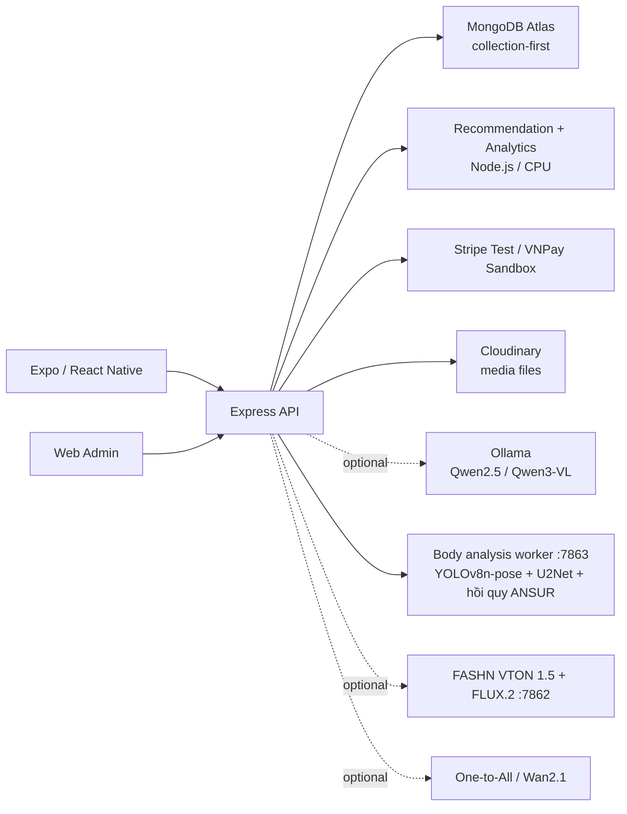
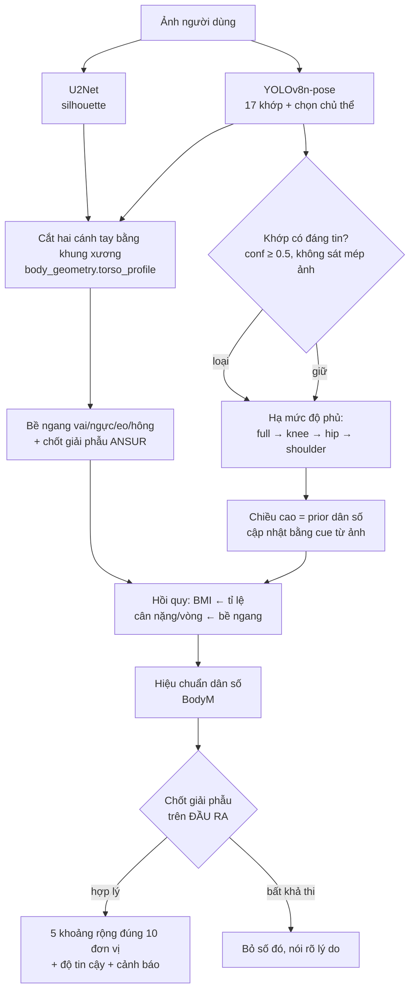

# JAPANO

Nền tảng thương mại điện tử thời trang Nhật Bản gồm ứng dụng mobile, Web Admin, backend API, recommendation engine, trợ lý mua sắm, **đo cơ thể từ ảnh** và pipeline thử đồ AI chủ yếu chạy cục bộ. Một script Gemini Omni Flash tùy chọn chỉ dùng để thử nghiệm tạo video thủ công, không nằm trên luồng chạy mặc định của ứng dụng.


> [!IMPORTANT]
> JAPANO hiện là **full-stack demo/research prototype**.

> [!TIP]
> Coding agent nên đọc [`docs/CODEX_PROJECT_MEMORY.md`](docs/CODEX_PROJECT_MEMORY.md)
> trước khi quét toàn bộ repo. File này ghi runtime, bằng chứng AI, giới hạn và
> điểm đang làm dở; skill `japano-project-memory` yêu cầu cập nhật lại nó sau mỗi
> thay đổi quan trọng.

## Mục lục

- [Tổng quan](#tổng-quan)
- [Điểm nổi bật](#điểm-nổi-bật)
- [Kiến trúc hệ thống](#kiến-trúc-hệ-thống)
- [Chức năng](#chức-năng)
- [Model và thuật toán](#model-và-thuật-toán)
- [Đo cơ thể từ ảnh](#đo-cơ-thể-từ-ảnh)
- [Báo cáo fine-tune thử đồ](#báo-cáo-fine-tune-thử-đồ)
- [Yêu cầu hệ thống](#yêu-cầu-hệ-thống)
- [Cài đặt và chạy dự án](#cài-đặt-và-chạy-dự-án)
- [Cấu hình môi trường](#cấu-hình-môi-trường)
- [Scripts](#scripts)
- [API chính](#api-chính)
- [Cấu trúc thư mục](#cấu-trúc-thư-mục)
- [Website storefront](#website-storefront)
- [Kiểm thử](#kiểm-thử)
- [Giới hạn hiện tại](#giới-hạn-hiện-tại)

## Trạng thái xác minh gần nhất

- **Phong cảnh "Đưa tôi đến đây" đã sửa (2026-08-29).** Ảnh Naoshima cũ chụp từ
  ngoài biển — 45% dưới khung là nước — nên người bị ghép đứng giữa mặt biển. Nay
  mỗi góc chụp mang metadata riêng (`footAnchor`, `groundPolygon`,
  `personHeightRatio`, hướng sáng, bóng đổ) trong `backend/lib/japanScenes.js`, và
  compositor cắt nền **bám theo điểm đặt chân** thay vì cắt giữa. Ba góc đã duyệt:
  Miyanoura (CC BY 2.5), Honmura (CC BY-SA 4.0), Senbon Torii (CC BY-SA 4.0).
  Ảnh trước/sau: `test-results/japan-scenes/naoshima-contact-sheet.jpg`.
  Kiểm bằng `node scripts/validate_japan_scenes.js`.
- **Gợi ý trang phục theo địa điểm.** `GET /api/japan-spots/recommendations` chấm
  điểm 100 bằng quy tắc trên metadata thật của catalog (25 phong cách · 20 mùa ·
  20 màu · 15 loại đồ · 15 size còn hàng · 5 chất lượng dữ liệu). **Không gọi
  LLM**, đo được 8 ms khi tính mới và 25 ms khi trúng cache RAM. Đền/chùa không
  bao giờ gợi ý đồ bơi; địa điểm biển chỉ gợi ý khi lượt đó đã qua cổng 18+.
  Scene, gợi ý và ảnh kết quả không tạo collection; chỉ danh mục nguồn 25 địa
  điểm được lưu trong `japan_spots`.

- **Database rút từ 34 xuống 29 collection, sau đó có 30 collection khi thêm
  danh mục địa điểm thật (2026-08-29).** `product_details`
  nhúng vào `products`; `banners` và `discount_rules` nhúng vào `settings`;
  `vip_memberships` suy ra từ `orders`; `ai_descriptions` chuyển thành cache RAM.
  `voucher_redemptions` và `flagcard_collections` được giữ lại vì là sổ chứng từ
  và có thể chứa quà quản trị viên cấp tay. `dataSize` 838 KB → 623 KB,
  `totalIndexSize` 3,23 MB → 2,90 MB. Collection thứ 30 là `japan_spots` gồm 25
  địa điểm người dùng nhìn thấy; nó chỉ lưu URL ảnh và metadata, không lưu blob.
  ERD tổng quát là tập con 19 bảng và gate đối chiếu Atlas **ĐẠT**. Xem
  [`MONGODB_STORAGE_AUDIT_2026-08-29.md`](docs/database/MONGODB_STORAGE_AUDIT_2026-08-29.md).
- **Ba lỗi thật đã sửa trong lúc migration**, tất cả đều có test hồi quy:
  banner biến mất khỏi ứng dụng (`/api/banners` trả `[]`); backend treo lúc khởi
  động vì `replaceCollection` upsert trước khi xoá; và boot nhận nhầm database đã
  có dữ liệu là database trống rồi ghi đè bằng `db.json`.
- **Migration này đã làm mất 263 document chỉ tồn tại trên Atlas** (4 đơn hàng,
  4 thanh toán, 227 bản ghi hành vi và một số khác). Sản phẩm, biến thể và ảnh đã
  khôi phục đủ. Nguyên nhân và phạm vi ghi trong báo cáo audit ở trên.

- **Thử đồ một chạm với 5 hồ sơ tham chiếu chạy ngầm (2026-08-29).** Khách chỉ
  chọn/chụp ảnh của mình; app không còn hiện dải người mẫu và không yêu cầu nhập
  chiều cao, cân nặng hay số đo trước khi thử. Backend so hình học dáng người với
  năm hồ sơ đã đo sẵn để bổ sung prior chọn size khi ảnh không đủ căn cứ tuyệt
  đối. Prior chỉ là khoảng tham chiếu nội bộ, không phải số đo thật và không được
  ghi vào hồ sơ khách. Nếu ảnh đủ tốt, ước lượng từ chính ảnh luôn được ưu tiên.
  Phân tích warm kiểm tra thực tế trả sau **415 ms**, các khoảng hiển thị rộng
  đúng 10 đơn vị (`160–170 cm`, `50–60 kg`, `90–100/70–80/90–100 cm`) và size M.
  Client dùng chung promise phân tích nên bấm tạo ảnh trong lúc đang phân tích
  không chạy pose/body hai lần. Xem
  [`HIDDEN_BODY_ANCHORS_BALANCED_2026-08-29.md`](docs/project_evidence/ai_benchmarks/HIDDEN_BODY_ANCHORS_BALANCED_2026-08-29.md).
- **Ghép ảnh vào phong cảnh Nhật Bản (2026-08-29).** `POST /api/japan-spots/scene-photo`
  tách người bằng U2Net rồi đặt lên ảnh thật của địa điểm — **không** dùng GPU và
  **không** dùng model sinh ảnh, nên khuôn mặt và cơ thể giữ nguyên từng pixel.
  Đo thật: **912 ms** cho mẫu dựng sẵn, **1 195 ms** cho ảnh vừa thử đồ xong.
  App chỉ gửi tên địa điểm; địa chỉ ảnh nền do máy chủ tự tra và chỉ tải từ đúng
  một host đã duyệt.
- **Khám phá Nhật Bản mở rộng lên 25 địa điểm.** Năm nơi mới — đảo nghệ thuật
  Naoshima, núi thiêng Koyasan, hẻm núi Takachiho, phố cổ Kurashiki Bikan và suối
  nước nóng Ginzan — đều đối chiếu với trang du lịch chính thức của tỉnh hoặc
  JNTO. Trang sản phẩm có thêm mục "Mặc bộ này ở đâu trên đất Nhật" lấy từ đúng
  bảng dữ liệu đó. `npm run db:japan-spots:sync -- --apply` materialize đúng
  danh mục đóng gói của app vào Atlas và `GET /api/japan-spots/catalog` đọc lại
  25 bản ghi; ảnh thật vẫn ở nguồn ngoài, MongoDB chỉ giữ URL và ghi công.
- Ngày 2026-08-29: Backend/Admin và các worker body-analysis, FASHN, motion đang
  có cấu hình service cục bộ; cần chạy `./scripts/japano-services.sh status` để
  xác minh lại trạng thái tại thời điểm dùng.
- Motion hiện là **tối ưu suy luận**, chưa phải fine-tune: walk khoảng 58 giây
  trực tiếp / 65 giây qua backend, turn khoảng 71 giây và pose khoảng 66 giây
  trên RTX 5060 Ti 16 GB. Xem
  [`MOTION_INFERENCE_2026-08-29.md`](docs/project_evidence/ai_benchmarks/MOTION_INFERENCE_2026-08-29.md).
- Splash JAPANO mới dùng logo thương hiệu, cảnh người phụ nữ cầm dù, hoa anh đào
  và chữ xuất hiện tuần tự. Launcher icon dùng đúng monogram JAPANO; logo cạnh
  lời chào có fallback asset nội bộ khi Admin chưa cấu hình logo. Danh sách sản
  phẩm có poster reveal, vignette, light sweep và scroll scale/fade, đồng thời
  tôn trọng Reduce Motion.
- **UI premium 2026-08-29.** Trang chủ mobile có hero hành trình Nhật Bản, cụm
  JAPANO AI Studio ngay màn đầu, thẻ sản phẩm trung tính hơn, lý do gợi ý AI gọn
  và tab thử đồ nổi rõ. Web Admin có màn đăng nhập hai cột responsive cùng phần
  command center cho dashboard. Đã kiểm tra trực quan mobile thật trên Redmi và
  trang Admin ở desktop/390x844; dashboard sau đăng nhập chưa được kiểm tra trực
  quan vì phiên này không có thông tin đăng nhập admin còn hiệu lực. Khôi phục
  phiên mobile dùng hồ sơ cache để hiện UI trước rồi xác thực token ở nền, đưa
  cold launch từ khoảng 15 giây xuống còn khoảng 3–4 giây trên video Redmi. Đợt
  hoàn thiện 9.5 tiếp tục rút splash, giữ nền thương hiệu thay cho màn trắng,
  cố định skeleton đúng chiều cao thẻ thật, cho tên sản phẩm hai dòng và đổi lý
  do kỹ thuật thành câu dễ hiểu. Admin có thêm điều hướng bàn phím, trạng thái
  `aria-live`/`aria-busy` và skeleton đúng hình command center.
- **Hoàn thiện App và Web Admin 2026-08-30.** Tab Sản phẩm giữ số lượng và sắp
  xếp trên màn đầu, còn bộ lọc nâng cao được thu gọn để sản phẩm xuất hiện sớm.
  Trang chi tiết có chia sẻ thật, nội dung AI hướng tới khách hàng và chỉ còn hai
  CTA cố định `Thử trên ảnh`/`Thêm vào giỏ`. Màn thử đồ có hành trình 3 bước,
  vùng xem trước gọn hơn và coi số đo thật là tùy chọn. Các màn này đã được kiểm
  tra trực quan trong app native đang chạy trên Redmi Note 8 Pro. Admin bổ sung
  tương phản màu tốt hơn, nhãn bàn phím/trình đọc màn hình, bảng có thể cuộn bằng
  bàn phím, tiêu đề mobile không bị cắt và luồng quên/đặt lại mật khẩu dùng API
  sẵn có. Login, dashboard và 16 route Admin đã được kiểm tra ở desktop/mobile;
  axe không phát hiện lỗi WCAG 2/2.1 A/AA khi bật Reduce Motion. Phần dashboard
  đăng nhập dùng phiên QA ngắn hạn để kiểm tra giao diện; mật khẩu Admin trong
  cấu hình hiện trả 401 và không bị tự ý thay đổi. Lượt UI này không chạy lại tác
  vụ sinh ảnh/video GPU.
- APK Redmi hiện tại là `1.0.12` (`versionCode 13`). Cài đè bằng `adb install -r`
  hoặc mở link APK qua Tailscale để giữ dữ liệu; không gỡ bản cũ trước khi cập nhật.
  Link tailnet: <https://rd-system.tail6502ce.ts.net:4101/api/apk/JAPANO-redmi-v1.0.12.apk>
  (hostname MagicDNS trỏ tới `100.69.188.16`; dùng hostname chứ không dùng IP trần
  vì Tailscale Serve chỉ cấp chứng chỉ TLS cho hostname).
  SHA-256: `9c7792dda8a1d59cd50eb8da7c6dfe56d67a5d26dd1811b9cbb1c84d70137959`
  (123 393 960 byte). Chứng chỉ ký SHA-1 `5e8f16062ea3cd2c4a0d547876baa6f38cabf625`
  **không đổi**, nên cài đè giữ nguyên dữ liệu ứng dụng. Package `vn.japano.app`,
  targetSdk 34. Đã xác minh: metadata gói, chữ ký, tải qua tailnet với đúng
  `Content-Type`, `Content-Length` và SHA-256 khớp bản build.
  Đã cài đè và kiểm tra giao diện trên Redmi Note 8 Pro: app giữ dữ liệu, cold
  launch bằng video, trang chủ/AI Studio, thẻ gợi ý, tab Sản phẩm, cuộn lưới và
  tab bar đều hiển thị đúng. Theo yêu cầu lượt này, chỉ kiểm tra Redmi, không
  thực hiện kiểm tra OPPO.
  Các thay đổi UI ngày 2026-08-30 đã được đóng gói lại bằng JDK 17 và cài đè
  thành công lên Redmi; `firstInstallTime` được giữ nguyên, còn `lastUpdateTime`
  chuyển sang 2026-08-30. Link Tailscale trả HTTP 200, đúng MIME, kích thước và
  hash mới. Sau lần mở release, thiết bị tự khóa màn hình; log đã tới
  `Running "main"` và không có crash JS/native, nhưng giao diện sau cài chưa thể
  chụp lại. Ba màn nguồn tương ứng đã được kiểm tra trực quan qua phiên native
  Metro ngay trước khi build.
  Build phải dùng JDK 17: JDK 21 trên máy này thiếu `jlink` và Gradle sẽ dừng ở
  bước `androidJdkImage`.
  `cd mobile/android && JAVA_HOME=/usr/lib/jvm/java-17-openjdk-amd64 ./gradlew assembleRelease`
- Ảnh công khai từng trả 503 sau khi GPU đã sinh ảnh nay trả ảnh thật trong
  37,9 giây; ca bắt buộc chuyển pose trả trong 61,9 giây kèm cảnh báo danh tính.
  Ảnh ngoài miền đo vẫn trả `insufficient_evidence`, không bịa cm/kg.
- Bikini hai mảnh dùng hai flat-lay sạch và một lượt FLUX.2 đa tham chiếu thay
  vì gửi nhầm category one-pieces cho FASHN. Smoke test thật trả ảnh 1152×1536
  trong 58,1 giây sau khi cache kiểm tra 18+ từ lượt body-analysis; quality và
  coverage gate đều qua, không warning. Lỗi lượt OPPO bị backend chặn sau khi
  FLUX đã sinh ảnh được sửa bằng pose riêng cho input/output và protected-core
  gate cho đồ bơi; smoke cold-cache sau sửa trả HTTP 200 trong khoảng 73 giây,
  vẫn chặn ảnh hở lõi nhạy cảm. Đây là thay đổi backend nên không cần cài lại
  APK; chưa xác nhận bằng lần bấm lại trực tiếp trên OPPO. Xem
  [`BRAND_CINEMATIC_SWIMWEAR_2026-08-29.md`](docs/project_evidence/ai_benchmarks/BRAND_CINEMATIC_SWIMWEAR_2026-08-29.md).
- Chatbot đã qua test câu mua đồ có/không dấu, lọc màu–dịp–ngân sách, size còn
  hàng và câu nối tiếp. Mục tiêu sức khỏe đã tách khỏi sản phẩm/quỹ mua sắm.
  Xem [`TRYON_CHAT_GOALS_2026-08-29.md`](docs/project_evidence/ai_benchmarks/TRYON_CHAT_GOALS_2026-08-29.md).

## Tổng quan

JAPANO là npm monorepo gồm ba ứng dụng chính:

| Thành phần | Công nghệ | Vai trò |
|---|---|---|
| Mobile | React Native 0.74, Expo SDK 51, Expo Router, TypeScript | Trải nghiệm mua sắm, thanh toán, thử đồ, botchat và khám phá Nhật Bản |
| Backend | Node.js 20+, Express 4 | REST API, dữ liệu, thanh toán, recommendation, analytics và điều phối AI |
| Web Admin | HTML, CSS, JavaScript thuần | Quản trị thương mại, nội dung, thanh toán và báo cáo model |

Backend phục vụ đồng thời API và Web Admin:

- Admin: <http://localhost:4100>
- API: <http://localhost:4100/api>
- Health: <http://localhost:4100/api/health>
- AI health: <http://localhost:4100/api/ai/health>

Khi có `MONGODB_URI`, MongoDB là nguồn dữ liệu chính; lần chạy đầu backend dùng
`backend/data/db.json` làm seed rồi ghi theo mô hình collection-first. Atlas
hiện có 30 collection; `app_state` là legacy và không phải nguồn runtime hiện
hành. Cloudinary giữ file media, MongoDB chỉ lưu URL/metadata media.

## Điểm nổi bật

- Recommendation hybrid theo hành vi thật: Selective SSM, graph propagation, next-item transition, pairwise ranker và các retrieval expert.
- Botchat Ori có memory nhiều lượt, semantic routing, catalog-grounded response và Ollama rewrite tùy chọn.
- Đo cơ thể từ MỘT ảnh: chiều cao, cân nặng, vòng 1/2/3, body shape và size — có sai số đo trên tập test tách theo danh tính, không phải con số tự khai.
- Virtual try-on bằng FASHN VTON 1.5, FLUX.2 đa tham chiếu riêng cho bikini hai mảnh, adaptive pose transfer, accessory refinement và quality gate.
- Hiệu ứng vừa vặn thật: vải căng, đường may bục khi quá chật, form rủ khi quá rộng — có chốt an toàn theo từng loại trang phục.
- Tạo “Ảnh sống” bằng One-to-All Animation 1.3B-v2 trên nền Wan2.1, chỉ nạp CUDA khi người dùng yêu cầu.
- Dashboard quản trị có dự báo doanh thu, nhu cầu/tồn kho, phân khúc, churn heuristic, market basket và model telemetry.
- Thanh toán COD, Stripe Test Mode và VNPay Sandbox; có reconcile, return và refund workflow.
- Loyalty riêng của JAPANO: VIP theo doanh số tháng và bộ sưu tập 7 Flagcard địa danh Nhật Bản.
- Review verified-purchase, moderation chống lách từ nhạy cảm, reaction hữu ích/không hữu ích và media tùy chọn.
- Dữ liệu hành chính Việt Nam gồm 34 tỉnh/thành và 3.321 phường/xã.
- Core backend, Admin, recommendation và bot fallback chạy được không cần GPU.

## Kiến trúc hệ thống



Các service chạy nền, mỗi cái một tiến trình riêng:

| Service | Cổng | Tài nguyên | Bắt buộc |
|---|---|---|---|
| `japano-backend` | 4100 | CPU | Có |
| `japano-body-analysis` | 7863 | CPU (cố ý không chiếm VRAM) | Không — có đường lùi |
| `japano-fashn` | 7862 | GPU ~15 GB | Chỉ khi thử đồ |
| `japano-motion` | — | GPU ~13,5 GB | Chỉ khi tạo video |

Bật/tắt cả cụm bằng một lệnh:

```bash
./scripts/japano-services.sh on      # bật + chờ sẵn sàng + tự chạy kiểm tra
./scripts/japano-services.sh off     # tắt tạm, nhường CPU/GPU cho việc khác
./scripts/japano-services.sh status  # service nào đang chạy, ai đang giữ GPU
```

Luồng recommendation:

```text
view · search · wishlist · cart · try-on · chat · purchase
                           │
            ┌──────────────┼─────────────────┐
            ▼              ▼                 ▼
      Selective SSM   LightGCN-style   Next-item transition
            └──────────────┼─────────────────┘
                           ▼
        Retrieval experts + adaptive MoE weighting
                           ▼
             Pairwise stacked final ranking
                           ▼
        Negative feedback · diversity · exploration
```

## Chức năng

### Ứng dụng mobile

| Nhóm | Chức năng |
|---|---|
| Catalog | Trang chủ, danh mục, tìm kiếm, lọc/sắp xếp, gallery ảnh/video, sản phẩm liên quan |
| Sản phẩm | Màu, size, tồn kho, giá khuyến mãi, đánh giá và verified-purchase |
| Mua sắm | Wishlist, giỏ hàng đa biến thể, voucher, địa chỉ, checkout và lịch sử đơn |
| Thanh toán | COD, Stripe Card/Checkout Test Mode, VNPay Sandbox trong WebView |
| Hậu mãi | Theo dõi timeline đơn, yêu cầu trả hàng và trạng thái hoàn tiền |
| Trợ lý Ori | Botchat nổi và màn chat đầy đủ; hỏi giá, voucher, đơn hàng, size còn kho, phối đồ và xu hướng; câu hỏi mua đồ có/không dấu và tham chiếu “cái đó” được grounded vào catalog |
| Stylist AI | Phân tích màu chủ đạo, hồ sơ phong cách, tư vấn size và gợi ý outfit |
| Đo cơ thể | Từ một ảnh ra chiều cao, cân nặng, vòng 1/2/3 dạng khoảng 10 đơn vị, kèm độ tin cậy và cảnh báo khi ảnh cắt cụt hoặc đồ rộng; số đo tự nhập luôn được ưu tiên |
| Thử đồ AI | Virtual try-on, phụ kiện theo pose, hiệu ứng chật/vừa/rộng theo size, quality gate và video “Ảnh sống” tùy chọn |
| Mục tiêu | Kế hoạch tiết kiệm mua sản phẩm; lộ trình sức khỏe tách riêng theo trọng tâm/mức vận động, SMART goals và wellness guardrails |
| Nhật Bản | Địa danh, review cộng đồng, gợi ý trải nghiệm, văn hóa và nội dung hằng ngày |
| Loyalty | JAPANO VIP, Flagcard, voucher cá nhân và thông báo trong ứng dụng |

### Web Admin

| Nhóm | Chức năng |
|---|---|
| Dashboard | KPI trực tiếp, doanh thu, đơn hàng, tồn kho, khách hàng và commerce activity |
| Analytics | Forecast 3 tháng, DemandScore, inventory risk, K-Means, RFM churn và market basket |
| Model observability | Trạng thái SSM/GNN/next-item/ranker, graph edges, training pairs, coverage và bot telemetry |
| Commerce | Quản lý đơn, sản phẩm, biến thể, danh mục, người dùng và giỏ hàng đang hoạt động |
| Payment | Tra cứu giao dịch Stripe/VNPay, reconcile, return và refund |
| Content | Review moderation, Japan community, banners, notifications và voucher |
| Loyalty | Cấu hình/cấp Flagcard, bộ sưu tập và theo dõi VIP |
| Integrations | Health của API, database, Cloudinary, payment gateway và các AI service |

### Backend

- REST API chia theo domain trong [`backend/routes`](backend/routes).
- MongoDB là nguồn dữ liệu chính khi có `MONGODB_URI`; runtime đọc/ghi trực tiếp
  30 collection theo thực thể. `app_state` chỉ là legacy đã được migration bỏ.
- Cloudinary giữ file media; MongoDB chỉ lưu URL và metadata media.
- Đăng ký/đăng nhập dùng bcrypt + JWT; mobile lưu token trong SecureStore, Admin kiểm tra phiên và role trước khi gọi API.
- Role gồm `customer < staff < admin < super_admin`; các endpoint nhạy cảm như state, analytics, payment/refund và moderation có middleware kiểm tra quyền.
- Giá, voucher, payment promotion và VIP discount được tính lại phía server.
- Log hành vi nuôi recommendation gồm view, search, wishlist, cart, try-on, chat, goal và purchase.
- Cache recommendation tách theo state, TTL 60 giây và invalidation khi dữ liệu thay đổi.
- Health endpoint riêng cho core service và AI pipeline.

### Chức năng đặc biệt

#### Recommendation có feedback âm

Event bỏ giỏ/bỏ yêu thích với `value=0` được lưu thành tín hiệu âm. Impression do bot tự hiển thị không được coi là sở thích dương, giúp giảm feedback loop.

#### Botchat catalog-grounded

Ori truy hồi sản phẩm, giá, voucher và đơn hàng từ state thật trước khi tạo câu trả lời. Qwen2.5 chỉ được phép viết lại bản nháp đã grounded; khi Ollama tắt, timeout hoặc GPU bận, bot vẫn trả local response.

#### GPU hand-off

FASHN, FLUX.2, Ollama và motion model không giữ VRAM đồng thời. Pipeline có GPU lock, tuần tự nạp/nhả model, low-memory mode và giới hạn tài nguyên cho video.

#### Loyalty

- Tổng tiền hàng hợp lệ trong tháng đạt `5.000.000₫`: mở VIP 30 ngày.
- VIP giảm 10% cho một đơn vị sản phẩm tự chọn trong mỗi đơn.
- Đơn đủ `5.000.000₫`: nhận một Flagcard.
- Đủ 7 Flagcard: nhận voucher cá nhân giảm 50%, một lượt, hiệu lực 90 ngày.

## Model và thuật toán

> [!NOTE]
> Không có họ model nào mặc nhiên “mạnh hơn Transformer” cho mọi bài toán. Các khối SSM, LightGCN và mLSTM bên dưới là implementation nhỏ **inspired/style** chạy online bằng JavaScript; không phải checkpoint Mamba, LightGCN, xLSTM hoặc HSTU chính thức.

### LLM và Vision-Language qua Ollama

| Model | Chức năng | Điều kiện/Fallback |
|---|---|---|
| `qwen2.5:7b` | Semantic review moderation | Local anti-evasion rules vẫn hoạt động khi Ollama offline |
| `qwen2.5:7b` | Viết lại câu trả lời grounded của Ori | Chỉ bật khi `JAPANO_OLLAMA_CHAT=1`; mặc định tắt |
| `qwen2.5:7b` | Diễn đạt coaching cho shopping/wellness goals | Công thức ngân sách và safety rules luôn chạy cục bộ |
| `qwen3-vl:8b` | Phân tích ảnh sản phẩm và sinh mô tả | Có catalog-grounded fallback, không tự suy đoán chất liệu |
| `qwen3-vl:8b` | Ước lượng mood/age range và style tags từ ảnh | Có neutral fallback; kết quả chỉ mang tính tham khảo |

Ollama và model weights không được cài bởi `npm install`:

```bash
ollama pull qwen2.5:7b
ollama pull qwen3-vl:8b
```

### Computer Vision và Generative AI

Bốn nhóm model, mỗi nhóm giải một bài toán khác hẳn nhau. Không model nào kiêm việc của model khác.

**Nhóm 1 — Nhìn ảnh, hiểu người trong ảnh** (luôn chạy, CPU)

| Model | Vai trò | Nguồn |
|---|---|---|
| YOLOv8n-pose | 17 khớp cơ thể + chọn chủ thể chính khi ảnh nhiều người | Weight nằm trong repo |
| U2Net (rembg) | Tách nền, lấy silhouette người | Cài sẵn trong môi trường |

**Nhóm 2 — Từ hình học ra số đo** (luôn chạy, CPU, train trong repo này)

| Artifact | Vai trò | Train trên |
|---|---|---|
| `body_geometry.calibration.json` | Cắt hai cánh tay khỏi thân, trần/sàn giải phẫu, chiều dài đầu | VITON-HD parsing + cực trị ANSUR II |
| `body_bmi_estimator.joblib` | Tỉ lệ bề ngang → BMI (không cần thang cm) | ANSUR II |
| `body_weight_estimator.joblib` | Chiều cao + 4 bề ngang + độ rộng quần áo → cân nặng | ANSUR II |
| `body_girth_estimators.joblib` | Bề ngang → vòng ngực/eo/hông | ANSUR II |
| `bodym_population_calibration.json` | Kéo đầu ra ANSUR về dân số chung | BodyM train split |

**Nhóm 3 — Sinh ảnh thử đồ** (GPU, chỉ khi người dùng bấm thử)

| Model | Vai trò | Trạng thái |
|---|---|---|
| FASHN VTON 1.5 | Engine virtual try-on chính | Cần external repo + weights |
| FLUX.2 Klein 4B | Pose transfer khi ảnh khó; accessory refinement | Repose thích ứng; ép bằng `JAPANO_FORCE_REPOSE=1` |
| LoRA rank 8 trên FLUX.2 | Mô phỏng chật/vừa/rộng theo size — **fine-tune trong dự án này** | Chỉ áp cho `tops`; xem [báo cáo](#báo-cáo-fine-tune-thử-đồ) |
| CatVTON | Try-on fallback | Tắt mặc định |

**Nhóm 4 — Sinh video chuyển động** (GPU, tùy chọn)

| Model | Vai trò | Trạng thái |
|---|---|---|
| Wan2.1-T2V-1.3B + One-to-All `1.3b_2` | Tạo video từ ảnh đã thử đồ | CUDA-only, không có CPU fallback |
| YOLOv10m ONNX + ViTPose ONNX | Pose/control và kiểm tra action cho motion | Đi cùng One-to-All installation |

[`backend/pose_reposer.py`](backend/pose_reposer.py) còn có capability Stable Diffusion 1.5 + ControlNet OpenPose cho direct CatVTON service, nhưng app route chính hiện không kích hoạt nhánh repose này.

## Đo cơ thể từ ảnh

Người dùng chọn một ảnh, hệ thống trả về chiều cao, cân nặng, vòng 1/2/3 và size
gợi ý. Phần này được **làm lại toàn bộ ngày 28/08/2026**; mục dưới ghi cả lỗi cũ,
cách sửa và sai số đo được, để ai đọc cũng kiểm chứng lại được.

### Lỗi gốc

Ảnh một người mẫu nữ gầy, áo đỏ dài tay, ảnh cắt ngang đùi cho ra:
**200–210 cm, 110–120 kg, vòng eo 150–160 cm**. Bốn nguyên nhân độc lập, tất cả
đều đo được chứ không phải suy đoán:

| # | Nguyên nhân | Bằng chứng |
|---|---|---|
| 1 | Segmentation gộp hai cánh tay vào thân | Từ y=460 đến y=1100 silhouette chỉ có **một** đoạn liên tục rộng 460–503 px, trong khi hai khớp hông chỉ cách nhau **214 px** |
| 2 | Khớp đầu gối giả được dùng làm mốc đo | Ảnh cao 1320 px; YOLO đặt đầu gối ở y=1303 và y=1319 với độ tin cậy 0,25/0,32 |
| 3 | Chiều dài đầu suy từ một hệ số cố định | `(mắt − đỉnh đầu)/0,55` cho 208 px; hệ số đúng đo trên 6.479 khuôn mặt có nhãn là **0,511 ± 0,048** |
| 4 | Kẹp về biên rồi nhân hằng số | 8,61 đầu/thân bị kẹp còn 8,6, nhân 24,0 cm ⇒ **206,4 cm** |

Chiều cao sai 40 cm kéo mọi bề ngang quy ra cm sai theo, đặc trưng lệch miền
huấn luyện tới 8 độ lệch chuẩn, cổng out-of-distribution veto model học máy, và
nhánh dự phòng BMI tuyến tính trả 119,8 kg.

### Pipeline sau khi sửa



Nguyên tắc bất di bất dịch: **số đo do người dùng tự nhập luôn thắng ước lượng
của AI**, kể cả khi AI "tự tin" hơn. Người dùng biết chiều cao của chính họ.

### Dataset

Khảo sát 8 ứng viên, bảng đầy đủ ở
[`DATASET_SURVEY.md`](backend/ai_training/body_dataset/provenance/DATASET_SURVEY.md).
Ba bộ được dùng, ba vai trò **không được lẫn lộn**:

| Bộ | Có ảnh? | Có số đo thật? | Vai trò trong JAPANO | License | Thương mại |
|---|---|---|---|---|---|
| ANSUR II — 6.068 người | ❌ chỉ CSV | ✅ 93 số đo | Prior nhân trắc + hồi quy số-đo→cân-nặng/vòng | CC0-1.0 | ✅ |
| VITON-HD — 8.052 ảnh có nhãn tay/thân | ✅ | ❌ | Hiệu chuẩn hình học, tách tay khỏi thân | CC-BY-NC-SA-4.0 | ❌ |
| BodyM — 2.505 người | ✅ silhouette | ✅ 14 số đo + cao/nặng | **Đo sai số end-to-end ảnh→số đo** | CC-BY-NC-4.0 | ❌ |

> [!WARNING]
> VITON-HD và BodyM đều **phi thương mại**. Mọi hằng số hiệu chuẩn và checkpoint
> fit trên hai bộ này thừa hưởng ràng buộc đó. Riêng phần suy từ ANSUR II (CC0)
> thì không bị ràng buộc. Tắt lớp hiệu chuẩn BodyM bằng
> `JAPANO_BODY_POPULATION_CALIBRATION=0`.

Hai bộ HuggingFace `body-measurements-*` đã bị **loại**: license CC-BY-NC-**ND**
cấm tạo tác phẩm phái sinh (kể cả checkpoint), và thực chất chúng không có số đo.

Script tải lại được, không cần credential:

```bash
python3 backend/ai_training/fetch_bodym_dataset.py --splits testB testA train
python3 backend/ai_training/build_torso_calibration.py
```

### Kết quả — ba mức, tập test tách theo danh tính

**Mức 1 — Bề ngang thân, VITON-HD test (1.203 ảnh).** Ground truth là nhãn
parsing, chỉ tính hàng có nhãn cả hai cánh tay.

| Mốc | Baseline MAE | Sau khi sửa | MAPE |
|---|---:|---:|---|
| Ngực | 45,02 px | **23,00 px** | 16,6% → 8,0% |
| Eo | 79,34 px | **17,44 px** | 34,8% → **10,3%** |
| Hông | 79,23 px | **20,50 px** | 31,2% → 10,0% |

Riêng tập con "tay dính vào thân": eo **109,18 → 20,38 px**.

**Mức 2 — Hồi quy, ANSUR II test (1.214 người).**

| Mục tiêu | Điều kiện | Baseline | Sau khi train lại |
|---|---|---:|---:|
| Cân nặng | số đo bằng thước | 3,13 kg | 6,93 kg |
| Cân nặng | **đặc trưng giống ảnh** | **24,96 kg** | **6,37 kg** |
| Vòng eo | giống ảnh | 19,02 cm | **5,51 cm** |
| Vòng hông | giống ảnh | 19,99 cm | **4,13 cm** |

Model mới **kém hơn** ở điều kiện phòng thí nghiệm và **tốt hơn 4 lần** ở điều
kiện chạy thật. Đây là đánh đổi có chủ đích, và nó giải thích vì sao bản cũ buộc
phải veto chính model của mình bằng cổng out-of-distribution.

**Mức 3 — Ảnh → số đo end-to-end, BodyM testB (400 người).** Con số dự án chưa
từng có: sai số thật từ ảnh, không phải sai số của riêng bước hồi quy.

| Đại lượng | Baseline MAE | Sau khi sửa | Bias trước | Bias sau |
|---|---:|---:|---:|---:|
| Chiều cao | 20,01 cm | **6,44 cm** | **+16,57** | **−1,94** |
| Cân nặng | 15,99 kg | **9,00 kg** | +0,74 | −2,1 |
| Vòng ngực | 12,91 cm | **6,11 cm** | −2,17 | −1,0 |
| Vòng eo | 9,96 cm | **6,50 cm** | +5,26 | −1,5 |
| Vòng hông | 12,24 cm | **5,57 cm** | +6,19 | −1,3 |

Bias chiều cao **+16,57 cm** chính là lỗi 206 cm ở quy mô dân số.

**Ảnh regression áo đỏ** — cổng tỉnh táo, **không phải** ground truth vì không có
số đo thật của người trong ảnh:

| Đại lượng | Trước | Sau | Dải hợp lý bằng mắt |
|---|---|---|---|
| Chiều cao | 200–210 cm | **160–170 cm** | 160–180 ✓ |
| Cân nặng | 110–120 kg | **60–70 kg** | 50–70 ✓ |
| Vòng ngực | 130–140 cm | **90–100 cm** | 70–100 ✓ |
| Vòng eo | 150–160 cm | **80–90 cm** | 60–90 ✓ |

### Tốc độ

| Giai đoạn | Trước | Sau |
|---|---:|---:|
| Nạp YOLO + U2Net mỗi request | ~3,2 s | **0 s** |
| **API `/api/stylist/body-analysis`** | **4,12 s** | **0,35 s** (P50, n=8; P90 0,37 s) |

Nguyên nhân: mỗi request sinh một tiến trình Python mới và nạp lại hai model
không hề đổi. Worker [`body_analysis_service.py`](backend/body_analysis_service.py)
giữ chúng thường trú; Node luôn có đường lùi về `runAccessoryPipeline` nếu worker
không chạy, nên bật/tắt worker không làm hỏng tính năng.

### Hiệu ứng vừa vặn và chính sách vết bục

Độ chật/rộng không chỉ là một dòng cảnh báo — nó điều khiển bước fit-refine, tức
là quyết định bức ảnh cuối cùng trông thế nào.

| Verdict | Hiệu ứng được phép |
|---|---|
| `slightly_tight` | vải căng nhẹ |
| `tight` | vải căng, đường may bị kéo, nút áo căng |
| `very_tight` | thêm tách đường may, và **bục một đoạn** nếu trang phục cho phép |
| `slightly_loose` → `very_loose` | nếp gấp, vai xệ, tay áo rộng, form rủ thùng thình |

Vết bục kích hoạt theo **độ chật thật**, không theo "catalog hết size". Một người
95 kg tự chọn size S vẫn phải thấy vết bục kể cả khi shop bán tới 5XL. Đo trên
đường cong severity: người 55 kg chọn S chỉ đạt 0,34 và người 70 kg chọn S đạt
0,66 — cả hai đều dưới ngưỡng 0,85, nên không có chuyện rách nhầm người thường.

Lệnh cấm bục có **hai loại khác hẳn nhau**, và chỉ một loại được nới:

| Trang phục | Lý do cấm | Hết size thì sao |
|---|---|---|
| Đồ bơi, bikini, crop top, short, váy ngắn | `safety` — bục là làm hở thêm cơ thể | **Tuyệt đối không bục** |
| Kimono, yukata, haori, áo khoác | `construction` — phải giữ đúng kết cấu | Được bục, vì trung thực hơn ảnh phẳng lì |
| Quần, chân váy (mọi loại) | vùng thân dưới | Không bao giờ bục |

### Ảnh có nhiều người

**Chỉ MỘT người được thay đồ** — người **to nhất và gần ống kính nhất**. Không có
chiều sâu thật từ ảnh đơn, nên "gần ống kính" đo bằng kích thước biểu kiến:

```
điểm = diện_tích×6 + chiều_cao_box×4 + vị_trí_trong_khung×1.5 + confidence×0.5
```

Chiều cao box có trọng số riêng vì người đứng sát máy thường bị cắt chân, nên
diện tích của họ có thể nhỏ hơn người đứng xa mà thấy trọn người. Vị trí trong
khung chỉ để phân xử khi hai người xấp xỉ bằng nhau — công thức cũ cho vị trí tới
4,5 điểm và từng chọn nhầm một người chiếm 1,9% khung thay vì người chiếm 25,6%.

Những người còn lại được `restore_secondary_people()` dán nguyên trạng trở lại
sau khi model chỉnh tư thế, và cổng `secondary_person_changed` chặn ảnh nếu pixel
của họ bị đổi quá ngưỡng.

### Giới hạn phải nói rõ

- **Chiều cao chủ yếu là prior khi ảnh không có vật chuẩn.** Với ảnh áo đỏ, trọng
  số của cue từ ảnh chỉ 0,168; phần còn lại là prior dân số. Kết quả được gắn
  `basis: population_prior` và `usableForSizing: false`, và **không** được dùng để
  chốt size. Đây là giới hạn vật lý của ảnh đơn, không phải lỗi sửa được bằng model.
- **Bin 10 đơn vị chỉ chứa giá trị thật 38–52% số lần.** Hiển thị khoảng rộng đúng
  10 là yêu cầu sản phẩm; độ phủ thật của nó là con số đó, và nó thấp. Khoảng bất
  định thật vẫn được giữ trong `uncertainty*` cho chẩn đoán.
- **Chế độ áo phom rộng chưa đo được.** Không tìm được bộ ảnh nào có người mặc đồ
  rộng kèm số đo thật. BodyM chụp đồ bó sát, VITON-HD không có số đo.
- **Sai số tách nền chưa được chấm** — BodyM chỉ có silhouette nhị phân.
- **Nam kém hơn nữ** trên BodyM testB (cân nặng 16,78 so với 14,08 kg trước hiệu
  chuẩn). Chưa điều tra.
- Một ảnh chính diện **không** tách được "áo rộng" khỏi "bụng to". `clothingSlack`
  thực chất đo "rộng hơn khung xương bao nhiêu", nên nó là tín hiệu, không phải
  phép đo quần áo.

Toàn bộ bảng số, cách tái tạo và nhật ký quyết định nằm ở
[`BODY_MEASUREMENT.md`](backend/ai_training/BODY_MEASUREMENT.md).

## Báo cáo fine-tune thử đồ

> [!NOTE]
> Dự án có **hai nỗ lực huấn luyện tách biệt**, đừng nhầm số liệu của chúng với nhau:
>
> | | Huấn luyện cái gì | Trên dữ liệu nào | Báo cáo ở đâu |
> |---|---|---|---|
> | **Fine-tune** | LoRA rank 8 cho FLUX.2 Klein 4B, để mô phỏng chật/vừa/rộng | VITON-HD | mục này |
> | **Train lại** | Bộ hồi quy ảnh→số đo (cân nặng, vòng, BMI) | ANSUR II + BodyM | [Đo cơ thể từ ảnh](#đo-cơ-thể-từ-ảnh) |

Kết quả thực nghiệm ngày **26/08/2026**: dự án không fine-tune trọng số FASHN
VTON 1.5 (repository cục bộ chỉ cung cấp inference). Phần được fine-tune là
**LoRA rank 8 cho FLUX.2 Klein 4B img2img**, dùng sau FASHN để mô phỏng áo chật,
vừa hoặc rộng theo size khách chọn. Adapter chỉ áp dụng cho `tops`, đúng miền dữ
liệu upper-body; các nhóm khác tiếp tục dùng pipeline gốc và quality gate.

### Dữ liệu

| Mục | Kết quả đã xác minh |
|---|---|
| Nguồn | Kaggle `marquis03/high-resolution-viton-zalando-dataset` (VITON-HD), 5,25 GB |
| Dataset fit của JAPANO | 116 mẫu, 21 danh tính, đủ 7 lớp `good` → `very_loose` |
| Provenance nhãn | 96 target tự sinh bởi fit-refiner hiện tại + 20 identity-copy cho lớp `good` |
| Chia theo danh tính | train 81 mẫu/15 người; validation 18/3; test 17/3 |
| Giới hạn miền | Upper-body; không dùng kết quả này để tuyên bố đã học tốt bottoms, kimono hoặc one-pieces |

VITON-HD dùng license **CC-BY-NC-SA-4.0**: dữ liệu và checkpoint phái sinh chỉ
phù hợp nghiên cứu/đồ án, không được coi là asset sẵn sàng cho sản phẩm thương
mại. Chi tiết provenance nằm ở
[`backend/ai_training/provenance/viton_hd.manifest.json`](backend/ai_training/provenance/viton_hd.manifest.json).

### Cấu hình và kết quả train

| Tham số | Giá trị |
|---|---|
| Base model | FLUX.2 Klein 4B |
| LoRA | rank 8, alpha 8 |
| Ảnh train | 512 px, BF16, batch 1, gradient accumulation 4 |
| Optimizer | 8-bit Adam, learning rate `1e-4`, constant schedule |
| Train | 600 bước, seed 17, checkpoint mỗi 100 bước |
| Tài nguyên thực đo | 80,3 phút; peak VRAM 15,2 GB |
| Artifact cuối | `backend/ai_training/models/fit_lora/` |

Checkpoint 600 train xong nhưng không được bật chỉ vì là mốc cuối. Benchmark
validation đã loại checkpoint 600 và 500 do artifact/failure; checkpoint 400
qua đủ acceptance gate và hiện là bản production:
`backend/ai_training/models/fit_lora/checkpoint-400`.

| Proxy tự động, 8 mẫu/2 danh tính | Baseline | LoRA checkpoint 400 |
|---|---:|---:|
| Pass rate | 100% | 100% |
| Failure / artifact | 0% / 0% | 0% / 0% |
| Body drift, thấp hơn tốt hơn | 0,1148 | 0,1145 |
| Color shift, thấp hơn tốt hơn | 6,6574 | 8,4305 |
| Fit structure change, cao hơn tốt hơn | 16,7195 | 19,0849 |
| Latency P50 | 13,43 giây | 14,54 giây |

Các số trên là proxy từ quality gate, **không phải điểm người chấm**. Khi LoRA
không qua quality gate ở một ảnh thực tế, backend giữ ảnh FASHN sạch thay vì trả
ảnh làm sai cơ thể. Trạng thái hiện hành luôn đọc từ
[`fit_lora.status.json`](backend/ai_training/models/fit_lora.status.json); quy
trình tái tạo dataset, train và benchmark nằm trong
[`backend/ai_training/README.md`](backend/ai_training/README.md).

Smoke test API thật sau khi sửa lỗi chờ vô hạn: ca thường trả ảnh trong 37,5
giây ở lượt đầu và 25,6 giây ở lượt model đã nóng; ca lệch size cực lớn gồm cả
FASHN + LoRA hoàn tất trong 82,5 giây. Thời gian phụ thuộc GPU, pose và số lớp
trang phục, nhưng request không còn treo nhiều phút vì lỗi async.

### Recommendation và Botchat chạy CPU

| Thành phần | Implementation hiện tại |
|---|---|
| Selective SSM | State 12 chiều, gate theo event, tối đa 64 hành vi/user; Mamba-inspired |
| LightGCN-style | Graph propagation hai lớp trên quan hệ user–item |
| Next-item expert | Phân phối Markov bậc một theo session, gap tối đa 72 giờ |
| Pairwise ranker | Logistic SGD, 4 features, 12 epoch, chronological leave-last-positive-out |
| Adaptive MoE | Đổi trọng số expert theo độ dài lịch sử; không phải neural learned MoE |
| Matrix Factorization | SGD, 8 latent dimensions, 25 epoch |
| Item-CF | Cosine similarity trên co-interaction, tối đa 12 neighbor |
| Content retrieval | Tag, category, price bucket và style profile |
| Market basket | Pairwise association rules với support, confidence và lift |
| Trending | DemandScore và time decay với half-life 14 ngày |
| Bot semantic router | Feature hashing 48 chiều: word, bigram và character trigram |
| Bot memory | mLSTM-style outer-product matrix memory, tối đa 12 lượt |
| Bot MoE router | Exact rules + semantic prototype + memory signal |

API trả model provenance và diagnostics tại:

- `GET /api/recommendations/home`
- `GET /api/analytics`
- `GET /api/ai/health`

Offline ranking evaluation chưa được triển khai; `NDCG@10` và `Recall@10` hiện được báo là `not-measured`, không có số accuracy giả.

### Analytics

| Bài toán | Phương pháp |
|---|---|
| Dự báo doanh thu | OLS + Holt double exponential smoothing + Weighted Moving Average, blend theo inverse MAE |
| Dự báo nhu cầu/tồn kho | DemandScore đa tín hiệu + momentum 30/60 ngày |
| Phân khúc khách hàng | K-Means `k ≤ 3`, chuẩn hóa z-score |
| Churn prioritization | RFM heuristic: Recency 62% + Frequency 23% + Monetary 15% |
| Mua kèm | Pairwise association rules |
| Outfit | HSL color harmony + tag cosine + trending |
| Tư vấn size | Ưu tiên số đo khách nhập → vòng đo AI đã hiệu chuẩn → chiều cao/cân nặng/BMI → size chart sản phẩm. Phân biệt rõ `recommendedSize`, `selectedSize`, `no_size` (sản phẩm thiếu size chart) và `outsideAvailableRange` (cơ thể vượt mọi size đang bán) |

DemandScore, inventory risk và churn là heuristic minh bạch, không phải supervised classifier hay xác suất đã calibration.

## Yêu cầu hệ thống

### Chạy core

- Node.js `>= 20`
- npm
- Khoảng trống đủ cho `node_modules`

Core gồm Backend, Admin, JSON database, analytics, recommendation và local bot fallback; không yêu cầu Python, MongoDB, Ollama hoặc GPU.

### Chạy mobile

- Android Studio + Android SDK Platform-Tools (`adb`)
- JDK 17 cho Android native development build
- Android emulator hoặc thiết bị thật
- iOS cần macOS + Xcode

### Chạy full AI

- Linux/Bash được khuyến nghị cho `start-all.sh`
- Python environment riêng cho từng external model repository
- NVIDIA CUDA GPU; cấu hình hiện tại được thiết kế cho khoảng 16 GB VRAM
- Motion service yêu cầu CUDA ONNX provider, mặc định cần khoảng 13,5 GB VRAM trống và 14 GB RAM hệ thống khả dụng
- `curl`, `awk`, `grep`, `adb` và `nvidia-smi`

Repo không có một `requirements.txt` chung cho toàn bộ AI stack. FASHN, FLUX.2, CatVTON và One-to-All phải được chuẩn bị trong environment của repository gốc tương ứng.

## Cài đặt và chạy dự án

### 1. Cài dependencies

Từ thư mục gốc:

```bash
npm ci
```

`npm ci` dùng root lockfile, cài cả hai workspace và chạy postinstall cần thiết cho Stripe native.

### 2. Tạo file cấu hình riêng

```bash
cp .env.example .env.server
```

Chỉnh các placeholder và đường dẫn theo máy. Backend tự load `.env.server`; tuyệt đối không đưa file này lên GitHub.

### 3. Chạy Backend và Web Admin

```bash
npm run backend
```

Hoặc đổi cổng:

```bash
PORT=4200 npm run backend
```

Sau khi chạy:

- Admin: <http://localhost:4100>
- API: <http://localhost:4100/api>
- API health: <http://localhost:4100/api/health>

Lần đầu backend tự seed dữ liệu demo. Có thể chạy backend riêng bằng:

```bash
./start-backend.sh
```

Trên Windows:

```bat
start-backend.bat
```

### 4. Chạy Android

Khởi động backend ở terminal thứ nhất, sau đó tại terminal thứ hai:

```bash
EXPO_USE_METRO_WORKSPACE_ROOT=1 \
EXPO_PUBLIC_API_URL=http://10.0.2.2:4100 \
npm --workspace mobile run android -- --localhost
```

Với thiết bị thật, dùng `adb reverse`:

```bash
adb reverse tcp:4100 tcp:4100
adb reverse tcp:8081 tcp:8081
```

Hoặc dùng IP LAN:

```bash
EXPO_PUBLIC_API_URL=http://192.168.1.10:4100 \
npm --workspace mobile run android
```

### 5. Chạy toàn bộ Android bằng một lệnh

Full AI stack:

```bash
./start-all.sh
```

Ở chế độ mặc định, FASHN/FLUX thử đồ và One-to-All tạo video đều là thành phần bắt buộc. Nếu một service không sẵn sàng, script báo lỗi và dừng thay vì mở app với tính năng AI bị thiếu.

Chỉ chạy core, không yêu cầu FASHN/motion:

```bash
JAPANO_SKIP_FASHN=1 JAPANO_SKIP_MOTION=1 ./start-all.sh
```

Một số tùy chọn:

```bash
# Chọn thiết bị
JAPANO_ANDROID_SERIAL=emulator-5554 ./start-all.sh

# Xóa Metro cache
JAPANO_EXPO_CLEAR=1 ./start-all.sh

# Đổi cổng
PORT=4200 ./start-all.sh
```

`start-all.sh` sẽ:

1. Kiểm tra/cài Node dependencies khi cần.
2. Khởi động FASHN + FLUX.2 nếu không skip.
3. Khởi động và bắt buộc xác nhận One-to-All sẵn sàng để tạo video thử đồ (trừ khi người chạy chủ động đặt `JAPANO_SKIP_MOTION=1`).
4. Bỏ qua CatVTON theo mặc định.
5. Khởi động Backend + Admin.
6. Nếu có Android device online, thiết lập `adb reverse` và mở Expo/native development client; nếu không có ADB/device, giữ Backend + AI ở chế độ server-only để APK release từ xa dùng qua Tailscale.
7. Dừng các process do script tạo khi nhận `Ctrl+C`.

`start-all.sh` không chạy backend, Web Admin, AI hay Metro ngầm khi chưa được gọi. Ở chế độ server-only, script vẫn giữ terminal mở để các process sống; nhấn `Ctrl+C` sẽ dừng toàn bộ process do script tạo.

### 6. Chạy iOS

iOS trên macOS:

```bash
EXPO_PUBLIC_API_URL=http://localhost:4100 npm --workspace mobile run ios
```

Repository hiện chỉ hỗ trợ Android/iOS development build; không có script hay cấu hình Web được duy trì. Các tính năng native payment/try-on cần được kiểm tra trên thiết bị Android/iOS.

## Cấu hình môi trường

Xem toàn bộ biến tham khảo trong [`.env.example`](.env.example).

### Core và mobile

| Biến | Mặc định | Mục đích |
|---|---|---|
| `PORT` | `4100` | Cổng Backend/Admin |
| `JAPANO_DATA_FILE` | `backend/data/db.json` | File seed/fallback khi chưa cấu hình MongoDB |
| `EXPO_PUBLIC_API_URL` | Tự dò | Base URL của mobile |
| `EXPO_PUBLIC_API_PORT` | `4100` | Cổng fallback mobile |
| `JAPANO_API_URL` | `http://127.0.0.1:4100` | Base URL cho smoke test |

### Xác thực và bảo vệ API

| Biến | Mục đích |
|---|---|
| `JWT_SECRET`, `JWT_TTL` | Ký và đặt thời hạn JWT; production bắt buộc đặt secret riêng |
| `JAPANO_ADMIN_EMAIL`, `JAPANO_ADMIN_PASSWORD` | Khởi tạo hoặc thăng hạng một tài khoản admin lúc boot |
| `JAPANO_RATE_LIMIT_MAX`, `JAPANO_AUTH_RATE_LIMIT_MAX` | Giới hạn request API và endpoint xác thực |
| `JAPANO_ALLOWED_ORIGINS` | Danh sách origin cách nhau bởi dấu phẩy; cần đặt khi triển khai public |

### Storage và media tùy chọn

| Biến | Mục đích |
|---|---|
| `MONGODB_URI`, `MONGODB_DB` | Nguồn dữ liệu chính và các collection để xem bằng Compass |
| `CLOUDINARY_URL` | Lưu media; MongoDB chỉ lưu URL/media metadata |

### Payment

| Biến | Mục đích |
|---|---|
| `STRIPE_SECRET_KEY` | Stripe Test secret; chỉ lưu phía server |
| `STRIPE_PUBLISHABLE_KEY` | Publishable key trả cho mobile |
| `STRIPE_WEBHOOK_SECRET` | Xác thực Stripe webhook |
| `STRIPE_CURRENCY` | Tiền tệ, mặc định `vnd` |
| `VNPAY_TMN_CODE`, `VNPAY_HASH_SECRET` | VNPay Sandbox merchant |
| `VNPAY_PAY_URL`, `VNPAY_API_URL`, `VNPAY_RETURN_URL` | Endpoint VNPay Sandbox |

### AI

| Biến | Mục đích |
|---|---|
| `JAPANO_OLLAMA_URL` | Ollama API, mặc định `http://127.0.0.1:11434` |
| `JAPANO_OLLAMA_CHAT` | Bật/tắt Qwen rewrite cho Ori; mặc định `0` |
| `JAPANO_FASHN_DIR`, `JAPANO_FASHN_PYTHON` | FASHN installation dùng bởi `start-all.sh` |
| `JAPANO_FLUX_REPOSE_HOME` | FLUX.2 Klein 4B weights |
| `JAPANO_FORCE_REPOSE` | Ép mọi ảnh đi qua pose transfer; mặc định `0` |
| `JAPANO_ACCESSORY_REFINE` | Bật accessory refinement; mặc định `1` |
| `JAPANO_ONE_TO_ALL_HOME`, `JAPANO_ONE_TO_ALL_PYTHON` | Motion installation |
| `JAPANO_BODY_WORKER_URL` | Worker đo cơ thể; đặt rỗng để tắt hẳn và quay về đường spawn |
| `JAPANO_BODY_WORKER_PORT` | Cổng worker, mặc định `7863` |
| `JAPANO_BODY_ANALYSIS_ENABLED` | Bật/tắt toàn bộ tính năng đo cơ thể |
| `JAPANO_BODY_ESTIMATE_MIN_CONFIDENCE` | Ngưỡng tin cậy để ước lượng được dùng CHỌN SIZE, mặc định `0.35` |
| `JAPANO_BODY_DISPLAY_MIN_CONFIDENCE` | Ngưỡng thấp hơn, chỉ để HIỂN THỊ, mặc định `0.20` |
| `JAPANO_BODY_POPULATION_CALIBRATION` | `0` để tắt lớp hiệu chuẩn BodyM (phi thương mại) |
| `JAPANO_BODY_OOD_SIGMA` | Độ rộng cổng lệch miền, mặc định `4.0` |
| `JAPANO_LANDMARK_MIN_CONFIDENCE` | Ngưỡng tin cậy tối thiểu của một khớp để được làm mốc đo, mặc định `0.5` |
| `JAPANO_REMBG_MODEL` | Model tách nền, mặc định `u2net` |
| `JAPANO_FIT_TEAR_ENABLED` | Bật hiệu ứng bục đường may, mặc định bật |
| `JAPANO_FIT_TEAR_MIN_SEVERITY` | Ngưỡng severity để được bục, mặc định `0.85` |
| `JAPANO_SKIP_FASHN`, `JAPANO_SKIP_MOTION` | Bỏ qua service trong `start-all.sh` |
| `JAPANO_SKIP_CATVTON`, `JAPANO_CATVTON_FALLBACK` | Điều khiển CatVTON service và route fallback |
| `GEMINI_API_KEY` | Key cho script test video Gemini tùy chọn; không đặt tiền tố `EXPO_PUBLIC_` |
| `JAPANO_GEMINI_VIDEO_MODEL`, `JAPANO_GEMINI_VIDEO_TIMEOUT_MS` | Model và timeout cho script test Gemini |

### Test video Gemini Omni Flash tùy chọn

Luồng ứng dụng chính không phụ thuộc Gemini. Khi cần so sánh chất lượng video cloud, script [`scripts/test-gemini-video.mjs`](scripts/test-gemini-video.mjs) gửi một ảnh tham chiếu tới Gemini Omni Flash và lưu MP4 kết quả:

```bash
node scripts/test-gemini-video.mjs <duong-dan-anh> [duong-dan-output.mp4]
```

`GEMINI_API_KEY` phải có sẵn trong environment của tiến trình; script không tự đọc `backend/.env.server`. Đây là model cloud có thể phát sinh chi phí, nên không đưa key vào mobile, không commit key và không dùng lệnh này trong smoke test.

## Scripts

| Lệnh | Mô tả |
|---|---|
| `npm run backend` | Chạy Backend + Admin |
| `npm run backend:dev` | Hiện chạy giống backend start; chưa có hot reload |
| `npm run mobile` | Mở Expo dev server |
| `npm run dev:android` | Alias của `./start-all.sh` |
| `npm run check` | Backend tests + mobile TypeScript typecheck |
| `npm --workspace backend test` | Chỉ chạy backend tests |
| `npm --workspace mobile run typecheck` | Chỉ kiểm tra TypeScript mobile |
| `npm run verify` | Smoke test core API đang chạy |
| `npm run verify:ai` | Smoke test thêm try-on, vision và goals |
| `./scripts/japano-services.sh on\|off\|status` | Bật/tắt cả cụm service nền, chờ sẵn sàng và tự kiểm tra |
| `npm run body:train -- --ansur --robust` | Train lại bộ hồi quy cơ thể trên ANSUR II |
| `npm run test:python` | Chạy riêng test Python của pipeline cơ thể/thử đồ |

Huấn luyện và đánh giá phần đo cơ thể — chạy theo đúng thứ tự này:

| Bước | Lệnh |
|---|---|
| 1. Tải dataset | `python3 backend/ai_training/fetch_bodym_dataset.py --splits testB testA train` |
| 2. Trích nhãn tay/thân | `python3 backend/ai_training/build_torso_calibration.py` |
| 3. Fit hằng số hình học | `python3 backend/ai_training/fit_body_geometry_calibration.py` |
| 4. Train hồi quy | `python3 backend/ai_training/train_body_estimator.py --ansur --robust` |
| 5. Hiệu chuẩn dân số | `python3 backend/ai_training/fit_bodym_population_calibration.py` |
| 6a. Chấm bề ngang | `python3 backend/ai_training/evaluate_torso_extraction.py --split test` |
| 6b. Chấm end-to-end | `python3 backend/ai_training/evaluate_body_pipeline.py --split testB` |
| 6c. So baseline/mới | `python3 backend/ai_training/compare_body_estimators.py --baseline-weight <cũ> --baseline-girth <cũ>` |

`verify` có ghi interaction/profile test cho user `verify-user`; nên chạy trên dữ liệu demo hoặc file DB riêng.

Đổi API smoke test:

```bash
JAPANO_API_URL=http://127.0.0.1:4200 npm run verify
```

Seed khi DB kiểm thử đang trống:

```bash
npm run verify -- --seed
```

## API chính

| Method | Endpoint | Chức năng |
|---|---|---|
| `GET` | `/api/health` | Core health và feature flags |
| `GET` | `/api/ai/health` | AI services và pipeline diagnostics |
| `GET` | `/api/products` | Catalog |
| `GET` | `/api/products/:slug/related` | Sản phẩm liên quan |
| `GET` | `/api/recommendations/home` | Personalized recommendations |
| `POST` | `/api/interactions` | Thu thập hành vi |
| `POST` | `/api/stylist/chat` | Botchat Ori |
| `POST` | `/api/stylist/recommend` | Stylist/camera recommendation |
| `POST` | `/api/stylist/size` | Size advisor |
| `POST` | `/api/tryon` | Virtual try-on |
| `POST` | `/api/tryon/motion` | Tạo “Ảnh sống” |
| `POST` | `/api/orders` | Tạo đơn COD |
| `POST` | `/api/stripe/payment-intent` | Stripe Test PaymentIntent |
| `POST` | `/api/vnpay/payment-url` | VNPay Sandbox URL |
| `POST` | `/api/orders/:id/returns` | Yêu cầu trả hàng |
| `POST` | `/api/payments/:id/refund` | Refund theo provider |
| `GET` | `/api/analytics` | Dashboard analytics/model telemetry |
| `GET` | `/api/vip/status/:userId` | VIP status |
| `GET` | `/api/flagcards/collection/:userId` | Flagcard collection |

Chi tiết implementation nằm trong [`backend/routes`](backend/routes).

## Cấu trúc thư mục

```text
japano/
├── admin/                       # Web Admin
│   ├── index.html
│   ├── styles.css
│   └── js/
├── backend/
│   ├── server.js               # Express bootstrap
│   ├── routes/                 # REST routes theo domain
│   ├── lib/                    # Commerce, AI, analytics, recommendation
│   ├── test/                   # node:test suites
│   ├── data/db.json            # Seed/fallback khi không cấu hình MongoDB
│   ├── body_analysis.py        # Ảnh → chiều cao/cân nặng/vòng 1-2-3
│   ├── body_geometry.py        # Cắt tay khỏi thân, chốt giải phẫu, đo đầu
│   ├── body_analysis_service.py# Worker thường trú cổng 7863
│   ├── accessory_pipeline.py   # Pose, chọn chủ thể, phụ kiện, quality gate
│   ├── ai_training/            # Dataset, script train/eval, checkpoint
│   │   ├── BODY_MEASUREMENT.md # Toàn bộ số liệu phần đo cơ thể
│   │   ├── body_dataset/provenance/  # Manifest + license 3 dataset
│   │   ├── models/             # Checkpoint (gitignored)
│   │   └── evaluation/         # Kết quả benchmark dạng JSON
│   ├── fashn_service.py        # FASHN + FLUX.2 service
│   ├── motion_service.py       # One-to-All service
│   └── catvton_service.py      # Optional CatVTON service
├── mobile/
│   ├── app/                    # Expo Router screens
│   ├── components/
│   ├── lib/
│   └── assets/
├── scripts/
│   ├── verify.mjs              # API smoke test
│   ├── japano-services.sh      # Bật/tắt cụm service nền
│   ├── adb-ui.py               # Điều khiển app Android bằng nhãn trên màn hình
│   └── test-gemini-video.mjs   # Gemini Omni Flash test thủ công (tùy chọn)
├── .env.example
├── package.json
├── start-all.sh
└── README.md
```

ERD và schema tham khảo:

| File | Nội dung |
|---|---|
| [`JAPANO_ERD.drawio`](JAPANO_ERD.drawio) | **ERD duy nhất của dự án:** đúng 1 trang với 19 bảng logic chính của app, gồm `Địa điểm Nhật Bản`. Dây nối bám đúng ô FK nguồn → ô PK logic `id` đích; MongoDB vẫn dùng `_id` vật lý. `Phiếu giảm giá` là bảng nhỏ riêng, đơn hàng tham chiếu bằng `voucherId`. Toàn bộ tên hiển thị bằng tiếng Việt |
| [`docs/database/ERD_STORAGE_AUDIT_2026-08-29.md`](docs/database/ERD_STORAGE_AUDIT_2026-08-29.md) | Audit lịch sử trước migration: 2.455 document, 0,75 MB; quyết định giảm 34 → 29 collection |
| [`docs/architecture/erd/preview/JAPANO_ERD.png`](docs/architecture/erd/preview/JAPANO_ERD.png) | PNG xem nhanh trang tổng quát của file ERD duy nhất |
| [`docs/database/atlas-snapshot.json`](docs/database/atlas-snapshot.json) | Snapshot chỉ đọc từ Atlas dùng để sinh và kiểm chứng file ERD trên |

Các bản trùng/cũ đã được dọn ngày 2026-08-29. Không tạo thêm file `core`,
`physical`, `final`, `v2` hoặc bản sao song song; chỉ cập nhật
`JAPANO_ERD.drawio`.

Sinh lại ERD từ dữ liệu thật thay vì sửa tay file `.drawio`:

```bash
node scripts/atlas_audit.js --out docs/database/atlas-snapshot.json
python3 scripts/build_erd.py
python3 scripts/validate_drawio.py JAPANO_ERD.drawio
python3 scripts/validate_erd_against_atlas.py
```

Tên collection/field kỹ thuật vẫn được giữ trong thuộc tính XML ẩn để validator
đối chiếu Atlas, nhưng không trộn tiếng Anh vào phần sơ đồ nhìn thấy. Từ điển
224 tên trường nằm ở `scripts/erd_i18n_vi.py`. ERD dùng đúng một trang và
nối trực tiếp từng hàng FK tới bảng đích bằng các hành lang riêng, không gom dây
thành chùm ở bảng trung tâm.

## Website storefront

Website bán hàng nằm ở `web/` và là **một dự án độc lập** với ứng dụng di động:
React 19 + App Router riêng, dependency riêng, không nằm trong npm workspaces
của repo này và không import mã React Native. Nó dùng chung backend JAPANO và
MongoDB Atlas `japano` qua một lớp BFF same-origin.

```bash
npm --prefix web install
npm --prefix web run dev      # http://localhost:4200
```

Runtime kiểm tra ngày 2026-08-30:

- Trên máy chủ: <http://localhost:4200>
- Trong cùng tailnet: <http://100.69.188.16:4200>
- Dev server trả 200 cho trang chủ, `/san-pham` và `/thu-do`; desktop 1440 px và
  mobile 390 px render đúng, không có console error hoặc response lỗi. ESLint,
  TypeScript, 7/7 unit test và production build đều pass; Playwright đạt 31
  pass, 1 skip có chủ đích cho case Three.js desktop trong project mobile.
- Hero desktop dùng Three.js tải trễ; GSAP tạo phản hồi click, chuyển route, ảnh
  bay vào giỏ và xác nhận đơn COD sau phản hồi thành công của backend. Mobile,
  Data Saver, thiết bị RAM thấp và reduced-motion tự dùng artwork tĩnh. Bản
  production mới đo Lighthouse 94/100 Performance, 100 Accessibility, 100 Best
  Practices, 100 SEO; LCP 1,5 s, CLS 0,003 và TBT 10 ms.
- URL tailnet hiện dùng forward tạm của user service
  `japano-storefront-tailnet`; nó không thay đổi cấu hình Tailscale Serve đang có
  và có thể dừng khi user session kết thúc hoặc máy khởi động lại. Để có HTTPS
  bền vững cần chạy một lần với quyền quản trị:
  `sudo tailscale serve --bg --yes --https=4200 http://127.0.0.1:4200`.

Hướng dẫn đầy đủ — biến môi trường, kiến trúc BFF, hàng đợi AI bất đồng bộ,
kiểm thử, yêu cầu cùng tailnet Tailscale và giới hạn Cloudflare — nằm trong
[`web/README.md`](web/README.md).

## Kiểm thử

Chạy toàn bộ kiểm tra source:

```bash
npm run check
```

Kiểm tra API sau khi backend đã chạy:

```bash
npm run verify
```

Kiểm tra cả AI stack:

```bash
npm run verify:ai
```

`npm run check` chạy ba thứ: **342 test backend** (`node:test`), **102 test Python**
(`unittest`, hiện có 2 skip theo cấu hình) và TypeScript typecheck của mobile.

| Nhóm | Bao phủ |
|---|---|
| Thương mại | recommendation provenance, cache isolation, next-item transition, causal ranker, feedback âm, bot model trace, analytics, payment/VIP, Flagcard, moderation, dữ liệu hành chính |
| Đo cơ thể | tay buông sát thân không bị tính vào eo, tay chống hông, ảnh cắt ngang gối, áo oversized, người rất mập không bị kẹp thành người gầy, ảnh mới không kế thừa số đo ảnh cũ, mọi khoảng hiển thị rộng đúng 10, số đo người dùng nhập luôn thắng |
| Chốt giải phẫu | vòng đo bất khả thi bị loại, vòng lớn hơn chiều cao bị loại, BMI ngoài dải bị loại, hằng số hiệu chuẩn đủ rộng cho người béo |
| Chính sách vết bục | 95 kg mặc S/M phải bục (cả khi shop còn size lớn), người 55/70 kg không bục nhầm, đồ bơi và crop top không bao giờ bục, kimono hết size thì được bục, quần/váy không bao giờ bục |
| Chọn chủ thể | người to thắng người nhỏ đứng giữa khung, người gần máy bị cắt chân vẫn thắng, chỉ một người được thay đồ |
| Worker | worker lỗi/timeout/JSON hỏng đều phải rơi về đường spawn, không làm sập request |
| Chatbot/mục tiêu | catalog query có/không dấu, ngữ cảnh nhiều lượt, giá/size thật, chống Ollama từ chối, tách coaching sức khỏe khỏi mua sắm và chốt dữ liệu sức khỏe bất hợp lệ |

## Giới hạn hiện tại

- Admin và mobile đã có login thật cùng JWT/RBAC, nhưng một số endpoint thu thập hành vi hoặc đồng bộ dữ liệu khách vẫn nhận `userId` từ request body. Chúng cần được chuyển hoàn toàn sang identity lấy từ JWT trước production.
- CORS mở cho mọi origin khi chưa đặt `JAPANO_ALLOWED_ORIGINS`; CSP của Admin hiện tắt vì phần JavaScript thuần chưa được audit đầy đủ. Cả hai phải được siết chặt khi public.
- Một số wrapper mobile cho camera, try-on, goals, Japan community và return vẫn fallback về demo user; cần chuẩn hóa identity trước production.
- Cập nhật state hiện giữ API đồng bộ để tương thích route hiện có; nếu cần nhiều backend ghi đồng thời, bước tiếp theo là chuyển các mutation sang transaction MongoDB theo từng collection.
- Stripe chỉ nhận test keys và VNPay dùng sandbox/demo configuration.
- Notification hiện là record trong shared state, chưa tích hợp FCM/APNs push.
- AI checkpoints và Python environments không nằm trong repo và không được cài bởi npm.
- Recommendation SSM/GNN/mLSTM là lightweight inspired implementations; chưa có offline NDCG/Recall benchmark.
- Full try-on/motion phụ thuộc CUDA, VRAM, RAM và external model licenses.
- Đo cơ thể: chiều cao chủ yếu là prior dân số khi ảnh không có vật chuẩn, bin 10 đơn vị chỉ chứa giá trị thật 38–52% số lần, và chế độ áo phom rộng chưa có dataset để đo. Chi tiết ở [Đo cơ thể từ ảnh](#đo-cơ-thể-từ-ảnh).
- Người có tỉ lệ cơ thể nằm ngoài miền hiệu chuẩn (ví dụ chiều cao cực hiếm),
  ảnh cắt cụt hoặc không có thang đo có thể nhận `insufficient_evidence`. Đây là
  chốt chống bịa số; try-on trang phục thường vẫn chạy bằng pipeline riêng.
- Khảo sát GitHub/Kaggle cho chatbot nằm tại
  [`DATASET_SURVEY.md`](backend/ai_training/chatbot_dataset/provenance/DATASET_SURVEY.md).
  Chưa có checkpoint chatbot/wellness fine-tune; hiện là catalog grounding,
  intent/eval và luật an toàn dựa trên WHO/CDC.
- Hằng số hiệu chuẩn hình học và lớp hiệu chuẩn dân số fit trên VITON-HD/BodyM nên **phi thương mại**; bản thương mại phải thay bằng dữ liệu có license phù hợp.
- Chưa mở rộng dataset fine-tune LoRA thử đồ: acceptance gate hiện chỉ dựa trên 8 mẫu/2 danh tính, quá nhỏ để kết luận chắc chắn.
- Trước production cần hoàn tất audit authorization cho từng route, request validation, secret management, MongoDB transaction/migration, audit log, observability và CI/CD.

## Trước khi push lên GitHub

```bash
npm run check
git status
git check-ignore .env.server
```

Đảm bảo:

- `.env.server`, API keys, model weights, runtime output và customer data không được stage.
- Chỉ `.env.example` được commit làm mẫu cấu hình.
- `backend/data/db.json` không chứa dữ liệu người dùng thật.
- Không commit virtual environments, `node_modules`, APK/build output hoặc video/ảnh runtime.
- Kiểm tra lại staged files bằng `git diff --cached`.
