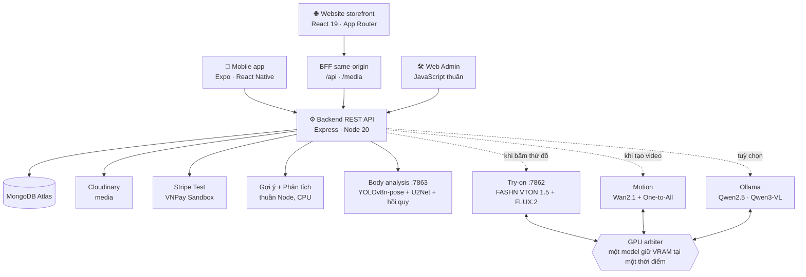
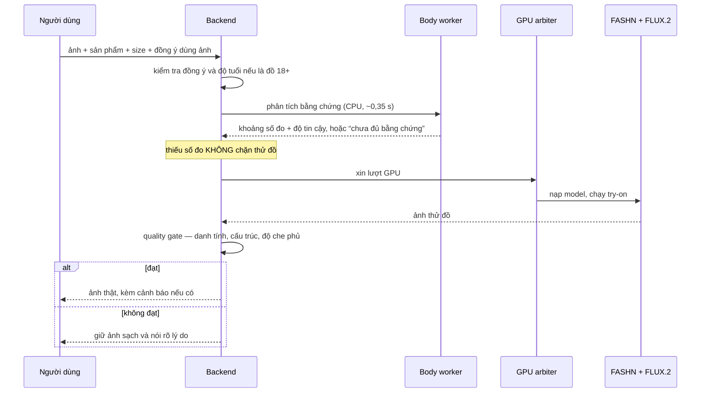

<div align="center">

# JAPANO

**Nền tảng thương mại điện tử thời trang Nhật Bản, có thử đồ AI trên ảnh thật.**

Chọn một sản phẩm, đưa ảnh của bạn vào, và nhận lại bức ảnh do AI sinh ra —
không phải ảnh sản phẩm dán đè lên người. Kèm gợi ý size có bằng chứng, video
chuyển động từ chính kết quả đó, và một chuyến "đi Nhật" ngay trong khung ảnh.

[](https://nodejs.org)
[](https://expo.dev)
[](https://reactnative.dev)
[](https://react.dev)
[](https://expressjs.com)
[](https://pytorch.org)
[](https://typescriptlang.org)

</div>

---

JAPANO gồm **bốn sản phẩm chạy trên cùng một backend**: ứng dụng di động Android,
website storefront, trang quản trị, và một cụm dịch vụ AI chạy trên GPU nội bộ.
Toàn bộ tính năng thương mại — giỏ hàng, voucher, thanh toán, đổi trả, loyalty —
đều hoạt động thật, và mọi con số AI trong tài liệu này đều đến từ một lượt đo
thực tế trên máy, không phải ước lượng.

> [!TIP]
> Coding agent nên đọc [`docs/CODEX_PROJECT_MEMORY.md`](docs/CODEX_PROJECT_MEMORY.md)
> trước khi quét toàn bộ repo — file đó ghi runtime, bằng chứng và việc đang làm dở.

## Mục lục

- [Điểm mạnh](#điểm-mạnh)
- [Kiến trúc](#kiến-trúc)
- [Module](#module)
- [Công nghệ sử dụng](#công-nghệ-sử-dụng)
- [AI trong JAPANO](#ai-trong-japano)
  - [Fine-tune: cái gì thật sự được huấn luyện](#fine-tune-cái-gì-thật-sự-được-huấn-luyện)
  - [Đo cơ thể từ ảnh](#đo-cơ-thể-từ-ảnh)
  - [Gợi ý và phân tích](#gợi-ý-và-phân-tích)
- [Hoạt động thế nào](#hoạt-động-thế-nào)
- [Bắt đầu nhanh](#bắt-đầu-nhanh)
- [Kiểm thử](#kiểm-thử)
- [Giới hạn đã biết](#giới-hạn-đã-biết)
- [Cấu trúc thư mục](#cấu-trúc-thư-mục)

## Điểm mạnh

**Thử đồ là ảnh AI thật, không phải overlay.** Pipeline chạy FASHN VTON 1.5, có
pose transfer bằng FLUX.2 khi ảnh khó, và một quality gate chấm danh tính, cấu
trúc và độ che phủ trước khi trả ảnh. Nếu ảnh sinh ra làm sai cơ thể, backend giữ
ảnh sạch thay vì trả ảnh hỏng.

**Độ vừa vặn điều khiển bức ảnh, không chỉ là dòng chữ cảnh báo.** Chọn size nhỏ
hơn cơ thể thì vải căng, đường may bị kéo, và ở mức rất chật thì trang phục có
thể bục — kích hoạt theo độ chật **đo được**, không theo việc shop còn size hay
không. Đồ bơi, crop top, quần và chân váy **không bao giờ** bục, vì bục ở đó là
làm hở thêm cơ thể.

**Đo cơ thể có trách nhiệm.** Một ảnh không có vật chuẩn thì không thể xác định
chính xác chiều cao hay số đo. Hệ thống trả về **khoảng 10 đơn vị kèm độ tin
cậy**, nói rõ "chưa đủ bằng chứng" khi ảnh bị cắt cụt hoặc mặc đồ quá rộng, và
**số đo người dùng tự nhập luôn thắng ước lượng của AI**.

**Thiếu số đo không chặn thử đồ.** Đo cơ thể và thử đồ là hai khả năng tách biệt.
Một ảnh không đo được vẫn có thể đủ điều kiện tạo ảnh thử đồ, và ngược lại.

**"Đưa tôi đến đây".** Sau khi thử đồ, kết quả được ghép vào ảnh thật của một địa
điểm Nhật Bản. Mỗi cảnh có metadata riêng — điểm đặt chân, vùng đứng được, tỉ lệ
người, hướng sáng — nên người đứng đúng mặt đất chứ không lơ lửng giữa mặt nước.

**Một backend, ba client.** App, website và Admin dùng chung catalog, tài khoản,
đơn hàng, voucher và AI. Không có bản sao dữ liệu nào cho riêng client nào.

**Chạy được khi không có GPU.** Backend, Admin, gợi ý sản phẩm, phân tích và
fallback của chatbot đều chạy trên CPU. Không có GPU thì các nút AI báo lỗi rõ
ràng thay vì trả kết quả giả.

**Nói thật về AI.** Chỗ nào là fine-tune có checkpoint thì nói rõ; chỗ nào chỉ là
tối ưu suy luận hoặc heuristic minh bạch thì cũng nói rõ. Chỉ số nào chưa đo thì
báo `not-measured` thay vì bịa một con số đẹp.

## Kiến trúc



Mỗi dịch vụ AI là một tiến trình riêng và **chỉ chiếm GPU khi được gọi**. Một GPU
arbiter xếp hàng theo màn hình người dùng đang mở, nạp và nhả model tuần tự, nên
16 GB VRAM đủ cho cả try-on ~15 GB lẫn motion ~13,5 GB mà không OOM.

| Dịch vụ | Cổng | Tài nguyên | Bắt buộc |
|---|---|---|---|
| `japano-backend` | 4100 | CPU | ✅ |
| `japano-body-analysis` | 7863 | CPU — cố ý không chiếm VRAM | ❌ có đường lùi |
| `japano-fashn` | 7862 | GPU ~15 GB | ❌ chỉ khi thử đồ |
| `japano-motion` | — | GPU ~13,5 GB | ❌ chỉ khi tạo video |

```bash
./scripts/japano-services.sh on      # bật cả cụm và chờ sẵn sàng
./scripts/japano-services.sh off     # tắt tạm, nhường CPU/GPU cho việc khác
./scripts/japano-services.sh status  # ai đang chạy, ai đang giữ GPU
```

## Module

### 📱 Ứng dụng di động

| Nhóm | Chức năng |
|---|---|
| **Mua sắm** | Catalog, tìm kiếm, lọc/sắp xếp, gallery ảnh–video, wishlist, giỏ đa biến thể, voucher, sổ địa chỉ |
| **Thanh toán** | COD, Stripe Card/Checkout (Test Mode), VNPay Sandbox trong WebView |
| **Hậu mãi** | Timeline đơn, yêu cầu trả từng dòng hàng, theo dõi hoàn tiền |
| **Thử đồ AI** | Tải/chụp ảnh thật, chọn màu–size theo tồn kho, virtual try-on, phụ kiện theo pose, quality gate, video "Ảnh sống" |
| **Đo cơ thể** | Chiều cao, cân nặng, vòng 1/2/3 dạng khoảng kèm độ tin cậy và cảnh báo |
| **Trợ lý Ori** | Botchat nổi + màn chat đầy đủ, grounded vào catalog thật, nhớ nhiều lượt |
| **Stylist** | Màu chủ đạo, hồ sơ phong cách, tư vấn size, gợi ý outfit |
| **Nhật Bản** | 25 địa danh, review cộng đồng, gợi ý trải nghiệm, ghép ảnh "Đưa tôi đến đây" |
| **Mục tiêu** | Quỹ tiết kiệm mua sản phẩm; lộ trình sức khoẻ tách riêng, có guardrail |
| **Loyalty** | VIP theo chi tiêu tháng, Flagcard, voucher cá nhân, thông báo |

Bản phát hành hiện tại: `1.0.19` (`versionCode 20`), package `vn.japano.app`,
targetSdk 34. Cài đè để giữ dữ liệu; **không** gỡ bản cũ trước.

`1.0.19` bỏ ảnh người mẫu thử nhanh khỏi màn TryOn: khách chỉ chụp hoặc tải ảnh
thật từ thư viện. Màn này hiện tồn kho theo từng màu–size, giữ ảnh kết quả khi
ghép tiếp phụ kiện, và tách hiệu ứng chờ thành 5 giây "Đang kiểm tra ảnh" rồi
mới đếm "Thời gian xử lý AI" từ 0. Request GPU không bị huỷ khi app vào nền;
khi quay lại, đồng hồ dùng thời gian thực và kết quả vẫn được nhận bình thường.
Catalog giữ bản server gần nhất, tự tải lại khi app trở thành active và thử lại
mỗi 12 giây khi mất kết nối, nên lỗi mạng lúc mở app không còn làm mất lựa chọn
màu–size vào dữ liệu mẫu đóng gói.

### 🌐 Website storefront

Dự án **độc lập** trong [`web/`](web) — React 19 + App Router, dependency riêng,
không nằm trong npm workspaces và không import một dòng React Native nào. Nó gọi
backend qua một lớp BFF same-origin: trình duyệt chỉ thấy `/api` và `/media`, JWT
nằm trong cookie `HttpOnly` chứ không vào `localStorage`, mutation kiểm tra
`Origin`, và các route quản trị bị chặn ngay ở tầng proxy.

Hàng đợi AI bất đồng bộ (`queued → running → completed/failed/cancelled`) cho
phép thử đồ mất một phút mà không treo request, huỷ được giữa chừng, và **không
hiển thị thanh phần trăm giả**. Hero dùng video thật, tự dừng khi ra khỏi khung
nhìn và rơi về ảnh tĩnh khi bật Data Saver hoặc `prefers-reduced-motion`. Bản đồ
cửa hàng chỉ nhúng khi người dùng bấm mở, để trang mua sắm luôn nhẹ.

Chi tiết: [`web/README.md`](web/README.md).

App và Storefront dùng cùng backend MongoDB, catalog, danh tính người dùng, đơn
hàng, giỏ và wishlist khi đăng nhập bằng cùng email. Cache AsyncStorage/localStorage
chỉ giúp mở nhanh/offline sau khi xác thực và được tách theo từng user. Storefront
không có giỏ/yêu thích khách: chưa đăng nhập chỉ xem, tìm và lọc sản phẩm; giỏ,
yêu thích, thanh toán, tài khoản, Ori và thử đồ AI đều chuyển tới đăng nhập và
BFF từ chối API bảo vệ bằng `401`. Sau đăng nhập, hai client tiếp tục đồng bộ
giỏ/wishlist của tài khoản về backend. Số “Đã bán” trên mọi
thẻ sản phẩm lấy từ đơn thành công thật (loại dữ liệu demo/admin-test), kể cả khi
giá trị là 0 — không chèn đơn giả để làm bảng bán chạy trông dày hơn.

### 🛠️ Web Admin

| Nhóm | Chức năng |
|---|---|
| **Dashboard** | KPI trực tiếp, doanh thu, đơn, tồn kho, khách hàng |
| **Analytics** | Forecast 3 tháng, DemandScore, inventory risk, K-Means, RFM churn, market basket |
| **Model observability** | Trạng thái từng expert gợi ý, graph edges, training pairs, coverage, bot telemetry |
| **Commerce** | Đơn, sản phẩm, biến thể, danh mục, người dùng, giỏ đang hoạt động |
| **Payment** | Tra cứu giao dịch Stripe/VNPay, reconcile, return, refund |
| **Content** | Duyệt review, Japan community, banner, thông báo, voucher |
| **Integrations** | Health của API, media, payment gateway và từng dịch vụ AI |

Phân quyền `customer < staff < admin < super_admin`; endpoint nhạy cảm có
middleware kiểm tra vai trò riêng. Sản phẩm chỉ **ẩn/hiện lại**, không xoá vĩnh
viễn — để đơn hàng và báo cáo cũ không mất tham chiếu.

### ⚙️ Backend

REST API chia theo domain trong [`backend/routes`](backend/routes) — auth,
catalog, orders, returns, reviews, loyalty, payments, stylist, tryon, japanSpots,
push và hàng đợi AI bất đồng bộ. Nguyên tắc xuyên suốt: **giá, voucher, tồn kho
và tổng tiền luôn được tính lại phía server**; client không bao giờ là nguồn sự
thật. Đăng nhập dùng bcrypt + JWT; rate limit chống brute-force chỉ áp cho
endpoint thật sự nhận thông tin đăng nhập, không áp cho kiểm tra phiên.

Kèm theo là dữ liệu hành chính Việt Nam sau sáp nhập: **34 tỉnh/thành và 3.321
phường/xã**, dùng chung cho sổ địa chỉ của app và website.

## Công nghệ sử dụng

<table>
<tr><th align="left">Tầng</th><th align="left">Công nghệ</th></tr>
<tr>
<td><b>Mobile</b></td>
<td>Expo SDK 51 · React Native 0.74 · React 18 · Expo Router · SecureStore · expo-notifications · Stripe React Native · Google Sign-In</td>
</tr>
<tr>
<td><b>Website</b></td>
<td>React 19 · App Router (vinext) · TypeScript strict · TanStack Query · Zod · React Hook Form · Motion for React · GSAP · View Transitions · Tailwind 4 · Vitest · Playwright · Cloudflare Workers</td>
</tr>
<tr>
<td><b>Backend</b></td>
<td>Node 20 · Express 4 · MongoDB Atlas · Cloudinary · JWT + bcrypt · Helmet · express-rate-limit · Pino · Stripe · Nodemailer · Sentry</td>
</tr>
<tr>
<td><b>AI runtime</b></td>
<td>PyTorch + CUDA · FASHN VTON 1.5 · FLUX.2 Klein 4B · Wan2.1-T2V-1.3B · One-to-All Animation · YOLOv8n-pose · U2Net · ONNX Runtime · scikit-learn · Ollama (Qwen2.5, Qwen3-VL)</td>
</tr>
<tr>
<td><b>Admin</b></td>
<td>HTML · CSS · JavaScript thuần, không build step</td>
</tr>
<tr>
<td><b>Vận hành</b></td>
<td>systemd user services · Tailscale · Playwright · Lighthouse</td>
</tr>
</table>

## AI trong JAPANO

Năm nhóm model, mỗi nhóm giải một bài toán khác hẳn nhau. Không model nào kiêm
việc của model khác.

**Nhóm 1 — Nhìn ảnh, hiểu người trong ảnh.** Luôn chạy, CPU.

| Model | Vai trò |
|---|---|
| YOLOv8n-pose | 17 khớp cơ thể, chọn chủ thể chính khi ảnh có nhiều người |
| U2Net | Tách nền, lấy silhouette |

Ảnh nhiều người: **chỉ một người được thay đồ** — người to nhất và gần ống kính
nhất, chấm bằng diện tích, chiều cao khung, vị trí và độ tin cậy.

**Nhóm 2 — Từ hình học ra số đo.** Luôn chạy, CPU, **huấn luyện trong repo này**.

| Artifact | Vai trò | Train trên |
|---|---|---|
| `body_geometry.calibration.json` | Cắt hai cánh tay khỏi thân, trần/sàn giải phẫu | VITON-HD + cực trị ANSUR II |
| `body_bmi_estimator.joblib` | Tỉ lệ bề ngang → BMI, không cần thang cm | ANSUR II |
| `body_weight_estimator.joblib` | Chiều cao + bề ngang + độ rộng quần áo → cân nặng | ANSUR II |
| `body_girth_estimators.joblib` | Bề ngang → vòng ngực/eo/hông | ANSUR II |
| `bodym_population_calibration.json` | Kéo đầu ra về dân số chung | BodyM |

**Nhóm 3 — Sinh ảnh thử đồ.** GPU, chỉ khi người dùng bấm thử.

| Model | Vai trò | Trạng thái |
|---|---|---|
| FASHN VTON 1.5 | Engine try-on chính | Inference |
| FLUX.2 Klein 4B | Pose transfer khi ảnh khó, tinh chỉnh phụ kiện, ghép bikini hai mảnh đa tham chiếu | Inference |
| **LoRA rank 8 trên FLUX.2** | Mô phỏng chật/vừa/rộng theo size | **Fine-tune trong dự án này** |

**Nhóm 4 — Sinh video chuyển động.** GPU, tuỳ chọn.

| Model | Vai trò |
|---|---|
| Wan2.1-T2V-1.3B + One-to-All `1.3b_2` | Video từ ảnh đã thử đồ, CUDA-only |
| YOLOv10m + ViTPose (ONNX) | Pose control và kiểm tra action cho motion |

**Nhóm 5 — Ngôn ngữ.** Tuỳ chọn, qua Ollama. `qwen2.5:7b` viết lại câu trả lời đã
grounded và duyệt review; `qwen3-vl:8b` đọc ảnh sản phẩm sinh mô tả. Khi Ollama
tắt hoặc GPU bận, mọi tính năng vẫn chạy bằng đường lùi cục bộ — LLM chỉ được
phép **viết lại** bản nháp đã grounded, không được bịa tồn kho, giá hay sự thật
về cơ thể.

### Fine-tune: cái gì thật sự được huấn luyện

> [!IMPORTANT]
> Trong dự án này, "fine-tune" chỉ được dùng khi có đủ: dữ liệu có license rõ,
> optimizer thật sự cập nhật trọng số, checkpoint tải lại được kèm hash, và đánh
> giá trên tập tách theo danh tính. Mọi thứ khác gọi đúng tên của nó.

**✅ Đã fine-tune — LoRA cho bước fit-refinement**

| Mục | Giá trị |
|---|---|
| Base model | FLUX.2 Klein 4B (img2img) |
| Adapter | LoRA rank 8, alpha 8 |
| Dữ liệu | VITON-HD — 116 mẫu, 21 danh tính, 7 lớp `good` → `very_loose` |
| Chia dữ liệu | **Theo danh tính**: train 81 mẫu/15 người · validation 18/3 · test 17/3 |
| Cấu hình | 512 px, BF16, batch 1, grad-accum 4, Adam 8-bit, LR `1e-4`, 600 bước, seed 17 |
| Tài nguyên đo được | 80,3 phút · peak VRAM 15,2 GB |
| Checkpoint được chấp nhận offline | `checkpoint-400`, hash `a1643dda4cdb1f3c-16731128`; runtime mặc định không nạp |

Checkpoint 500 và 600 **bị acceptance gate loại** vì artifact — mốc cuối không
mặc nhiên là mốc tốt nhất. Benchmark validation (8 mẫu / 2 danh tính):

| Chỉ số | Baseline | LoRA ckpt-400 |
|---|---:|---:|
| Pass rate | 100% | 100% |
| Failure / artifact | 0% / 0% | 0% / 0% |
| Body drift ↓ | 0,1148 | **0,1145** |
| Fit structure change ↑ | 16,7195 | **19,0849** |
| Color shift ↓ | 6,6574 | 8,4305 |
| Latency P50 | 13,43 s | 14,54 s |

Đây là **proxy từ quality gate, không phải điểm người chấm**. Adapter chỉ áp cho
`tops` — đúng miền dữ liệu upper-body — và **mặc định tắt**, bật bằng
`JAPANO_FIT_LORA_PATH`. Trạng thái luôn đọc từ
[`fit_lora.status.json`](backend/ai_training/models/fit_lora.status.json), không
chép từ tài liệu. Quy trình tái tạo dataset, train và benchmark nằm trong
[`backend/ai_training/README.md`](backend/ai_training/README.md).

QA runtime ngày 05/09/2026 với 10 bộ bổ sung × 5 ảnh full-body đã được AI
outpaint: 49/50 request trả ảnh, một ca fail-closed; tuy nhiên review nghiêm ngặt
chỉ ra 0/50 ảnh giữ đúng đồng thời loại, kết cấu và phom garment. Có 35/50 ảnh
giữ được màu/họa tiết nhưng sai dáng, 14/50 không còn nhận ra đúng garment và 1
lỗi kỹ thuật. Đây là giới hạn chất lượng hiện tại, không được diễn giải 49/50
thành tỷ lệ thành công thị giác. Chi tiết và contact sheet nằm tại
[`test-results/tryon/2026-09-05/10-more-outfits-x-5-full-body-ai-20260905-050239/`](test-results/tryon/2026-09-05/10-more-outfits-x-5-full-body-ai-20260905-050239/).

Test bổ sung lúc 06:43 ngày 05/09: Yukata xanh chàm + Haori Seigaiha × 5 mẫu
trả 10/10 ảnh 960×1280, trung bình 33,16 giây (fast, size M, không profile/số đo).
Yukata vẫn sai phom ở 5/5 ảnh; Haori có 3/5 ảnh đóng vạt thành sơ mi.
Xem [bảng ảnh và review](test-results/tryon/2026-09-05/2-outfits-x-5-people-064308/REVIEW.md); tỷ lệ API không phải tỷ lệ đạt thị giác.

Cùng ngày, test riêng `bikini-hoa-anh-dao` trên 5 ảnh đó đạt 5/5 API và 5/5
giữ đúng thiết kế hai mảnh/họa tiết, nhưng không giữ nghiêm ngặt pose ban đầu.
P50 là 36,72 giây; cold-start đầu tiên 88,19 giây, bốn lượt sau trung bình 35,99
giây. Bikini chậm vì có cổng Qwen3-VL kiểm tra ảnh người lớn trước, rồi chạy một
lượt FLUX.2 đa tham chiếu low-memory cho cả áo và quần; arbiter nhả model khi về
focus `browse`, nên lần sau phải nạp lại. Xem
[`REVIEW.md`](test-results/tryon/2026-09-05/bikini-1-outfit-x-5-full-body-ai-20260905054341/REVIEW.md).

**❌ Không fine-tune, và nói rõ vì sao**

| Thành phần | Trạng thái thật |
|---|---|
| FASHN VTON 1.5 | Repo cục bộ chỉ có mã inference — **không khả thi** để fine-tune |
| Motion (Wan2.1 / One-to-All) | **Tối ưu suy luận**, không có checkpoint mới |
| Chatbot, wellness coaching | Không có checkpoint; grounding và safety rules chạy cục bộ |
| Gợi ý, phân tích | Implementation JS chạy online, không phải checkpoint pretrained |

> [!WARNING]
> VITON-HD (`CC-BY-NC-SA-4.0`) và BodyM (`CC-BY-NC-4.0`) đều **phi thương mại**.
> Mọi checkpoint và hằng số hiệu chuẩn phái sinh thừa hưởng ràng buộc đó — phù
> hợp nghiên cứu và đồ án, không phải asset thương mại. Phần suy từ ANSUR II
> (`CC0-1.0`) thì không bị ràng buộc.

Khảo sát dữ liệu ngày 01/09/2026 được khóa trong
[`tryon_sources.manifest.json`](backend/ai_training/provenance/tryon_sources.manifest.json)
và kiểm tra bằng `python3 backend/ai_training/audit_tryon_sources.py`. Kết luận:

- VITON-HD 5,2 GB đã có đủ 11.647 cặp train / 2.032 cặp test, nhưng chỉ phù hợp
  nghiên cứu upper-body trong studio.
- StreetTryOn là ứng viên tốt nhất để đo ảnh ngoài đời, nhưng cần quyền truy cập
  DeepFashion2 chính thức và vẫn cấm thương mại.
- Dress Code đủ tops/bottoms/dresses nhưng cần biểu mẫu có chữ ký và email tổ chức.
- FIT-VTO 100K có nhãn số đo/fit tốt, nhưng giấy phép `CC-BY-NC-ND-4.0`; chưa có
  chấp thuận bằng văn bản thì không dùng nó để sinh adapter phái sinh.
- Không tải lại mirror Kaggle hoặc train thêm trên cùng 116 target tổng hợp chỉ
  để tăng số bước: việc đó không bổ sung pose, danh mục hay ground truth thật.

### Đo cơ thể từ ảnh

Bộ hồi quy được **train lại** trên ANSUR II với đặc trưng giống điều kiện ảnh
thật, thay vì đặc trưng đo bằng thước. Đánh đổi có chủ đích: kém hơn ở phòng thí
nghiệm, **tốt hơn khoảng 4 lần** ở điều kiện chạy thật.

Sai số end-to-end ảnh → số đo, đo trên **BodyM testB, 400 người**:

| Đại lượng | Trước | Sau | Bias trước → sau |
|---|---:|---:|---|
| Chiều cao | 20,01 cm | **6,44 cm** | +16,57 → **−1,94** |
| Cân nặng | 15,99 kg | **9,00 kg** | +0,74 → −2,1 |
| Vòng ngực | 12,91 cm | **6,11 cm** | −2,17 → −1,0 |
| Vòng eo | 9,96 cm | **6,50 cm** | +5,26 → −1,5 |
| Vòng hông | 12,24 cm | **5,57 cm** | +6,19 → −1,3 |

Độ trễ `/api/stylist/body-analysis`: **0,35 s** P50 — model được giữ thường trú
trong một worker thay vì nạp lại mỗi request, thay cho ~4,1 s trước đó.

Đầu ra luôn là **khoảng 10 đơn vị kèm độ tin cậy**, và pipeline có một cổng tỉnh
táo chạy trên chính đầu ra: số nào bất khả thi về giải phẫu thì bị bỏ kèm lý do,
thay vì trả một con số sai với vẻ tự tin.

### Gợi ý và phân tích

Toàn bộ chạy **thuần Node trên CPU**, không cần GPU:

| Thành phần | Implementation |
|---|---|
| Selective SSM | State 12 chiều, gate theo event, tối đa 64 hành vi/user — *Mamba-inspired* |
| Graph propagation | Hai lớp trên quan hệ user–item — *LightGCN-style* |
| Next-item | Phân phối Markov bậc một theo session, gap tối đa 72 giờ |
| Ranker cuối | Pairwise logistic SGD, đánh giá chronological leave-last-positive-out |
| Adaptive MoE | Đổi trọng số expert theo độ dài lịch sử |
| Retrieval | Matrix factorization, item-CF cosine, content tag/price/style, market basket |
| Bot memory | Ma trận outer-product tối đa 12 lượt — *mLSTM-style* |
| Dự báo doanh thu | OLS + Holt double exponential + WMA, blend theo inverse MAE |
| Phân khúc & churn | K-Means `k ≤ 3` chuẩn hoá z-score; RFM heuristic minh bạch |

> [!NOTE]
> Không có họ model nào mặc nhiên "mạnh hơn Transformer" cho mọi bài toán. Các
> khối trên là implementation nhỏ *inspired/style*, **không phải** checkpoint
> Mamba, LightGCN hay xLSTM chính thức. Offline ranking evaluation chưa triển
> khai: `NDCG@10` và `Recall@10` được báo `not-measured`, không có accuracy giả.

Feedback âm cũng được học: bỏ giỏ và bỏ yêu thích lưu thành tín hiệu âm, và
impression do chính bot hiển thị **không** được tính là sở thích dương — giảm
vòng lặp tự khen.

## Hoạt động thế nào

### Luồng thử đồ



App hiện dùng profile preview `fast` (16 bước, cạnh dài 1280) và khởi động làm
nóng GPU song song với bước phân tích cơ thể trên CPU. Smoke API thật cho một
món đồ, model đã sẵn sàng và không dùng cache hoàn tất trong **22,835 giây** trên
RTX 5060 Ti 16 GB. Ma trận sáu loại trang phục ở profile này đạt 6/6, trong
**22–41,6 giây**, trung bình **28,37 giây**. Trang phục nhiều lớp, dáng khó hoặc
hiệu ứng chật/rộng mạnh vẫn có thể lâu hơn. Bikini hai mảnh qua FLUX.2 đa tham
chiếu từng đo **58,1 giây** khi cache 18+ đã ấm và khoảng **73 giây** khi cache
nguội. Video chuyển động: walk khoảng **58 giây** trực tiếp / **65 giây** qua
backend, turn khoảng **71 giây**, pose khoảng **66 giây**.

Coverage gate coi cổ áo rộng/chữ V, bóng da và vải màu da là tín hiệu cần cảnh
báo thay vì tự động huỷ một ảnh bình thường. Ảnh lộ gần như toàn bộ lõi vùng
nhạy cảm vẫn bị chặn; đồng ý sử dụng ảnh và kiểm tra người trưởng thành cho đồ
18+ vẫn được giữ nguyên.

### Luồng "Đưa tôi đến đây"

Chọn địa điểm → sản phẩm phù hợp hiện ngay bên dưới → thử đồ → ghép kết quả vào
ảnh thật của địa điểm.

Storefront và app dùng cùng hợp đồng backend: mỗi scene trả 4 dáng AI, một dáng
đề xuất theo loại địa điểm và danh sách vị trí đứng đã duyệt. Client gửi
`travelPoseId` vào `/api/tryon` và `slotId` vào `/api/japan-spots/scene-photo`.
Backend kiểm tra footprint thật của chân/vạt áo sau resize; một điểm tiếp xúc
nằm ngoài `groundPolygon` là từ chối ảnh thay vì đặt người trên nước/không trung.
Hiện 36/36 scene của đủ 35/35 địa điểm hiển thị qua validator, với 38 vị trí
đứng đã duyệt. Ma trận dùng ảnh thử đồ thật đạt 38/38 lượt `groundSafe:true`;
ma trận payload cũ đi đúng đường Tailscale của OPPO đạt 35/35 HTTP 200. Scene
chưa curate vẫn bị chặn fail-closed, nhưng không còn địa điểm nào trong app rơi
vào nhánh đó. Arashiyama, Itsukushima và Ginzan là các regression 422 đã được
khóa bằng test phủ toàn bộ catalog.

Gợi ý sản phẩm chấm điểm bằng quy tắc trên metadata thật của catalog — phong
cách, mùa, màu, loại đồ, size còn hàng — **không gọi LLM**, đo được **8 ms** khi
tính mới và **25 ms** khi trúng cache. Đền chùa không bao giờ gợi ý đồ bơi; địa
điểm biển chỉ gợi ý khi lượt đó đã qua cổng 18+.

Việc ghép dùng segmentation chứ **không dùng model sinh ảnh**, nên khuôn mặt và
cơ thể sống sót nguyên vẹn từng pixel — **912 ms** cho ảnh dựng sẵn và
**1 195 ms** cho ảnh vừa thử đồ xong. Nếu bước ghép cảnh lỗi, ảnh thử đồ vẫn
được giữ để thử lại riêng bước đó.

Mỗi ảnh nền có metadata riêng và khung ảnh được cắt **bám theo điểm đặt chân**,
không cắt giữa. Một ảnh đẹp, license rõ, độ phân giải cao vẫn có thể bị loại nếu
người không thể đứng được trong đó — ảnh Naoshima cũ chụp từ ngoài biển từng làm
model đứng giữa mặt nước, và đó là lý do lớp metadata này tồn tại.

A/B cùng người, Yukata và dáng nghiêng 3/4 ngày 01/09/2026: `balanced` 20 bước
54,83 giây và `high` 25 bước 54,57 giây, cả hai qua coverage gate và không có
quality warning. Hai ảnh gần như tương đương (`SSIM 0,992`, sai khác trung bình
0,74/255); tăng step không được coi là cải thiện độ chân thật khi chưa có khác
biệt nhìn thấy. App vì vậy dùng profile `fast` đã được đo riêng; Storefront có
thể chọn profile theo ngữ cảnh hiển thị.

Sau một lượt cần FLUX để mô phỏng chật/rộng, backend trả ảnh ngay khi quality
gate hoàn tất rồi mới làm nóng lại FASHN ở nền. Việc nạp model cho lượt kế tiếp
không còn nằm trong thời gian chờ của request hiện tại; số bước, ảnh đầu ra và
các cổng chất lượng không thay đổi.

Đo trực tiếp trên Redmi Note 8 Pro ngày 03/09/2026: ca cũ lệch fit nhẹ
`severity=0,39` đã mất 65,544 giây ở backend và 117–161 giây trên UI vì chờ phân
tích cơ thể rồi chạy thêm một lượt FLUX. Chế độ `fast` hiện chờ phân tích tối đa
4,5 giây và luôn dùng một lượt VTON; chỉ chạy fit-effect khi client yêu cầu rõ
`fitEffect: true`. Lượt thật mới nhất từ ảnh thư viện đạt HTTP 200 trong 23,576
giây; FASHN và quality/safety gate vẫn chạy. Một phép đo trước đó đạt 19,918
giây. Android ghi nhận app chuyển qua Home, Cài đặt và Camera trong lúc request
chạy mà không có `GPU_JOB_CANCELLED`.

Warm-up tối 04/09/2026 chạy đúng 70 request thật (5 preset × 14 trang phục,
`fast`, size M): 67 ảnh vượt quality gate, 3 ảnh bị từ chối vì thay đổi/che mặt,
0 cache hit và 0 job bị huỷ. Thời gian trung bình 21,56 giây/request, khoảng
19,86–37,76 giây; GPU đạt đỉnh 100% ở cả 70 lượt và VRAM cao nhất 4.962 MiB.
Sau khi trả ảnh cuối, hàng đợi rỗng và GPU trở về 0%; model FASHN vẫn warm cho
lượt kế tiếp, còn arbiter sẽ nhả nó khi chuyển sang Motion. Đây là kiểm tra
runtime có ảnh trả về, chưa phải đánh giá trực quan chất lượng toàn bộ 67 ảnh.

Ma trận Khám phá Nhật Bản tối 04/09/2026 chạy 10 địa điểm × 5 preset theo đúng
mặc định app (giữ pose, sản phẩm/size gợi ý đầu tiên, scene/slot đầu tiên):
48/50 ảnh 1024×1536 ghép thành công và đều `groundSafe:true`; hai lượt Otaru bị
coverage gate chặn trước khi ghép. Có 22 inference mới (trung bình 21,76 giây)
và 28 cache hit khi nhiều địa điểm dùng cùng outfit; bước ghép cảnh trung bình
0,46 giây. Visual review xác nhận hình thể năm preset được giữ nhưng còn ba gap:
người mẫu đi chân trần/ánh sáng chưa hòa nền, áo happi `khoac-nhat` mất cấu trúc
mở vạt, và hồ sơ 155 cm/115 kg bị recommender rơi về S khi 4XL không có thay vì
chọn size khả dụng gần nhất XXL. Ba điểm này chưa được sửa trong lượt kiểm thử.

Ma trận ngày 05/09/2026 chạy 15 trang phục × 5 ảnh kiểm thử qua API thật ở
profile `fast`: 74/75 ảnh 960×1280 hợp lệ; một ca Sơ mi trắng với ảnh very-slim
bị fail-closed lặp lại ở lần retry, không trả overlay giả. P50 là 22,6 giây,
P95 40,3 giây và trung bình 28,0 giây. Bốn output pass sau đó được ghép với 10
scene: 40/40 request trả JPEG 1024×1536, `groundSafe:true`, trung bình 0,51
giây. Tuy nhiên visual review chỉ 10/40 ảnh cảnh đạt tự nhiên vì chỉ nguồn
Cardigan có toàn thân; ba nguồn còn lại đã cắt chân nên vẫn trông cụt/lơ lửng
dù validator hình học đạt. Kết quả này xác nhận scene cần thêm cổng kiểm tra độ
phủ chân, không được coi HTTP 200 hoặc `groundSafe` là đủ cho chất lượng nhìn.

Motion local cũng đã được kiểm tra trực tiếp trên Redmi: worker One-to-All sẵn
sàng, request hoàn tất trong 70,186 giây và hai khung hình cách nhau hai giây
khác nhau, xác nhận video thật sự phát. Đây vẫn là profile chất lượng, chưa phải
luồng nhanh như ảnh thử đồ.

### Luồng mua hàng

Storefront yêu cầu đăng nhập trước khi thêm giỏ hoặc yêu thích; giỏ thuộc tài
khoản và đồng bộ với app qua backend. Ở bước đặt hàng, toàn bộ giá, mã ưu đãi,
tồn kho và tổng tiền được tính lại từ dữ liệu server. Đơn COD
xác nhận ngay; Stripe và VNPay chỉ báo thành công **sau** callback thật từ cổng
thanh toán.

Mỗi đơn đã nhận hàng tạo một lượt đánh giá cho từng sản phẩm. Khách mua lại sản
phẩm trong một đơn khác đã hoàn tất sẽ được đánh giá tiếp; cùng một sản phẩm
trong cùng một đơn chỉ gửi được một đánh giá.

### Loyalty

Chi tiêu hợp lệ đạt `5.000.000₫`/tháng mở VIP 30 ngày, giảm 10% cho một đơn vị
sản phẩm tự chọn mỗi đơn. Mỗi đơn từ `5.000.000₫` nhận một Flagcard; đủ 7 thẻ đổi
được voucher cá nhân giảm 50%, dùng một lần, hiệu lực 90 ngày.

### Mục tiêu mua sắm và lộ trình sức khoẻ

**Quỹ mục tiêu là sổ theo dõi, không phải ví.** JAPANO không giữ tiền và không
xác minh số dư của bạn. Ghi nhận đủ 100% chỉ đánh dấu cột mốc tiến độ — **không
phát mã giảm giá**. Mục tiêu chỉ được coi là hoàn thành trọn vẹn khi bạn thực
sự mua được đúng sản phẩm đó bằng một đơn thành công.

Mã ưu đãi mục tiêu đã cấp trước đây vẫn dùng được, nhưng **chỉ giảm đúng sản
phẩm mục tiêu, tối đa một sản phẩm** — không giảm các món khác trong giỏ.

**Lộ trình sức khoẻ** yêu cầu 4 câu sàng lọc an toàn (mang thai/hậu sản, bệnh
nền hoặc thuốc ảnh hưởng cân nặng, tiền sử rối loạn ăn uống, đang được điều
trị). Bất kỳ câu nào là "Có" hoặc "Không muốn nói" — hoặc chưa trả lời đủ — thì
hệ thống chỉ đưa hướng dẫn chung, không tạo tốc độ giảm cân hay mốc thời gian.
Mọi số đo là **do bạn tự khai, không phải xác minh y tế**; hệ thống chỉ lưu kết
luận tổng hợp, không lưu chi tiết bệnh lý. Mục tiêu sức khoẻ không có quỹ,
không có voucher và không lưu dữ liệu thu nhập/tiết kiệm.

### Vòng đời voucher

Voucher **không bị trừ lượt ngay khi đặt hàng**. Vòng đời:

| Trạng thái | Khi nào | `voucher.used` |
|---|---|---|
| `reserved` | vừa tạo đơn | chưa tăng |
| `consumed` | tiền đã thực sự về (COD nhận hàng, hoặc callback Stripe/VNPay báo `paid`) | +1, đúng một lần |
| `released` | huỷ đơn, thanh toán thất bại/hết hạn | giữ nguyên, mã dùng lại được |

Thanh toán thất bại hay huỷ đơn **không làm bạn mất lượt dùng mã**. Trả lại
toàn bộ đơn đã thanh toán thì mã được **cấp lại** dưới dạng một mã thay thế
(hạn ít nhất 30 ngày) — nhưng chỉ sau khi tiền đã hoàn thành công. Trả một phần
thì không cấp lại, và số hoàn chỉ tính trên đúng phần bạn thực trả.

Rà soát sổ đổi mã (mặc định **chỉ đọc**, không ghi gì):

```bash
node backend/scripts/auditVoucherRedemptions.js            # dry-run
node backend/scripts/auditVoucherRedemptions.js --apply    # chỉ chạy khi đã xem báo cáo
```

## Bắt đầu nhanh

**Yêu cầu:** Node.js ≥ 20 · JDK 17 nếu build Android · Python riêng cho từng
repo model AI · GPU NVIDIA ~16 GB VRAM nếu muốn chạy thử đồ và motion.

```bash
# 1. Backend + mobile (npm workspaces)
npm ci
cp .env.example .env.server        # điền MONGODB_URI, JWT_SECRET, Cloudinary…

# 2. Backend + Web Admin
npm run backend                    # API :4100 · Admin tại /admin/

# 3. Ứng dụng di động
adb reverse tcp:4100 tcp:4100
npm --workspace mobile run android

# 4. Website (cây dependency riêng — KHÔNG cài từ thư mục gốc)
npm --prefix web install
npm --prefix web run dev           # http://localhost:4200
```

### MongoDB Compass dùng khi thuyết trình

Backend và ứng dụng **luôn dùng MongoDB Atlas** theo `MONGODB_URI` trong
`.env.server`. MongoDB cục bộ chỉ là bản trình bày đã che dữ liệu nhạy cảm, có
đúng **19 collection trùng với 19 bảng trên `JAPANO_ERD.drawio`**.

```bash
docker start japano-mongodb-compass
node scripts/sync_compass_presentation_erd19.js          # dry-run, không ghi
node scripts/sync_compass_presentation_erd19.js --apply  # chỉ tạo khi DB đích còn trống
```

Trong MongoDB Compass, kết nối `mongodb://127.0.0.1:27017` và mở database
`japano_presentation_19`. Không đổi `MONGODB_URI` của backend sang địa chỉ này.
Tập lệnh từ chối đích không phải localhost, từ chối ghi đè database đã có dữ
liệu, và che email, số điện thoại, địa chỉ, mật khẩu băm, số đo cùng mã giao dịch.

Dịch vụ AI là tuỳ chọn và bật riêng:

```bash
./scripts/japano-services.sh on
ollama pull qwen2.5:7b && ollama pull qwen3-vl:8b   # tuỳ chọn
```

Build APK release cần JDK 17 — JDK 21 trên máy phát triển thiếu `jlink` và Gradle
sẽ dừng ở `androidJdkImage`:

```bash
cd mobile/android
JAVA_HOME=/usr/lib/jvm/java-17-openjdk-amd64 ./gradlew assembleRelease
```

Toàn bộ biến môi trường tham khảo nằm trong [`.env.example`](.env.example).

## Kiểm thử

```bash
npm run check                      # backend tests + mobile typecheck + python tests
npm --workspace backend test       # 434 test (2026-09-04)
npm --workspace mobile run typecheck
python3 -m unittest discover -s backend/test/python -v

npm --prefix web run typecheck
npm --prefix web run test
npm --prefix web run e2e           # 2 project thiết bị: 390 px và 1440 px
```

Bộ e2e của website fail nếu có console error, ảnh vỡ, tràn ngang, hoặc bất kỳ
nút nào nhỏ hơn 44×44 — trên cả 360 px và 390 px. Smoke AI thật chạy riêng
(`JAPANO_E2E_REAL_AI=1`) và **bắt buộc nhận được ảnh/video mở được**; HTTP 200
không được tính là đạt.

Bằng chứng đo đạc theo ngày nằm trong
[`docs/project_evidence/`](docs/project_evidence): phần cứng, tham số, thời gian,
cổng chất lượng và cả những phương án đã bị loại.

## Giới hạn đã biết

- **Đây là demo/nghiên cứu, chưa phải sản phẩm thương mại.**
- **Một ảnh không có vật chuẩn không thể cho số đo tuyệt đối chính xác.** Sai số
  end-to-end ở trên là sai số thật — hãy đọc nó như một khoảng, đúng như cách API
  trả về.
- **Checkpoint fit-refine phi thương mại.** VITON-HD và BodyM ràng buộc
  non-commercial; phù hợp nghiên cứu và đồ án.
- **LoRA fit chỉ phủ `tops`** và mặc định tắt. Danh mục khác dùng pipeline gốc và
  quality gate.
- **Motion là CUDA-only**, không có đường lùi CPU.
- **Offline ranking evaluation chưa triển khai** — `NDCG@10`/`Recall@10` báo
  `not-measured`.
- **Thanh toán đang ở chế độ test** (Stripe Test Mode, VNPay Sandbox).
- **Website chưa deploy công khai.** Build và `wrangler deploy --dry-run` chạy
  được, nhưng backend hiện chỉ truy cập được trong mạng nội bộ Tailscale.
- **Google Sign-In trên web chưa từng đăng nhập thật** — thiếu client ID cho web;
  cấu hình chạy được không phải bằng chứng đăng nhập thành công.
- **Full E2E của website trên workerd còn cảnh báo hydration** ở một vài trang
  client sau điều hướng; đang được theo dõi.
- Repo không có một `requirements.txt` chung cho toàn bộ AI stack — FASHN,
  FLUX.2 và One-to-All phải được chuẩn bị trong environment gốc của chúng.

## Cấu trúc thư mục

```
japano/
├── mobile/              # Ứng dụng Expo · React Native
├── web/                 # Website storefront — dự án độc lập, React 19
├── backend/
│   ├── routes/          # REST API chia theo domain
│   ├── lib/             # Business rules, quality gate, GPU arbiter
│   ├── ai_training/     # Dataset, train, benchmark — tách khỏi mã chạy thật
│   └── *.py             # Worker AI: body analysis, try-on, motion, scene compose
├── admin/               # Web Admin, JavaScript thuần
├── docs/                # Kiến trúc, bằng chứng đo đạc, tài liệu kỹ thuật
└── scripts/             # Vận hành, đồng bộ dữ liệu, kiểm tra
```

---

<div align="center">

**Thiết kế tại Việt Nam · Cảm hứng Nhật Bản**

Đồ án tốt nghiệp. Dataset huấn luyện phi thương mại — xem
[Giới hạn đã biết](#giới-hạn-đã-biết) và
[`THIRD_PARTY_NOTICES.md`](THIRD_PARTY_NOTICES.md) trước khi dùng lại.

</div>

### Benchmark 20 ca thử đồ trên PC — 05/09/2026

4 trang phục × 5 mẫu, fast/M, không profile/số đo: 19/20 trả ảnh 960×1280;
1 ca sơ mi bị quality gate chặn sau hai lần sinh nội bộ. Trung bình 37,61 giây/ca,
P50 37,435 giây, toàn batch 12 phút 35 giây; hai lượt đầu 65,99/81,39 giây.
Sơ mi giữ đặc điểm chính tốt hơn trong bộ mẫu này; Yukata/Haori vẫn sai phom,
cardigan có ca rút ngắn hoặc thay đổi cả quần. Đây là tỷ lệ trả ảnh, không phải
tỷ lệ đúng trang phục. Xem [review và gallery](test-results/tryon/2026-09-05/4-outfits-x-5-people-091037/REVIEW.md).

### Chạy Storefront trực tiếp trên PC

Khi backend đang chạy ở cổng 4100, dùng
`JAPANO_API_ORIGIN=http://127.0.0.1:4100 npm --prefix web run dev`
để Storefront gọi backend nội bộ. Mở <http://localhost:4200> và
Web Admin tại <http://localhost:4100/admin/>. Không cần Tailscale cho hai địa chỉ này.

### Ori: giới hạn thời gian chờ phản hồi

Ori dùng chung ngân sách chờ AI cho nhận diện ý định và diễn đạt câu trả lời:
`JAPANO_CHAT_BUDGET_MS=8000` mặc định (tối đa 12000 ms), bước nhận diện tối đa
3000 ms. Khi AI chậm/lỗi, Ori trả bản nháp đã truy hồi từ catalog; giới hạn
áp dụng cả khi đọc nội dung JSON. Lỗi xử lý trả thông báo để gửi lại, lỗi lưu
lịch sử không làm mất câu trả lời đã tạo. Web tự cuộn tới tin mới.
Kiểm chứng ngày 05/09: backend 441 test đạt; 6 câu trên web đăng nhập thật
trả trong 97–853 ms, kiểm tra phục hồi sau HTTP 503 đạt. Chưa xác nhận thao tác
chat trên Redmi trong lượt này vì thiết bị đang thử đồ.
