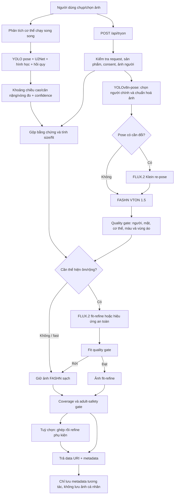
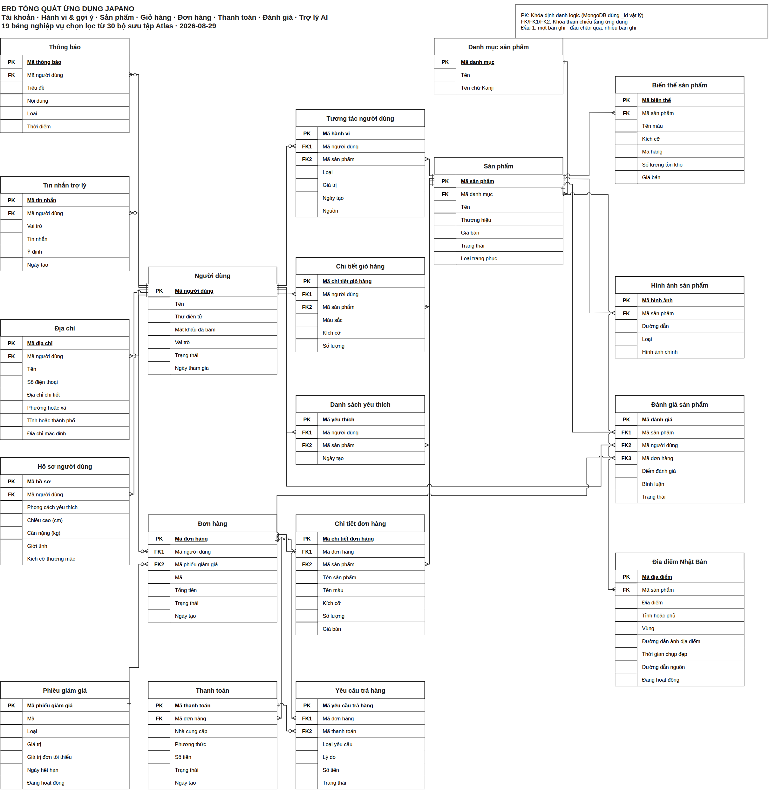

# README — Luồng tạo một ảnh thử đồ trong JAPANO

> Phạm vi kiểm tra: source và artifact đang có trong máy ngày **2026-09-05**.  
> Mục tiêu: dùng để ôn bài, bảo vệ đồ án và phân biệt phần nào là AI thật, phần nào là quy tắc, phần nào mới chỉ là nghiên cứu.

## 1. Trả lời ngắn gọn trước

Một lượt thử đồ của JAPANO không phải là một model duy nhất. Nó ghép ba bài toán khác nhau:

1. **Phân tích người và ước lượng vóc dáng:** YOLOv8n-pose + U2Net + hình học cơ thể + các model hồi quy scikit-learn.
2. **Suy luận size/độ vừa:** bảng size và thuật toán luật trong Node.js; số đo người nhập luôn được ưu tiên.
3. **Sinh ảnh thử đồ:** FASHN VTON 1.5 là model chính; FLUX.2 Klein 4B chỉ hỗ trợ đổi pose, tăng độ trung thành, sửa độ ôm/rủ hoặc gắn phụ kiện trong những trường hợp cần thiết.

Điểm phải nói thật khi bảo vệ:

- **Một ảnh 2D mặc quần áo không thể cho biết chính xác chiều cao, cân nặng và vòng 1/2/3.** Hệ thống chỉ ước lượng khoảng giá trị từ tỷ lệ pixel, silhouette, keypoint và prior nhân trắc.
- Ảnh không có vật chuẩn thì không có tỷ lệ `pixel/cm`. Chiều cao phải dựa một phần vào kích thước đầu và prior dân số; cân nặng còn phụ thuộc vào chiều cao ước lượng nên sai số cộng dồn.
- “Vòng 1” trong model gần với **chest circumference** hơn là phép đo ngực chuyên dụng; không có vòng dưới ngực và không thể suy ra cup size.
- Vòng đo từ ảnh là biên ngoài của **cơ thể cộng quần áo**. Vì vậy code cố ý không dùng vòng 1/2/3 do ảnh suy ra để chốt size.
- Thiếu bằng chứng thì kết quả phải là `insufficient_evidence`/`null`, không được bịa ra một con số đẹp.
- FASHN đang dùng weight nền, **không có bằng chứng FASHN đã được fine-tune trong project**.
- Có một LoRA đã train cho bước FLUX sửa độ fit của **tops**, nhưng bằng chứng đánh giá còn yếu và cấu hình service hiện tại không nạp LoRA này.

## 2. Sơ đồ luồng tổng thể



Phân tích cơ thể không phải điều kiện bắt buộc để FASHN sinh ảnh. Trên mobile, tác vụ này chạy nền; khi bấm tạo ảnh, app chỉ chờ tối đa khoảng 4,5 giây rồi vẫn có thể tiếp tục với size người dùng đã chọn và mức fit `unknown`.

## 3. Từng bước dùng model và thuật toán gì?

| Bước | Việc thực hiện | Model/thuật toán | Source chính | Kết quả |
| --- | --- | --- | --- | --- |
| 0 | Chụp hoặc chọn ảnh | Expo ImagePicker, ảnh JPEG/base64, `quality: 0.82` | [`mobile/app/tryon.tsx`](../mobile/app/tryon.tsx) | Ảnh người trong bộ nhớ app |
| 1 | Phân tích cơ thể song song | YOLOv8n-pose, U2Net/rembg, đo silhouette, hồi quy ANSUR/BodyM | [`backend/routes/stylist.js`](../backend/routes/stylist.js), [`backend/body_analysis.py`](../backend/body_analysis.py) | Khoảng số đo, confidence, cảnh báo |
| 2 | Nhận yêu cầu thử đồ | Validate ảnh, size, màu, sản phẩm, preset, consent | [`backend/routes/tryon.js`](../backend/routes/tryon.js) | Request hợp lệ hoặc lỗi 4xx |
| 3 | Cổng 18+ nếu trang phục yêu cầu | Ollama `qwen3-vl:8b` mặc định, câu hỏi nhị phân `yes/no/unsure` | [`backend/lib/adultImageCheck.js`](../backend/lib/adultImageCheck.js) | Chỉ quyết định an toàn; không đo tuổi hay số đo |
| 4 | Tìm người chính, keypoint và chuẩn hoá | Ultralytics YOLOv8n-pose, 17 keypoint COCO; chọn người có diện tích/chiều cao biểu kiến lớn | [`backend/accessory_pipeline.py`](../backend/accessory_pipeline.py) | Crop chuẩn hoá 768×1024, pose, confidence |
| 5 | Gộp bằng chứng cơ thể | Thứ tự ưu tiên: vòng thật → cao/nặng thật → ước lượng ảnh đủ tin cậy → anchor ẩn → fallback | [`backend/lib/bodyAnalysis.js`](../backend/lib/bodyAnalysis.js), [`backend/lib/bodyAnchors.js`](../backend/lib/bodyAnchors.js) | Profile dùng để tư vấn size |
| 6 | Phân loại độ vừa | Bảng size + chênh lệch bậc size + ease theo vòng thật + modifier yếu từ BMI/tỷ lệ ảnh | [`backend/lib/fitAnalysis.js`](../backend/lib/fitAnalysis.js) | 7 mức từ `very_tight` đến `very_loose`, hoặc `unknown` |
| 7 | Đổi pose khi ảnh không phù hợp | FLUX.2 Klein 4B, prompt khoá danh tính/cơ thể | [`backend/fashn_service.py`](../backend/fashn_service.py) | Ảnh cùng người ở pose dễ thử đồ hơn |
| 8 | Tạo ảnh thử đồ chính | `fashn_vton.TryOnPipeline`, FASHN VTON 1.5 | [`backend/fashn_service.py`](../backend/fashn_service.py) | Người mặc sản phẩm đã chọn |
| 9 | Kiểm tra ảnh FASHN | YOLO pose + so sánh vùng ảnh/thống kê pixel + heuristic | [`backend/accessory_pipeline.py`](../backend/accessory_pipeline.py) | Chặn mất người, đổi mặt/thân, che sai vùng |
| 10 | Thể hiện áo chật/rộng nếu cần | FLUX.2 Klein 4B; có thể nạp LoRA fit cho `tops`; một số ca chật có hiệu ứng texture/seam có kiểm soát | [`backend/fashn_service.py`](../backend/fashn_service.py), [`backend/routes/tryon.js`](../backend/routes/tryon.js) | Chỉ đổi cách vải ôm/rủ, mục tiêu là giữ nguyên cơ thể |
| 11 | Kiểm tra fit và độ che phủ | So ảnh trước/sau, YOLO/U2Net, skin/core-region heuristic | [`backend/accessory_pipeline.py`](../backend/accessory_pipeline.py) | Rớt thì giữ ảnh FASHN sạch; vi phạm nghiêm trọng thì chặn |
| 12 | Thêm phụ kiện nếu có | Ghép hình học ban đầu rồi FLUX.2 multi-reference refine, quality gate theo vùng | [`backend/routes/tryon.js`](../backend/routes/tryon.js), [`backend/fashn_service.py`](../backend/fashn_service.py) | Phụ kiện hoặc fallback về ảnh không phụ kiện |
| 13 | Trả kết quả | Data URI trong JSON; storefront có thêm lớp job bất đồng bộ | [`mobile/lib/api.ts`](../mobile/lib/api.ts), [`backend/routes/asyncAiJobs.js`](../backend/routes/asyncAiJobs.js) | Ảnh + engine + bodyAnalysis + sizeFit + safety |

Các nhánh đặc biệt:

- Đồ bơi hai mảnh dùng FLUX.2 multi-reference thay cho một lượt FASHN thông thường.
- Nhiều trang phục được chạy FASHN tuần tự; đây vẫn là điểm dễ rớt quality gate.
- CatVTON chỉ là fallback tùy chọn khi `JAPANO_CATVTON_FALLBACK=1`; mặc định tắt.
- `qualityMode: fast` trên app ưu tiên một lượt FASHN và thường bỏ fit-refine, trừ khi request bật `fitEffect` rõ ràng.

## 4. Vì sao nhìn hình lại “biết” chiều cao, cân nặng, vòng 1/2/3?

### 4.1 Nó không biết trực tiếp; nó trích dấu hiệu rồi suy luận xác suất

Pipeline làm lần lượt:

1. YOLOv8n-pose tìm mắt, mũi, vai, hông, gối, cổ chân và confidence của từng mốc.
2. U2Net tách silhouette người khỏi nền.
3. [`backend/body_geometry.py`](../backend/body_geometry.py) lấy các lát cắt ngang ở ngực/eo/hông, cố loại phần cánh tay và hợp nhất biên silhouette với khung xương.
4. Từ đó tạo các đặc trưng như số pixel chiều cao, ngang vai, ngang ngực, ngang eo, ngang hông, tỷ lệ các bề ngang trên chiều cao và mức quần áo có thể làm phồng silhouette.
5. Các công thức hình học hoặc model hồi quy ánh xạ đặc trưng đó thành **ước lượng có khoảng sai số**.

Đây là suy luận thống kê, không phải phép đo vật lý.

### 4.2 Chiều cao

Ba trường hợp được phân biệt:

- **Người dùng nhập chiều cao:** dùng số thật do người dùng cung cấp.
- **Có vật chuẩn biết kích thước:** suy ra tỷ lệ `cm/pixel`, đây là cách hợp lý nhất từ ảnh.
- **Không có vật chuẩn:** ước lượng số “đầu” theo chiều cao pixel, nhân với chiều dài đầu giả định, rồi hợp nhất với prior dân số theo giới tính bằng cách gán trọng số theo phương sai.

Các prior hiện có trong code xấp xỉ:

- chiều dài đầu: nữ 21,9 cm; nam 23,3 cm; chưa rõ 22,5 cm;
- chiều cao dân số: nữ 162 ± 9 cm; nam 173 ± 9 cm; chưa rõ 166 ± 10 cm.

Do đó một người đứng xa camera và một người thấp đứng gần camera có thể có cùng số pixel. Không có vật chuẩn thì không thể khử nhập nhằng này. Code đặt sàn sai số khá rộng và có thể trả `null` nếu ảnh cắt chân, pose xấu hoặc confidence thấp.

### 4.3 Cân nặng

Nếu người dùng không nhập cân nặng, nhánh chính hiện tại là:

```text
tỷ lệ vai/ngực/eo/hông theo pixel
        ↓ model BMI đã train
BMI ước lượng
        ↓
cân nặng ≈ BMI × (chiều cao_m)²
```

Một nhánh khác dùng model ANSUR từ bề ngang vật lý nếu chiều cao và scale đủ dùng. Fallback cuối cùng coi từng lát silhouette như một ellipse, ước lượng thể tích và nhân với mật độ/calibration.

Vì vậy sai số cân nặng đến từ cả silhouette, độ rộng quần áo, pose, độ sâu thân người giả định và chiều cao. Ảnh không nhìn thấy mật độ cơ/mỡ, độ sâu thật hay vật nằm ngoài mặt phẳng ảnh.

### 4.4 Vòng 1, vòng 2, vòng 3

Pipeline lấy chiều rộng ở các lát ngực, eo và hông. Ảnh chính diện chỉ cho chiều rộng `2a`, không cho chiều sâu `2b`. Có hai cách ước lượng:

- model hồi quy ANSUR nếu mẫu còn nằm trong miền dữ liệu hợp lý;
- fallback coi tiết diện là ellipse và dùng xấp xỉ Ramanujan:

```text
C ≈ π × [3(a + b) − √((3a + b)(a + 3b))]
```

Trong đó `b` vẫn phải lấy từ prior tỷ lệ chiều sâu/bề ngang của dân số. Đây chính là phần “đoán có cơ sở thống kê”.

Giới hạn cần nhớ:

- áo rộng làm vòng ngực/eo ảnh lớn hơn cơ thể;
- tay áp sát thân làm lát cắt rộng giả;
- xoay người, cúi người, tóc, túi xách và crop đều làm sai;
- vòng ngực ANSUR không tương đương đầy đủ với số đo may áo ngực;
- nếu ảnh bị cắt đúng hàng đo, hệ thống loại vòng đó;
- API đánh dấu `girthsMeasureClothing: true` để nói rõ đang đo cả biên quần áo.

Vì thế [`backend/lib/bodyAnalysis.js`](../backend/lib/bodyAnalysis.js) **không đưa vòng đo từ ảnh vào thuật toán chọn size**. Vòng người dùng tự đo mới là bằng chứng mạnh.

### 4.5 Body anchor không phải “nhận diện người rồi biết cân nặng”

[`backend/lib/bodyAnchors.js`](../backend/lib/bodyAnchors.js) so tỷ lệ hình học ảnh với một số preset nội bộ. Nếu gần một preset, nó chỉ cấp một prior ẩn về khoảng vóc dáng/size để tránh fallback quá vô nghĩa.

- Đây không phải nhận diện danh tính.
- Khoảng cân nặng gắn với preset là metadata thiết kế trước, không phải cân nặng đo ra từ ảnh khách.
- Ảnh/preset cụ thể không được trả về response.
- Prior này xếp sau số đo thật và ước lượng ảnh đủ confidence.

## 5. Thuật toán “fit người” thực sự làm gì?

“Fit” trong project có hai nghĩa khác nhau.

### 5.1 Fit để tư vấn size

[`backend/lib/fitAnalysis.js`](../backend/lib/fitAnalysis.js) là thuật toán luật, không phải neural network:

1. Lấy size người dùng chọn và size được khuyến nghị.
2. Tính khoảng cách theo thứ tự `S → M → L → XL → 2XL → ... → 5XL`.
3. Nếu có vòng thật, tính ease tại vùng liên quan:

```text
ease_cm = vòng trang phục theo bảng size − vòng cơ thể người dùng
```

4. Hợp nhất chênh lệch size, ease và modifier yếu từ BMI/tỷ lệ ảnh.
5. Trả một trong bảy mức: `very_tight`, `tight`, `slightly_tight`, `good`, `slightly_loose`, `loose`, `very_loose`; thiếu dữ liệu thì `unknown`.

Khoảng cách một bậc size có severity nền khoảng 0,34; hai bậc khoảng 0,66; từ ba bậc có thể lên khoảng 0,88. Các ngưỡng trực tiếp còn phụ thuộc vùng ngực/eo/hông và bảng size.

### 5.2 Fit để hình ảnh trông chật hoặc rộng

FASHN trước tiên tạo một ảnh thử đồ tương đối sạch. Sau đó, chỉ khi kế hoạch fit cho phép, FLUX.2 nhận ảnh đó và prompt kiểu:

```text
giữ nguyên khuôn mặt, danh tính, pose, tỷ lệ và hình dáng cơ thể;
chỉ thay đổi độ căng, nếp gấp và độ rủ của trang phục ở vùng được phép.
```

Kết quả lại phải qua `fit_effect_quality`. Nếu thân người, da, màu hoặc thiết kế áo thay đổi quá mức, hệ thống bỏ ảnh refine và trả ảnh FASHN ban đầu. Quần/váy không được thêm hiệu ứng rách đường may; ca quá chật chủ yếu dùng tension/stress an toàn.

Nói cách khác, body estimator không “nặn cơ thể” để vừa quần áo. Mục tiêu của fit-refine là **giữ nguyên người và đổi cách vải ôm/rủ trên người đó**.

## 6. Danh sách model và trạng thái huấn luyện

| Model/artifact | Dùng ở đâu | Nguồn weight | Có train/fine-tune trong project? |
| --- | --- | --- | --- |
| YOLOv8n-pose | Người chính, 17 keypoint, kiểm tra pose/người | `backend/models/yolov8n-pose.pt` | Không có bằng chứng fine-tune; dùng checkpoint pre-trained |
| U2Net qua rembg | Silhouette người, coverage | `/home/nhat/.u2net/u2net.onnx` trên máy này | Không; pre-trained |
| Body weight/girth/BMI regressors | Ánh xạ đặc trưng nhân trắc thành BMI/cân nặng/vòng đo | `backend/ai_training/models/*.joblib` | **Có train model hồi quy**, nhưng đây không phải fine-tune foundation model |
| FASHN VTON 1.5 | Sinh ảnh mặc quần áo chính | `/home/nhat/jp/ai/fashn-vton-1.5/weights/model.safetensors` | **Không** có training/fine-tune trong repo |
| FLUX.2 Klein 4B | Re-pose, fidelity, fit-refine, phụ kiện, đồ bơi hai mảnh | `/home/nhat/jp/ai/FLUX.2-klein-4B` | Model nền không train lại trong repo |
| FLUX fit LoRA | Tăng khả năng thể hiện chật/rộng cho `tops` | `backend/ai_training/models/fit_lora/checkpoint-400/` | **Có fine-tune LoRA offline**; bằng chứng còn giới hạn |
| Qwen3-VL 8B mặc định | Chỉ cổng xác nhận rõ là người lớn cho trang phục 18+ | Ollama local | Không; không tham gia đo cơ thể hoặc sinh ảnh |
| CatVTON service | Fallback tùy chọn | Service ngoài route chính | Không có bằng chứng fine-tune; mặc định không bật |

## 7. Data và model nằm ở đâu?

### 7.1 Trong repository

| Nội dung | Đường dẫn | Ghi chú |
| --- | --- | --- |
| UI và orchestration mobile | [`mobile/app/tryon.tsx`](../mobile/app/tryon.tsx), [`mobile/lib/api.ts`](../mobile/lib/api.ts) | Chọn ảnh, chạy body-analysis nền, gửi try-on |
| Route thử đồ | [`backend/routes/tryon.js`](../backend/routes/tryon.js) | Luồng điều phối chính |
| Service model ảnh | [`backend/fashn_service.py`](../backend/fashn_service.py) | Nạp FASHN, FLUX và LoRA tùy chọn |
| Phân tích pose/quality | [`backend/accessory_pipeline.py`](../backend/accessory_pipeline.py) | YOLO pose, chuẩn hoá, quality/coverage heuristic |
| Ước lượng cơ thể | [`backend/body_analysis.py`](../backend/body_analysis.py), [`backend/body_geometry.py`](../backend/body_geometry.py) | Hình học, confidence, regressors |
| Tư vấn size/fit | [`backend/lib/bodyAnalysis.js`](../backend/lib/bodyAnalysis.js), [`backend/lib/fitAnalysis.js`](../backend/lib/fitAnalysis.js) | Luật ưu tiên và bảy verdict |
| Ảnh sản phẩm | `mobile/assets/products/` | Route resolve bằng `backend/lib/garmentImages.js` |
| Preset thử đồ | `mobile/assets/tryon-presets/` | Hash và prior ở `backend/lib/tryonPresets.js` |
| Dataset LoRA đã dựng | `backend/ai_training/fit_dataset/` | 116 record; person/garment/target |
| Metadata LoRA | [`backend/ai_training/fit_dataset/metadata.jsonl`](../backend/ai_training/fit_dataset/metadata.jsonl) | Được Git theo dõi |
| Trainer LoRA | [`backend/ai_training/train_fit_lora.py`](../backend/ai_training/train_fit_lora.py) | Gọi trainer DreamBooth LoRA img2img của Diffusers |
| Checkpoint/status LoRA | `backend/ai_training/models/fit_lora/`, `backend/ai_training/models/fit_lora.status.json` | Có trên máy nhưng `models/*` bị `.gitignore` |
| Body regressors và metric | `backend/ai_training/models/body_*.joblib`, `backend/ai_training/models/body_estimator.metrics.json` | Có trên máy nhưng bị `.gitignore` |
| Provenance | [`backend/ai_training/provenance/tryon_sources.manifest.json`](../backend/ai_training/provenance/tryon_sources.manifest.json), [`backend/ai_training/body_dataset/provenance/`](../backend/ai_training/body_dataset/provenance/) | Nguồn, license, giới hạn |
| Đánh giá body end-to-end gần nhất | [`backend/ai_training/evaluation/body_pipeline_testA.json`](../backend/ai_training/evaluation/body_pipeline_testA.json), [`backend/ai_training/evaluation/body_pipeline_testB.json`](../backend/ai_training/evaluation/body_pipeline_testB.json) | Identity-disjoint, dùng mask BodyM trực tiếp |
| Đánh giá LoRA | [`backend/ai_training/evaluation/run-20260826-084732/`](../backend/ai_training/evaluation/run-20260826-084732/), [`backend/ai_training/contact_sheets/run-20260826-084732-baseline-vs-lora.jpg`](../backend/ai_training/contact_sheets/run-20260826-084732-baseline-vs-lora.jpg) | Ảnh baseline/LoRA và metric theo mẫu |
| Cache | `backend/data/tryon-cache/` | Chỉ cache preset; không cache ảnh cá nhân |

Lưu ý tái lập: checkpoint LoRA, model body và ảnh train trong `fit_dataset/images/` đang bị `.gitignore`. Clone Git sang máy mới **không đủ** để có toàn bộ model/dataset; phải chuyển artifact có kiểm tra hash và tuân thủ license.

### 7.2 Ngoài repository trên máy hiện tại

```text
/home/nhat/jp/ai/fashn-vton-1.5/       FASHN package/weights nền
/home/nhat/jp/ai/FLUX.2-klein-4B/      FLUX.2 Klein 4B nền
/home/nhat/.u2net/u2net.onnx            U2Net do rembg dùng
/home/nhat/jp/datasets/viton-hd/        VITON-HD, khoảng 5.25 GB
/home/nhat/jp/datasets/ansur2/          ANSUR II CSV nhân trắc
/home/nhat/jp/datasets/bodym/           BodyM mask + nhãn số đo
/home/nhat/jp/datasets/japano-fit-hf/   Dataset đã đóng gói cho trainer LoRA
/home/nhat/jp/logs/fit-lora-full.log    Log train LoRA đầy đủ
/tmp/japano-tryon-runtime/               File tạm lúc inference, có dọn sau request
```

License quan trọng:

- ANSUR II public là CC0 và không có ảnh; nó chỉ chứa 93 số đo/cân nặng.
- VITON-HD trong máy là dữ liệu nghiên cứu phi thương mại, chủ yếu nữ/áo phần trên và không có nhãn chật-rộng thật.
- BodyM là CC-BY-NC-4.0, có silhouette và số đo nhưng phi thương mại; ảnh chụp mặc đồ bó sát, không đại diện áo rộng ngoài đời.
- Manifest hiện ghi `productionCheckpointApproved: false` cho checkpoint fit.

## 8. Ảnh cá nhân và kết quả có được lưu không?

Theo route hiện tại:

- ảnh body-analysis đi qua bộ nhớ tiến trình, không được ghi thành dataset;
- FASHN có thể tạo file tạm trong `/tmp/japano-tryon-runtime/`, sau đó dọn;
- ảnh cá nhân không được đưa vào `backend/data/tryon-cache/`; cache chỉ dành cho preset server đã biết hash;
- response trả ảnh dưới dạng data URI cho client;
- collection `profiles` (MongoDB, hoặc fallback `backend/data/db.json`) có thể lưu cả số đo người dùng nhập và các trường ước lượng ảnh; ước lượng được gắn `source`, confidence và thế hệ estimator, không ghi đè để giả làm số đo thật;
- `interactions` chỉ lưu metadata như engine, fit verdict, confidence/range, safety và thời gian; route không ghi base64 ảnh vào interaction.

Đây là hành vi của source hiện tại, không phải cam kết pháp lý về mọi log của hạ tầng bên ngoài.

## 9. Fine-tune nằm ở bước nào? Fine cái gì? Chứng minh ra sao?

### 9.1 Fine-tune không chạy trong lúc người dùng bấm thử đồ

Training là quy trình **offline**. Luồng online chỉ nạp checkpoint đã train và chạy inference. Adapter, nếu được cấu hình, chỉ được áp dụng ở **bước 10: FLUX fit-refine sau ảnh FASHN**, không nằm trong body measurement và không biến FASHN thành model fine-tuned.

### 9.2 LoRA fit cho FLUX.2 Klein 4B

Những gì đã làm:

1. Lấy nguồn upper-body từ VITON-HD có provenance.
2. Dựng target fit tổng hợp cho bảy mức chật/rộng bằng FLUX.2; đây là self-distillation/synthetic target, không phải ảnh thật có nhãn fit.
3. Tạo 116 mẫu thuộc 21 identity, tất cả là `tops`.
4. Chia theo identity để tránh cùng người rơi vào cả train và validation/test.
5. Chạy trainer Diffusers DreamBooth LoRA img2img ở 512 px, BF16, rank/alpha 8, learning rate `1e-4`, batch 1, gradient accumulation 4, 600 optimizer step, checkpoint mỗi 100 step.
6. Train hoàn thành sau khoảng 80,3 phút, peak VRAM ghi nhận 15,2 GB.
7. So baseline và các checkpoint; file status chọn `checkpoint-400`, không phải checkpoint cuối 600.

Bằng chứng có thể kiểm tra:

- trainer: [`backend/ai_training/train_fit_lora.py`](../backend/ai_training/train_fit_lora.py);
- metadata: [`backend/ai_training/fit_dataset/metadata.jsonl`](../backend/ai_training/fit_dataset/metadata.jsonl);
- log: `/home/nhat/jp/logs/fit-lora-full.log`;
- checkpoint: `backend/ai_training/models/fit_lora/checkpoint-400/pytorch_lora_weights.safetensors`;
- SHA-256 checkpoint-400: `8f97371ff09e881defa842dcf2122fabc55cf107fa4cf2d4354df848f21956a2`;
- runtime fingerprint đã ghi: `a1643dda4cdb1f3c-16731128`;
- status/evaluation: `backend/ai_training/models/fit_lora.status.json`;
- ảnh đối chiếu: [`backend/ai_training/contact_sheets/run-20260826-084732-baseline-vs-lora.jpg`](../backend/ai_training/contact_sheets/run-20260826-084732-baseline-vs-lora.jpg).

### 9.3 Chứng minh đến mức nào?

| Bằng chứng cần có | Hiện trạng | Kết luận |
| --- | --- | --- |
| Có code trainer và optimizer update | Có | Đây là LoRA training thật, không chỉ prompt |
| Có checkpoint reload được | Có; evaluator từng ghi `adapterLoaded: true` | Có artifact inference |
| Có hash | Có SHA-256 và runtime fingerprint | Có thể kiểm tra đúng file |
| Có split theo identity | Có | Tốt hơn split ngẫu nhiên theo ảnh |
| Có held-out evaluation | Có nhưng chỉ 8 ảnh/2 identity ở validation được ghi vào status | Quá nhỏ để chứng minh tổng quát |
| Có human review chính thức | Không; script manual hiện trả `MANUAL_EVALUATION_EMPTY` | Chưa có bằng chứng người chấm |
| Có đủ category | Không; chỉ `tops` | Không được tuyên bố cho quần/váy/toàn catalog |
| Có quyền production | Không; dữ liệu VITON-HD phi thương mại và manifest ghi chưa duyệt production | Chỉ nên gọi là thí nghiệm học thuật |
| Đang được runtime nạp | Không ở snapshot 2026-09-05: `JAPANO_FIT_LORA_PATH` đang rỗng; FASHN service cũng inactive lúc kiểm tra | Không được nói LoRA đang chạy production |

Metric proxy trên 8 mẫu:

| Metric | Baseline | LoRA checkpoint-400 | Diễn giải |
| --- | ---: | ---: | --- |
| Pass rate tự động | 1.00 | 1.00 | Không giảm trên tập rất nhỏ |
| Body drift mean | 0.1148 | 0.1145 | Gần như ngang nhau |
| Color shift mean | 6.6574 | 8.4305 | LoRA tệ hơn theo metric này |
| Structure change mean | 16.7195 | 19.0849 | Fit rõ hơn, nhưng cũng có nguy cơ đổi thiết kế |
| Latency p50 | 13.43 s | 14.54 s | Chậm hơn |

File status ghi `ACCEPTED`, nhưng đó là acceptance gate tự động, **không phải phê duyệt chất lượng production**. Quan sát contact sheet hiện có cũng thấy một số ca tight làm thay đổi cấu trúc áo/placket/hem đáng kể; điều này củng cố lý do phải có human QA trước khi kích hoạt rộng rãi.

### 9.4 Các model body đã train nhưng không phải “fine-tune ảnh → số đo”

[`backend/ai_training/train_body_estimator.py`](../backend/ai_training/train_body_estimator.py) đã train các regressor scikit-learn trên 6.068 bản ghi ANSUR II:

- weight: GradientBoostingRegressor;
- chest/waist: Ridge pipeline;
- hip: GradientBoostingRegressor;
- BMI từ tỷ lệ bề ngang: Ridge pipeline.

Trainer tạo nhiễu mô phỏng sai số ảnh/quần áo và ghi 24.270 mẫu train sau augmentation, 1.214 mẫu test, seed 17. Artifact hiện có:

```text
body_weight_estimator.joblib  sha256 efc0dbc756e517169602572e986b85e95f39ffaee5ee929f0e8685f5dd16af29
body_girth_estimators.joblib  sha256 c561abfbed7abb764476fd80f8a87b874ada93199b7c0bafcac58b6bb394bf34
body_bmi_estimator.joblib     sha256 a2d6e59bdea97a269dd054cf5894934e244ce8aac75ec0daa44771652e0d0ea4
```

Đây là supervised regression từ **số đo/tỷ lệ đã trích** sang target. ANSUR không có ảnh, nên nó không chứng minh một model end-to-end nhìn RGB rồi biết cân nặng. Nhánh `--image` trong trainer vẫn yêu cầu `body_dataset/labels.csv`; thiếu nhãn ảnh thật thì trả `MODEL_NOT_TRAINED`.

Có một dòng cũ trong [`backend/ai_training/README.md`](../backend/ai_training/README.md) dễ gây hiểu nhầm rằng toàn bộ body estimator chưa train. Trạng thái hiện tại chính xác hơn là:

- regressor số học ANSUR: **đã train**, có joblib/hash/metric;
- model end-to-end RGB → số đo thật: **chưa có dataset nhãn để train**;
- đầu vào ảnh hiện nay: YOLO/U2Net + hình học, sau đó mới qua regressor.

## 10. Metric body nói lên điều gì?

Metric nội bộ trên ANSUR là ánh xạ **số đo vật lý → target**, chưa gồm lỗi tách nền và đo pixel. Vì vậy không được lấy MAE 3–5 đơn vị ở đó để quảng cáo là sai số trên ảnh người dùng.

Đánh giá gần end-to-end hơn dùng BodyM split `testB`, khác identity, 120 subject và 114 prediction hợp lệ:

| Target | MAE mới | Tỷ lệ giá trị thật nằm trong bin hiển thị |
| --- | ---: | ---: |
| Chiều cao | 6.56 cm | 45.61% |
| Cân nặng | 9.59 kg | 40.35% |
| Vòng ngực/chest | 6.49 cm | 41.23% |
| Vòng eo | 6.45 cm | 46.49% |
| Vòng hông | 5.70 cm | 56.14% |

Nhưng benchmark này dùng trực tiếp silhouette nhị phân BodyM, không chạy rembg trên ảnh RGB. Người trong BodyM mặc đồ bó và dữ liệu phi thương mại. Kết quả thực tế trên ảnh đời thường có thể kém hơn.

Câu trả lời bảo vệ đúng là: “Hệ thống cung cấp range và confidence để hỗ trợ trải nghiệm; không thay thế thước dây/cân. Số đo thật do người dùng nhập luôn ưu tiên.”

## 11. Các lệnh kiểm tra bằng chứng

Các lệnh dưới đây chỉ đọc dữ liệu:

```bash
# Đếm dataset fit và identity
wc -l backend/ai_training/fit_dataset/metadata.jsonl
jq -s 'group_by(.personId // .id) | length' \
  backend/ai_training/fit_dataset/metadata.jsonl

# Xem trạng thái/metric checkpoint
jq . backend/ai_training/models/fit_lora.status.json
jq . backend/ai_training/models/body_estimator.metrics.json
jq . backend/ai_training/evaluation/body_pipeline_testB.json

# Kiểm tra checkpoint đúng file
sha256sum \
  backend/ai_training/models/fit_lora/checkpoint-400/pytorch_lora_weights.safetensors \
  backend/ai_training/models/body_weight_estimator.joblib \
  backend/ai_training/models/body_girth_estimators.joblib \
  backend/ai_training/models/body_bmi_estimator.joblib

# Kiểm tra human evaluation hiện có dữ liệu hay chưa
python3 backend/ai_training/evaluate_tryon_manual.py

# Trạng thái runtime local
./scripts/japano-services.sh status
systemctl --user show japano-fashn.service -p Environment
```

Các entrypoint training, không nên chạy lại nếu chưa chốt license, dataset và thư mục output:

```bash
# Body regressors ANSUR, có làm nhiễu mô phỏng ảnh
python3 backend/ai_training/train_body_estimator.py --ansur --robust

# Nhánh ảnh sẽ từ chối nếu chưa có labels.csv thật
python3 backend/ai_training/train_body_estimator.py --image

# LoRA: kiểm tra môi trường trước, sau đó mới pilot/full train
python3 backend/ai_training/train_fit_lora.py --preflight
python3 backend/ai_training/train_fit_lora.py --pilot
python3 backend/ai_training/train_fit_lora.py --train
```

## 12. Bộ câu hỏi ôn nhanh

**Q: Model nào trực tiếp tạo ảnh mặc đồ?**  
A: Chủ yếu là FASHN VTON 1.5. FLUX.2 hỗ trợ một số nhánh trước/sau FASHN.

**Q: FASHN có được fine-tune không?**  
A: Không có bằng chứng. Repo đang dùng base weight FASHN bên ngoài project.

**Q: Vậy model nào được fine-tune thật?**  
A: FLUX.2 Klein 4B có LoRA cho fit-refine của `tops`, train offline 600 step; checkpoint-400 được gate tự động chọn. Nó không đang được nạp trong cấu hình service hiện tại.

**Q: Body measurement có dùng LoRA không?**  
A: Không. Nó dùng YOLO pose, U2Net, hình học và các regressor scikit-learn.

**Q: Vì sao một ảnh không cho số đo chính xác?**  
A: Không có scale và chiều sâu; quần áo/pose/camera làm méo silhouette. Hệ thống phải dùng prior dân số nên chỉ nên trả khoảng và confidence.

**Q: Vòng ảnh ước lượng có dùng để chọn size không?**  
A: Không. Code cố ý không dùng vì đó là biên cơ thể cộng quần áo. Vòng do người dùng tự đo mới được dùng trực tiếp.

**Q: Nếu body analysis thất bại thì có thử đồ được không?**  
A: Có thể. FASHN vẫn chạy nếu ảnh người và yêu cầu an toàn hợp lệ; size-fit khi đó có thể là `unknown` hoặc dựa trên size/preset yếu hơn.

**Q: Dữ liệu khách có tự động biến thành data train không?**  
A: Không theo source hiện tại. Ảnh cá nhân không được ghi vào fit dataset hay preset cache; chỉ metadata tương tác và profile người dùng có thể được lưu.

**Q: Có thể nói hệ thống đã sẵn sàng production về fit không?**  
A: Chưa. LoRA chỉ có 116 mẫu synthetic, scope tops, validation ghi nhận 8 ảnh/2 identity, chưa có human score và license dữ liệu là phi thương mại.

## 13. Kết luận dùng khi thuyết trình

JAPANO không tuyên bố “AI nhìn một ảnh là đo chính xác cơ thể”. Hệ thống dùng pose, silhouette, hình học và prior nhân trắc để tạo một **ước lượng có kiểm soát**, ưu tiên số đo thật và trả trạng thái thiếu bằng chứng khi cần. FASHN tạo ảnh thử đồ chính; thuật toán luật xác định mức fit; FLUX.2 chỉ sửa cách vải ôm/rủ dưới quality gate. Project có bằng chứng train LoRA và body regressors, nhưng chỉ LoRA FLUX là fine-tune model sinh ảnh, và bằng chứng hiện tại chưa đủ để gọi là production-grade.

---

## 14. Kịch bản vừa demo ứng dụng vừa thuyết trình ERD 19 bảng

Phần này dùng cho chính ERD 19 bảng mà người thuyết trình đang chiếu. Bản nguồn trong repository là [`JAPANO_ERD.drawio`](../JAPANO_ERD.drawio); bản xem nhanh là [`docs/architecture/erd/preview/JAPANO_ERD.png`](architecture/erd/preview/JAPANO_ERD.png).



### 14.1 Nên trình bày cái nào trước?

Thứ tự tốt nhất là:

1. **Chiếu toàn ERD trong 20–30 giây** để nói phạm vi và ba trục chính, nhưng chưa đọc từng bảng.
2. **Chuyển sang app và thao tác trước.** Sau mỗi hành động, quay lại ERD để chỉ dữ liệu nào được đọc hoặc ghi.
3. **Bấm tạo ảnh thử đồ rồi mới giải thích sâu ERD/AI.** Tận dụng thời gian GPU đang chạy để thuyết trình, tránh đứng chờ.
4. Quay lại app khi ảnh hoàn tất, tiếp tục yêu thích → giỏ hàng → checkout → đơn hàng.
5. Kết thúc bằng toàn ERD và kéo lại trọn đường đi của một người dùng.

Nguyên tắc dễ nhớ:

> **App trước để khán giả thấy hành vi; ERD sau để giải thích dữ liệu đứng phía sau hành vi đó.**

Không nên mở đầu bằng cách đọc đủ 19 tên bảng. Khán giả chưa có ngữ cảnh nên rất khó nhớ và phần trình bày sẽ giống đọc tài liệu hơn là bảo vệ một hệ thống đang hoạt động.

### 14.2 Cách hiểu ERD trước khi nói

Đây là ERD nghiệp vụ 19 bảng, tổ chức quanh ba “hub”:

- **Người dùng:** tài khoản, hồ sơ, địa chỉ, chat, thông báo và hành vi.
- **Sản phẩm:** danh mục, sản phẩm, biến thể, hình ảnh, yêu thích và địa điểm Nhật Bản.
- **Đơn hàng:** giỏ hàng, voucher, đơn, dòng hàng, thanh toán, đánh giá và trả hàng.

Các ký hiệu `PK`, `FK`, `FK1`, `FK2` trên hình là khoá định danh và tham chiếu **logic**. Runtime dùng MongoDB Atlas; MongoDB không tự áp đặt foreign key như MySQL. Backend, index và bước kiểm tra quan hệ chịu trách nhiệm giữ tính toàn vẹn.

Không cần nói cả 24 đường tham chiếu. Chỉ cần làm rõ các quan hệ phục vụ câu chuyện demo:

```text
Người dùng → Hồ sơ / Địa chỉ
Danh mục → Sản phẩm → Biến thể / Hình ảnh
Người dùng + Sản phẩm → Tương tác / Yêu thích / Giỏ hàng
Người dùng + Voucher → Đơn hàng → Chi tiết đơn hàng → Thanh toán
Đơn hàng → Đánh giá / Yêu cầu trả hàng → Thông báo
Người dùng → Tin nhắn trợ lý
Sản phẩm → Địa điểm Nhật Bản
```

### 14.3 Chuẩn bị màn hình trước khi demo

Nên chuẩn bị ba cửa sổ hoặc ba tab:

- **A — Ứng dụng:** đăng nhập bằng tài khoản trình bày, giỏ hàng sạch, có sẵn địa chỉ demo.
- **B — ERD:** mở ảnh rõ nét, biết cách zoom vào từng cụm.
- **C — Dự phòng:** ảnh/video của một lượt thử đồ thật đã xác minh; chỉ dùng khi service lỗi và phải nói rõ đây là bằng chứng chạy trước, không giả là kết quả live.

Chuẩn bị dữ liệu demo:

- một sản phẩm còn tồn kho, có ảnh chính và nhiều màu/kích cỡ;
- một preset người lớn đã được server phê duyệt hoặc ảnh demo không phải dữ liệu riêng tư;
- một voucher hợp lệ nếu muốn minh hoạ;
- một đơn hoàn tất cũ để mở màn đánh giá/trả hàng;
- ưu tiên COD cho lượt demo end-to-end ổn định; cổng online nên dùng sandbox nếu muốn trình diễn callback thật.

Kiểm tra trước giờ trình bày:

```bash
./scripts/japano-services.sh status
curl -fsS http://127.0.0.1:4100/api/health
curl -fsS http://127.0.0.1:7862/health
```

Không dùng ảnh khách hàng thật, không mở URI Atlas, token, mật khẩu băm, nội dung chat, địa chỉ hay mã thanh toán thật trên màn chiếu.

### 14.4 Timeline đề xuất cho bài demo 8–9 phút

| Thời gian | Đang chiếu | Nội dung |
| --- | --- | --- |
| 00:00–00:30 | Toàn ERD | Ba hub: người dùng, sản phẩm, đơn hàng |
| 00:30–01:10 | App → ERD | Tài khoản, hồ sơ, địa chỉ |
| 01:10–02:00 | App → ERD | Duyệt danh mục, sản phẩm, màu và size |
| 02:00–04:20 | App → ERD → App | Thử đồ AI; giải thích dữ liệu trong lúc chờ GPU |
| 04:20–05:10 | App → ERD | Yêu thích, tương tác, giỏ hàng |
| 05:10–06:50 | App → ERD | Địa chỉ, voucher, order, order item, payment |
| 06:50–07:40 | App → ERD | Lịch sử, đánh giá, trả hàng, thông báo |
| 07:40–08:15 | App → ERD | Chat AI và trải nghiệm địa điểm Nhật Bản |
| 08:15–08:45 | Toàn ERD | Kết luận một hành trình dữ liệu hoàn chỉnh |

## 15. Lời thoại chi tiết theo đúng luồng demo

Quy ước:

- `[APP]`: thao tác trực tiếp trên ứng dụng.
- `[ERD]`: chuyển sang sơ đồ và chỉ đúng bảng.
- `[NÓI]`: lời thoại có thể học gần như nguyên văn.
- `[CHUYỂN]`: câu nối sang phần tiếp theo.

### Cảnh 0 — Mở bài: nói câu chuyện trước, chưa đọc bảng

`[ERD — chiếu toàn sơ đồ]`

`[NÓI]`

> Em xin trình bày cơ sở dữ liệu JAPANO theo đúng một hành trình mua sắm thực tế, thay vì đọc lần lượt 19 bảng. Toàn bộ mô hình được tổ chức quanh ba trục: **người dùng** tạo ra nhu cầu, **sản phẩm** là đối tượng được khám phá và thử, còn **đơn hàng** là nơi ý định mua sắm trở thành giao dịch. Trong phần demo, em thao tác tới đâu thì sẽ quay lại ERD chỉ đúng dữ liệu được đọc hoặc ghi tới đó.

`[NÓI — nếu thầy/cô hỏi MongoDB sao lại có PK/FK]`

> PK và FK trên hình là cách biểu diễn khoá và tham chiếu ở mức logic. Dữ liệu runtime nằm trên MongoDB Atlas nên quan hệ không do hệ quản trị ép buộc giống cơ sở dữ liệu quan hệ; backend và index kiểm soát các tham chiếu này.

`[CHUYỂN]`

> Em bắt đầu từ người tạo ra toàn bộ hành trình này: khách hàng.

### Cảnh 1 — Tài khoản, hồ sơ và địa chỉ

`[APP]`

1. Mở app bằng tài khoản demo đã đăng nhập.
2. Vào nhanh trang hồ sơ, cho thấy phong cách/kích cỡ hoặc số đo nếu có.
3. Mở sổ địa chỉ rồi quay lại ngay, không nhập dữ liệu thật trên sân khấu.

`[ERD — chỉ Người dùng → Hồ sơ người dùng → Địa chỉ]`

`[NÓI]`

> Bảng **Người dùng** chỉ giữ danh tính đăng nhập, vai trò và trạng thái tài khoản. Dữ liệu cá nhân hoá như phong cách, chiều cao, cân nặng hay kích cỡ thường mặc được tách sang **Hồ sơ người dùng**. Việc tách này giúp phần xác thực không bị trộn với dữ liệu tư vấn thời trang vốn có thể thiếu, thay đổi hoặc nhạy cảm hơn. Một người dùng có thể lưu nhiều **Địa chỉ**, nhưng chỉ chọn một địa chỉ mặc định khi checkout.

> Với thử đồ AI, số đo người dùng tự nhập trong hồ sơ có độ tin cậy cao hơn số AI ước lượng từ ảnh. Nếu không đủ bằng chứng, hệ thống giữ trạng thái chưa xác định chứ không bịa số đo.

`[CHUYỂN]`

> Sau khi biết khách hàng là ai, hệ thống cần xác định chính xác khách đang xem món hàng nào và phiên bản nào của món hàng đó.

### Cảnh 2 — Danh mục, sản phẩm, biến thể và hình ảnh

`[APP]`

1. Mở danh sách sản phẩm.
2. Chọn một danh mục hoặc tìm một sản phẩm.
3. Mở trang chi tiết.
4. Đổi màu và size để số tồn/giá hiển thị thay đổi nếu sản phẩm có dữ liệu tương ứng.

`[ERD — chỉ Danh mục sản phẩm → Sản phẩm → Biến thể sản phẩm và Hình ảnh sản phẩm]`

`[NÓI]`

> **Danh mục sản phẩm** trả lời câu hỏi món hàng thuộc nhóm nào. **Sản phẩm** giữ thông tin chung như tên, thương hiệu và loại trang phục. Nhưng đơn vị bán và quản lý tồn kho thực tế là **Biến thể sản phẩm**, vì cùng một mẫu áo có thể có nhiều tổ hợp màu và kích cỡ, mỗi tổ hợp có tồn kho hoặc giá riêng.

> **Hình ảnh sản phẩm** được tách riêng vì một sản phẩm có thể có nhiều ảnh, còn mỗi ảnh có vai trò như ảnh chính, ảnh chi tiết hoặc ảnh dùng làm đầu vào thử đồ. Nhờ vậy app không phải nhồi toàn bộ media vào document sản phẩm.

> Đây cũng là lý do trên giao diện em không chỉ chọn “một sản phẩm”, mà chọn đúng **sản phẩm + màu + kích cỡ**.

`[CHUYỂN]`

> Khi khách vẫn còn phân vân, hệ thống dùng thử đồ AI để biến dữ liệu catalog thành một trải nghiệm cá nhân hoá.

### Cảnh 3 — Thử đồ AI: bấm trước, nói ERD trong lúc GPU chạy

`[APP]`

1. Bấm **Thử đồ** từ sản phẩm vừa chọn.
2. Chọn preset hợp lệ hoặc ảnh demo.
3. Chọn size/màu, sau đó bấm tạo ảnh.
4. Ngay khi giao diện chuyển sang trạng thái đang xử lý, chuyển qua ERD.

`[NÓI — ngay lúc bấm]`

> Ở thao tác này, app gửi ảnh người, sản phẩm, size và màu đã chọn tới backend. Phân tích cơ thể có thể chạy song song; việc thiếu số đo không tự động làm thất bại lượt thử đồ.

`[ERD — chỉ Hồ sơ người dùng, Sản phẩm, Hình ảnh sản phẩm và Tương tác người dùng]`

`[NÓI — trong lúc chờ kết quả]`

> Trên ERD, thử đồ AI không cần một bảng chứa ảnh cá nhân. Hệ thống có thể đọc **Hồ sơ người dùng** để lấy số đo thật, đọc **Sản phẩm** và **Hình ảnh sản phẩm** để lấy trang phục, sau đó chuyển dữ liệu sang các service AI bên ngoài database.

> Luồng model là: YOLOv8n-pose tìm người và keypoint; U2Net tách silhouette; thuật toán hình học và hồi quy chỉ tạo khoảng vóc dáng nếu đủ tin cậy; FASHN VTON 1.5 tạo ảnh mặc đồ; FLUX.2 chỉ hỗ trợ đổi pose hoặc sửa cách vải ôm/rủ khi cần; cuối cùng quality gate kiểm tra người, khuôn mặt, cơ thể và độ che phủ.

> Điểm thiết kế quan trọng là ảnh khách chỉ xử lý trong bộ nhớ hoặc file tạm rồi trả về client. Nó không được tự động biến thành dữ liệu train và không được ghi vào ERD như một hồ sơ ảnh cá nhân. Sau lượt thử, bảng **Tương tác người dùng** chỉ cần lưu metadata như ai đã thử sản phẩm nào, loại hành vi là `tryon`, nguồn, thời điểm, engine hoặc trạng thái chất lượng cần thiết cho gợi ý và phân tích.

> Như vậy database trả lời câu hỏi **ai tương tác với sản phẩm nào**; GPU service trả lời câu hỏi **ảnh được biến đổi như thế nào**. Tách hai trách nhiệm giúp giảm dữ liệu nhạy cảm, tránh phình cơ sở dữ liệu và cho phép thay model mà không thay schema nghiệp vụ.

`[APP — quay lại khi ảnh hoàn thành]`

`[NÓI]`

> Đây là kết quả trả về từ pipeline. Hệ thống giữ cơ thể và danh tính của người dùng, chỉ thay trang phục và cách vải ôm hoặc rủ. Kết quả này là ảnh sinh bởi model, còn size vẫn là tư vấn; nó không thay thế việc đo thật hay thử trực tiếp.

`[Nếu kết quả chưa xong]`

> GPU đang tiếp tục xử lý bất đồng bộ. Em sẽ đi tiếp phần dữ liệu mua sắm và quay lại kết quả sau. Em không dùng một ảnh dựng sẵn để giả là kết quả live.

`[CHUYỂN]`

> Khi đã hình dung được mình mặc sản phẩm như thế nào, ý định của khách bắt đầu chuyển thành hành vi mua sắm cụ thể.

### Cảnh 4 — Tương tác, yêu thích và giỏ hàng

`[APP]`

1. Bấm yêu thích sản phẩm.
2. Chọn đúng màu/size rồi thêm vào giỏ.
3. Mở giỏ và thay đổi số lượng một lần.

`[ERD — chỉ Tương tác người dùng, Danh sách yêu thích và Chi tiết giỏ hàng]`

`[NÓI]`

> Ba bảng này nhìn giống nhau vì đều nối người dùng với sản phẩm, nhưng ý nghĩa hoàn toàn khác nhau. **Tương tác người dùng** là lịch sử sự kiện để hiểu hành vi; **Danh sách yêu thích** là trạng thái khách muốn giữ lại lâu dài; còn **Chi tiết giỏ hàng** là ý định mua hiện tại, có màu, kích cỡ và số lượng cụ thể.

> Khi khách bấm thích, hệ thống upsert trạng thái yêu thích. Khi khách thêm giỏ, hệ thống hợp nhất theo đúng lựa chọn sản phẩm hoặc biến thể, màu và size, thay vì tạo vô hạn dòng trùng nhau. Giỏ hàng vẫn có thể sửa hoặc xoá nên chưa phải chứng từ giao dịch.

`[CHUYỂN]`

> Ranh giới quan trọng nhất của hệ thống nằm ở bước tiếp theo: biến một giỏ hàng còn thay đổi được thành một đơn hàng có lịch sử ổn định.

### Cảnh 5 — Checkout, voucher, order item và payment

`[APP]`

1. Mở checkout.
2. Chọn địa chỉ demo.
3. Áp voucher hợp lệ nếu có.
4. Chọn COD để demo ổn định hoặc sandbox nếu cần minh hoạ thanh toán online.
5. Xác nhận đặt hàng.

`[ERD — chỉ Địa chỉ, Phiếu giảm giá, Người dùng → Đơn hàng → Chi tiết đơn hàng → Thanh toán]`

`[NÓI]`

> Trước khi tạo đơn, backend không tin hoàn toàn dữ liệu giá từ client. Hệ thống đọc lại sản phẩm, lựa chọn màu/size, tồn kho và quy tắc voucher để tính lại tổng tiền.

> **Đơn hàng** là phần đầu của chứng từ: ai mua, mã đơn, voucher, tổng tiền, địa chỉ nhận đã chụp lại và trạng thái hiện tại. **Chi tiết đơn hàng** là các dòng hàng cụ thể, giữ tên sản phẩm, màu, size, số lượng và giá tại thời điểm mua.

> Việc lưu lại tên, giá và địa chỉ trong đơn không phải dư thừa vô nghĩa. Đó là **snapshot lịch sử**. Nếu ngày mai sản phẩm đổi tên, đổi giá hoặc người dùng sửa địa chỉ mặc định thì hoá đơn cũ vẫn phải phản ánh chính xác giao dịch tại thời điểm đặt.

> **Thanh toán** được tách khỏi đơn hàng vì một đơn có thể có nhiều lần thử thanh toán, callback hoặc hoàn tiền, trong khi bản thân đơn hàng vẫn là cùng một chứng từ. Với COD, payment có thể ở trạng thái chờ; với cổng online, chỉ callback/reconcile hợp lệ mới được chuyển trạng thái thành công.

> Sau khi tạo đơn thành công, giỏ hàng có thể được làm sạch, nhưng chi tiết đơn hàng không bị mất vì nó đã trở thành snapshot độc lập.

`[CHUYỂN]`

> Tới đây ý định mua đã trở thành giao dịch. Phần còn lại của ERD bảo đảm hệ thống vẫn theo được vòng đời sau bán.

### Cảnh 6 — Lịch sử đơn, đánh giá, trả hàng và thông báo

`[APP]`

1. Mở lịch sử đơn hàng và chỉ mã/trạng thái đơn vừa tạo.
2. Nếu thời gian cho phép, mở một đơn demo đã hoàn tất để cho thấy nút đánh giá hoặc yêu cầu trả hàng.
3. Mở thông báo nếu có trạng thái đơn tương ứng.

`[ERD — chỉ Đơn hàng, Chi tiết đơn hàng, Đánh giá sản phẩm, Yêu cầu trả hàng, Thanh toán và Thông báo]`

`[NÓI]`

> **Đánh giá sản phẩm** không đứng độc lập. Hệ thống đối chiếu người dùng, sản phẩm và đơn hàng hoàn tất để xác nhận đây là verified purchase. Một lần mua lại ở đơn khác có thể mở một lượt đánh giá mới, nhưng cùng một đơn không được đánh giá lặp vô hạn.

> **Yêu cầu trả hàng** bám vào giao dịch và các dòng hàng được chọn, thay vì sửa thẳng đơn hàng. Nhờ đó hệ thống lưu được loại yêu cầu, lý do, số tiền và trạng thái xử lý theo từng giai đoạn. Khi hoàn tiền, record thanh toán được reconcile theo phần đã duyệt; hệ thống không đơn giản trừ tiền dựa trên con số client gửi lên.

> **Thông báo** là đầu ra hướng về người dùng: xác nhận đặt hàng, thay đổi trạng thái, kết quả duyệt trả hàng hoặc hoàn tiền. Vì gắn với mã người dùng, mỗi khách chỉ nhận đúng thông tin thuộc phiên của mình; thông báo toàn hệ thống là trường hợp có thể không gắn riêng một người.

`[CHUYỂN]`

> Ngoài mua hàng, JAPANO còn giữ hai nhánh trải nghiệm để hỗ trợ ra quyết định: trợ lý AI và bối cảnh văn hoá Nhật Bản.

### Cảnh 7 — Tin nhắn trợ lý và địa điểm Nhật Bản

`[APP]`

1. Hỏi trợ lý một câu về sản phẩm hoặc phối đồ.
2. Nếu có trong kịch bản demo, mở mục khám phá Nhật Bản và chọn một địa điểm phù hợp với sản phẩm.

`[ERD — chỉ Tin nhắn trợ lý, Người dùng, Sản phẩm, Tương tác người dùng và Địa điểm Nhật Bản]`

`[NÓI]`

> **Tin nhắn trợ lý** lưu lượt hội thoại theo người dùng, vai trò, nội dung và ý định. Model có thể thay đổi, nhưng lịch sử nghiệp vụ vẫn có một cấu trúc ổn định. Trợ lý chỉ được gợi ý từ catalog hiện có, không tự bịa sản phẩm hoặc tồn kho.

> **Địa điểm Nhật Bản** nối trải nghiệm văn hoá với sản phẩm phù hợp, đồng thời giữ địa điểm, vùng, nguồn ảnh và thời điểm chụp đẹp. Khi tạo ảnh tại địa điểm, compositor xử lý ảnh bên ngoài database; ERD chỉ giữ metadata địa điểm và liên kết sản phẩm, không lưu ảnh cá nhân thành một bảng mới.

`[CHUYỂN]`

> Em xin quay lại toàn sơ đồ để kết nối toàn bộ hành trình vừa demo.

### Cảnh 8 — Kết bài trên toàn ERD

`[ERD — thu nhỏ để thấy đủ 19 bảng; dùng con trỏ đi theo một đường duy nhất]`

Đi con trỏ theo thứ tự:

```text
Người dùng
→ Hồ sơ
→ Danh mục / Sản phẩm / Biến thể / Hình ảnh
→ Thử đồ và Tương tác
→ Yêu thích / Giỏ hàng
→ Địa chỉ / Voucher
→ Đơn hàng / Chi tiết đơn hàng / Thanh toán
→ Đánh giá / Trả hàng / Thông báo
```

`[NÓI]`

> Qua demo có thể thấy 19 bảng không phải 19 phần rời rạc. Chúng mô tả liên tục một vòng đời: **nhận diện khách hàng, hiểu nhu cầu, chọn đúng hàng, hỗ trợ thử đồ, ghi nhận ý định, tạo giao dịch và phục vụ hậu mãi**.

> Ba quyết định thiết kế chính của em là: tách tài khoản khỏi hồ sơ cá nhân hoá; tách sản phẩm chung khỏi biến thể tồn kho; và tách đơn hàng khỏi dòng hàng cùng các lần thanh toán. Phần AI là một service xử lý chuyên biệt, còn database chỉ lưu dữ liệu nghiệp vụ và metadata cần thiết. Nhờ đó hệ thống vừa giải thích được bằng ERD, vừa có thể thay model AI mà không phá luồng thương mại điện tử.

> Tóm lại, ERD này không chỉ cho biết dữ liệu nằm ở đâu; nó chứng minh rằng mỗi thao tác em vừa demo đều có một nơi lưu trữ, một quan hệ rõ ràng và một ranh giới trách nhiệm cụ thể.

## 16. Câu chuyển cảnh nên học thuộc

| Từ cảnh | Sang cảnh | Câu nói |
| --- | --- | --- |
| Mở bài | Người dùng | “Em bắt đầu từ chủ thể tạo ra toàn bộ hành trình: khách hàng.” |
| Hồ sơ | Catalog | “Biết khách hàng là ai rồi, hệ thống phải xác định chính xác khách đang xem mặt hàng và biến thể nào.” |
| Catalog | Thử đồ | “Dữ liệu sản phẩm chỉ mô tả món đồ; thử đồ AI giúp biến nó thành trải nghiệm trên chính người dùng.” |
| Thử đồ | Giỏ hàng | “Khi khách đã hình dung kết quả mặc, sự quan tâm chuyển thành ý định mua cụ thể.” |
| Giỏ hàng | Checkout | “Giỏ hàng còn sửa được; đặt hàng là thời điểm dữ liệu phải trở thành chứng từ ổn định.” |
| Thanh toán | Hậu mãi | “Giao dịch không kết thúc ở nút thanh toán; hệ thống còn phải giữ toàn bộ vòng đời sau bán.” |
| Hậu mãi | Kết bài | “Em quay lại toàn ERD để nối các thao tác vừa demo thành một đường dữ liệu duy nhất.” |

## 17. Bản rút gọn nếu chỉ có 3 phút

### 0:00–0:20 — Toàn ERD

> ERD JAPANO gồm 19 bảng nghiệp vụ xoay quanh ba hub: người dùng, sản phẩm và đơn hàng. Em sẽ trình bày theo một hành trình mua thật thay vì đọc bảng.

### 0:20–0:50 — Sản phẩm

`[APP: mở trang chi tiết]` → `[ERD: Category → Product → Variant/Media]`

> Sản phẩm giữ thông tin chung; biến thể là tổ hợp màu-size và đơn vị tồn kho; media tách riêng để một sản phẩm có nhiều ảnh.

### 0:50–1:35 — Thử đồ

`[APP: bấm tạo]` → `[ERD: Profile + Product + Media + Interaction]`

> Hồ sơ thật được ưu tiên cho tư vấn size. Ảnh và garment đi qua service AI; ảnh cá nhân không được ghi thành bảng. Database chỉ giữ metadata ai đã thử sản phẩm nào.

### 1:35–2:15 — Giỏ và đơn hàng

`[APP: thêm giỏ/checkout]` → `[ERD: Cart → Order → Order Item → Payment]`

> Giỏ là ý định có thể sửa; order là chứng từ; order item đóng băng tên, màu, size, giá; payment tách riêng để theo dõi trạng thái và hoàn tiền.

### 2:15–2:40 — Hậu mãi

`[ERD: Review + Return + Notification]`

> Review cần đơn hoàn tất để chứng minh đã mua. Trả hàng tách thành workflow riêng và kết quả được gửi lại bằng thông báo.

### 2:40–3:00 — Kết

> Thiết kế này nối liền cá nhân hoá, AI và thương mại điện tử nhưng vẫn tách dữ liệu nghiệp vụ khỏi xử lý GPU, nên dễ kiểm soát, mở rộng và bảo vệ dữ liệu người dùng.

## 18. Câu hỏi phản biện ERD dễ gặp

### Tại sao MongoDB lại vẽ PK/FK?

> Đây là khoá và tham chiếu logic để diễn tả quan hệ nghiệp vụ. MongoDB lưu document/reference; backend và index đảm bảo tính toàn vẹn thay vì foreign-key constraint của SQL.

### Tại sao không có bảng kết quả thử đồ?

> Ảnh cá nhân là dữ liệu nhạy cảm và kết quả lớn. Luồng hiện tại trả ảnh về client, chỉ dùng file tạm khi inference và lưu metadata tương tác cần thiết. Job storefront cũng chỉ ở RAM có TTL. Nếu sau này cho phép lưu lookbook, hệ thống cần consent, retention và collection riêng được thiết kế có chủ đích.

### Wishlist và Interaction có trùng nhau không?

> Không. Wishlist là trạng thái hiện tại “khách đang lưu sản phẩm nào”; interaction là chuỗi sự kiện theo thời gian phục vụ gợi ý và phân tích.

### Cart Item và Order Item có trùng nhau không?

> Không. Cart item là ý định còn thay đổi được. Order item là snapshot lịch sử sau checkout, phải tồn tại ngay cả khi giỏ bị xoá hoặc catalog đổi giá.

### Tại sao cần Product Variant?

> Vì tồn kho và giá gắn với tổ hợp màu-size cụ thể, không chỉ với tên sản phẩm chung. Đây là đơn vị bán thực tế.

### Tại sao Order Item lưu lại tên và giá?

> Để bảo toàn lịch sử giao dịch. Sản phẩm đổi tên hoặc giá sau này không được làm thay đổi hoá đơn cũ.

### Tại sao Payment tách khỏi Order?

> Một đơn có thể retry thanh toán, nhận callback và hoàn tiền. Tách payment giúp giữ lịch sử từng attempt mà không nhân bản order.

### Làm sao biết đánh giá là người mua thật?

> Backend đối chiếu user, product và một order đã hoàn tất. Review giữ tham chiếu tới giao dịch để chứng minh verified purchase.

### ERD có lưu số đo AI ước lượng không?

> Có thể. Mobile hiện lưu các trường estimate vào profile để lượt sau không phải tính lại, nhưng luôn tách chúng khỏi số đo thật bằng `source: image-estimation`, confidence và thế hệ estimator. Ảnh gốc không được lưu cùng các con số này, và estimate không được âm thầm đổi nhãn thành số đo người dùng tự khai.

### AI hỏng thì luồng mua hàng có hỏng theo không?

> Không. Thử đồ là capability hỗ trợ ra quyết định. Catalog, giỏ hàng, checkout và order là luồng nghiệp vụ độc lập; lỗi GPU không được làm sai dữ liệu thương mại.

## 19. Những câu không nên nói

- Không nói: “ERD này là các bảng SQL có foreign key vật lý.”
- Không nói: “AI nhìn ảnh là biết chính xác chiều cao, cân nặng và vòng 1/2/3.”
- Không nói: “Ảnh thử đồ được lưu trong database” nếu đang demo luồng hiện tại.
- Không nói: “LoRA đang chạy production” khi `JAPANO_FIT_LORA_PATH` còn trống.
- Không nói: “Một đơn chỉ có đúng một payment”; retry/callback có thể tạo nhiều attempt.
- Không nói: “Giỏ hàng và chi tiết đơn hàng là hai bảng trùng nhau.”
- Không đọc lần lượt tất cả field trên ERD; mỗi cảnh chỉ chỉ PK, FK và 1–2 field chứng minh hành vi vừa demo.
- Không che màn hình app bằng ERD quá lâu. Nhịp tốt là **thao tác app → chỉ 2–4 bảng → quay lại app**.
- Không giả kết quả cache hoặc video dự phòng là inference live. Nếu dùng bằng chứng chạy trước, phải nói rõ.

## 20. Công thức nói ERD không bị lan man

Với mỗi thao tác, chỉ cần trả lời bốn câu:

1. **Ai làm?** — actor hoặc `Người dùng`.
2. **Đọc gì?** — bảng nguồn, ví dụ `Sản phẩm`, `Biến thể`, `Hình ảnh`.
3. **Ghi gì?** — bảng trạng thái/sự kiện, ví dụ `Tương tác`, `Giỏ hàng`, `Đơn hàng`.
4. **Vì sao tách bảng?** — tồn kho, lịch sử, bảo mật hoặc khả năng mở rộng.

Mẫu câu chung:

> Khi người dùng **[hành động]**, backend đọc **[bảng nguồn]**, kiểm tra **[quy tắc]**, rồi tạo/cập nhật **[bảng đích]** qua tham chiếu **[FK]**. Hai bảng được tách vì **[lý do nghiệp vụ]**.

Ví dụ:

> Khi người dùng xác nhận checkout, backend đọc lại giỏ, sản phẩm, tồn kho và voucher; sau đó tạo Đơn hàng cùng các Chi tiết đơn hàng qua mã đơn. Hai phần được tách vì một đơn có nhiều dòng hàng và mỗi dòng phải giữ snapshot giá tại thời điểm mua.
