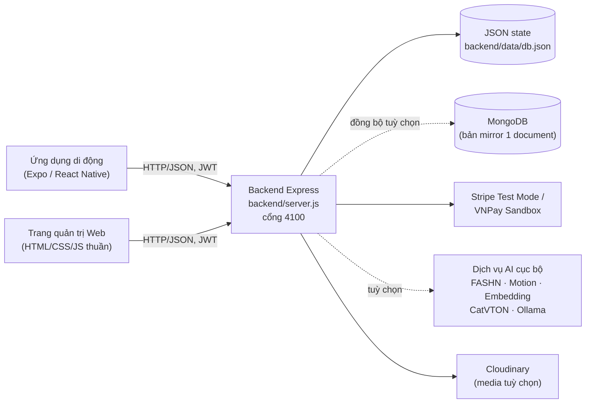
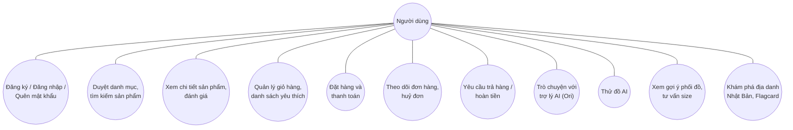
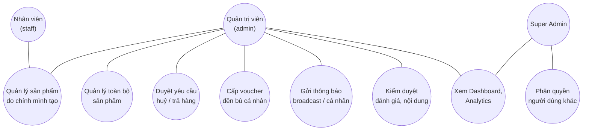

# CHƯƠNG 3: PHÂN TÍCH

## 3.1. Mô hình triển khai hệ thống

Hệ thống JAPANO Store được tổ chức dưới dạng một monorepo sử dụng cơ chế npm workspaces, khai báo tại `package.json:5-8` với hai workspace là `backend` và `mobile`. Ba ứng dụng — ứng dụng di động, trang quản trị web và máy chủ backend — cùng chia sẻ một tiến trình backend duy nhất, chạy trên một cổng mạng duy nhất (mặc định là cổng 4100, khai báo tại `backend/server.js:48`: `const PORT = Number(process.env.PORT || 4100)`).

Về bản chất, đây là kiến trúc client–server tập trung: phía client gồm ứng dụng di động Expo/React Native (`mobile/`) và trang quản trị web thuần HTML/CSS/JavaScript không qua bước biên dịch (`admin/`); phía server là một tiến trình Node.js/Express duy nhất (`backend/server.js`) đảm nhiệm ba vai trò cùng lúc: cung cấp REST API dưới đường dẫn `/api/*`, phục vụ tệp tĩnh của trang quản trị dưới đường dẫn `/admin`, và phục vụ tài nguyên media (ảnh sản phẩm) dưới đường dẫn `/assets/*`. Dữ liệu nghiệp vụ chính được lưu trong một tệp JSON duy nhất tại `backend/data/db.json`, có thể đồng bộ tuỳ chọn sang MongoDB dưới dạng một bản sao (mirror) toàn trạng thái; các dịch vụ trí tuệ nhân tạo (thử đồ ảo, tạo video chuyển động, embedding ngữ nghĩa) được triển khai như các tiến trình Python độc lập, giao tiếp với backend qua giao thức HTTP cục bộ.

### Sơ đồ kiến trúc triển khai



*Hình 3.1: Sơ đồ kiến trúc triển khai hệ thống JAPANO Store (nguồn: tổng hợp từ `backend/server.js`, `backend/lib/store.js`, `backend/lib/serviceUrls.js`; đối chiếu và xác nhận khớp với sơ đồ tương tự tại `README.md:64-77`).*

Bảng 3.1 trình bày vai trò cụ thể của từng thành phần trong sơ đồ trên, kèm vị trí mã nguồn tương ứng để có thể tra cứu, kiểm chứng trực tiếp.

**Bảng 3.1: Thành phần triển khai hệ thống**

| Thành phần | Công nghệ | Vai trò | Vị trí mã nguồn |
|---|---|---|---|
| Ứng dụng di động | Expo `~51.0.28`, React Native `0.74.5`, Expo Router `~3.5.23` | Giao diện mua sắm, giỏ hàng, thanh toán, trợ lý AI, thử đồ ảo | `mobile/app/`, `mobile/lib/` |
| Trang quản trị Web | HTML/CSS/JavaScript thuần, không build step | Quản lý sản phẩm, đơn hàng, người dùng, phân quyền, kiểm duyệt nội dung | `admin/index.html`, `admin/js/` |
| Backend Express | Node.js, Express `^4.19.2` | Xử lý API REST, xác thực JWT, điều phối thanh toán/AI, phục vụ tệp tĩnh của Admin | `backend/server.js` |
| Kho dữ liệu JSON | Tệp JSON, ghi nguyên tử (atomic write) | Nguồn dữ liệu chính (source of truth) của toàn hệ thống | `backend/lib/store.js`, `backend/data/db.json` |
| MongoDB (tuỳ chọn) | Driver `mongodb ^7.5.0` (không dùng Mongoose) | Bản sao lưu một-document của toàn trạng thái, phục vụ nhiều máy/nhiều lần triển khai cùng thấy một nguồn dữ liệu | `backend/lib/mongo.js`, `backend/lib/store.js:16-39` |
| Cloudinary (tuỳ chọn) | Cloudinary SDK `^2.10.0` | Lưu trữ media do người dùng tải lên (ảnh minh chứng trả hàng, video/âm thanh đánh giá) | `backend/lib/cloudinaryMedia.js` |
| Stripe Test Mode | Stripe SDK `^22.3.2` | Thanh toán thẻ, hoàn tiền, chỉ chấp nhận khoá `sk_test_`/`pk_test_` | `backend/routes/paymentsStripe.js`, `backend/lib/stripeClient.js` |
| VNPay Sandbox | Chữ ký HMAC-SHA512 tự triển khai | Thanh toán qua ngân hàng nội địa/QR, môi trường thử nghiệm | `backend/routes/paymentsVnpay.js`, `backend/lib/vnpaySign.js` |
| Dịch vụ AI cục bộ (tuỳ chọn) | FastAPI (Python), Ollama | Thử đồ ảo, tạo video chuyển động, embedding ngữ nghĩa, trò chuyện/thị giác AI | `backend/fashn_service.py`, `backend/motion_service.py`, `backend/embedding_service.py`, `backend/catvton_service.py` |

*Nguồn: tổng hợp và xác minh từ `thesis/evidence/architecture.md`, `thesis/evidence/technology-stack.md`, `thesis/evidence/database-analysis.md`.*

### Chuỗi middleware xử lý yêu cầu (request pipeline)

Toàn bộ yêu cầu gửi tới backend đều đi qua một chuỗi middleware Express được đăng ký tuần tự tại `backend/server.js:186-275`, theo đúng thứ tự sau:

1. `cors()` (dòng 187) — cho phép gọi API từ nhiều nguồn gốc (origin) khác nhau, không giới hạn danh sách domain cụ thể.
2. `helmet({contentSecurityPolicy:false})` (dòng 190) — bật các tiêu đề bảo mật HTTP mặc định của Helmet, riêng Content Security Policy bị tắt có chủ đích; mã nguồn có chú thích trực tiếp giải thích lý do (dòng 188-189): trang quản trị là JavaScript thuần chưa qua kiểm toán toàn bộ các đoạn `innerHTML` động.
3. `pinoHttp(...)` (dòng 191) — ghi log có cấu trúc cho mỗi yêu cầu, loại trừ endpoint `/api/health` để giảm nhiễu log.
4. Endpoint webhook của Stripe, `POST /api/stripe/webhook` (dòng 199-227), được đăng ký trực tiếp trên đối tượng `app` (không qua router `/api`) với `express.raw()` để giữ nguyên phần thân yêu cầu dạng byte thô, phục vụ việc xác minh chữ ký Stripe — đây là endpoint duy nhất được đăng ký trước bước phân tích JSON.
5. `express.json({limit:'120mb'})` (dòng 228) — phân tích phần thân yêu cầu dạng JSON, với giới hạn dung lượng lớn bất thường vì nhiều endpoint (ảnh/video đánh giá, ảnh minh chứng trả hàng, logo cửa hàng) truyền dữ liệu media dưới dạng chuỗi base64 nhúng trong JSON thay vì multipart form-data.
6. Định tuyến `/api` được tạo bằng `express.Router()` (dòng 233); một bộ giới hạn tần suất (`rate limit`) nghiêm ngặt hơn được áp riêng cho nhóm đường dẫn `/api/auth/*` (dòng 236-243) nhằm chống tấn công dò mật khẩu (brute-force).
7. Cả 17 tệp trong `backend/routes/` được nạp và gắn vào router `/api` (dòng 247-263).
8. Một bộ giới hạn tần suất tổng quát bao trùm toàn bộ router `/api` (dòng 265).
9. Tệp tĩnh của ứng dụng di động/quản trị (`/assets`, `/admin`) được phục vụ (dòng 270-275); riêng đường dẫn gốc `/` được chuyển hướng (redirect) sang `/admin/` (dòng 280) — đây là điểm được sửa lỗi trong một phiên làm việc trước: trước đó `/` từng phục vụ trực tiếp tệp `index.html`, khiến các đường dẫn tương đối trong tệp này (`styles.css`, `js/core.js`) bị trình duyệt diễn giải sai thành `/styles.css`, `/js/core.js` (lỗi 404) vì không nằm dưới `/admin`.

### Cơ chế tiêm phụ thuộc (dependency injection) giữa các module route

Một đặc điểm kiến trúc quan trọng của backend là toàn bộ 17 tệp dưới `backend/routes/` đều tuân theo cùng một khuôn mẫu:

```js
module.exports = function registerXRoutes(api, ctx) { /* api.get/post/... */ };
```

Cả 17 tệp cùng nhận **một đối tượng `ctx` duy nhất**, được khởi tạo một lần tại `backend/server.js:157-178`, gộp chung các hàm `read/write/update` của kho dữ liệu, các middleware xác thực (`requireAuth`, `optionalAuth`, `requireAdmin`, `requireSuperAdmin`, `requireStaff`), các hàm hỗ trợ Cloudinary/MongoDB/Stripe/VNPay, các hàm nghiệp vụ VIP/Flagcard, bộ dựng dữ liệu phân tích (analytics), và các hàm gửi thông báo đẩy. Nhờ khuôn mẫu này, không một tệp route nào thao tác trực tiếp với hệ thống tệp, MongoDB, Stripe hay Cloudinary — mọi thao tác đều đi qua `ctx`, giúp tách biệt logic nghiệp vụ khỏi chi tiết triển khai hạ tầng.

Việc tái sử dụng mã nguồn giữa các route cũng theo cùng nguyên tắc: `backend/routes/payments.js` và `backend/routes/returns.js` đều `require('./paymentsStripe')`/`require('./paymentsVnpay')` trực tiếp để dùng lại `makeStripeHelpers`/`makeVnpayHelpers`; hai tệp này lại `require('./orders')` để dùng chung `makeCreateOrderInState`. Kết quả là việc tạo đơn hàng — dù thanh toán bằng COD, Stripe hay VNPay — đều đi qua đúng một hàm xử lý duy nhất, không tồn tại ba luồng logic tính giá độc lập cho ba phương thức thanh toán.

### Điều phối các dịch vụ trí tuệ nhân tạo

Backend không chạy mô hình AI trong cùng tiến trình mà điều phối một tập hợp dịch vụ cục bộ độc lập qua giao thức HTTP, cùng hai tiến trình con (subprocess) Python được gọi trực tiếp. Bốn dịch vụ FastAPI độc lập, mỗi dịch vụ lắng nghe trên một cổng riêng, được liệt kê tại Bảng 3.1 phía trên; địa chỉ cơ sở (base URL) của từng dịch vụ được tập trung khai báo tại `backend/lib/serviceUrls.js`, có thể ghi đè qua biến môi trường. Toàn bộ các điểm tích hợp AI đều có đường dẫn dự phòng (fallback) để luồng thương mại điện tử lõi (duyệt sản phẩm, giỏ hàng, đặt hàng, thanh toán) không phụ thuộc vào việc có GPU hay có dịch vụ AI khả dụng hay không — điều này được xác nhận trực tiếp trong `README.md:60`: *"Core backend, Admin, recommendation và bot fallback chạy được không cần GPU."*

## 3.2. Sơ đồ Use Case

Nội dung use case trình bày dưới đây được xây dựng trực tiếp từ danh mục tính năng đã kiểm chứng có endpoint backend tương ứng (xem `thesis/evidence/feature-inventory.md`), không bao gồm bất kỳ chức năng nào không có bằng chứng mã nguồn — cụ thể, không có use case liên quan đến trò chơi giải trí hay hệ thống điểm/xu, vì các chức năng này không tồn tại trong mã nguồn (đã xác minh bằng tìm kiếm toàn bộ repo, không có kết quả trùng khớp).

### 3.2.1. Sơ đồ Use Case — Người dùng (khách hàng)



*Hình 3.2: Sơ đồ Use Case của người dùng (khách hàng) JAPANO Store (nguồn: đối chiếu `thesis/evidence/feature-inventory.md` mục 1–5).*

**Ghi chú phương pháp:** sơ đồ trên được thể hiện bằng cú pháp Mermaid nhằm bảo đảm có thể tái tạo chính xác và kiểm chứng lại từ văn bản; đây là dạng thể hiện đơn giản hoá của sơ đồ Use Case UML chuẩn. Trước khi đưa vào bản in chính thức, nhóm nên vẽ lại bằng công cụ UML chuyên dụng (draw.io, PlantUML, v.v.) để có ký hiệu tác nhân (hình que) và ranh giới hệ thống (system boundary) đúng chuẩn UML — nội dung (danh sách use case, mối liên hệ) đã được kiểm chứng đúng theo mã nguồn nên có thể giữ nguyên khi chuyển đổi hình thức thể hiện.

### 3.2.2. Sơ đồ Use Case — Quản trị viên

Cần lưu ý: hệ thống có bốn cấp vai trò (`customer < staff < admin < super_admin`, khai báo tại `backend/lib/auth.js:88-91`), trong đó ba cấp `staff`, `admin`, `super_admin` đều có quyền truy cập trang quản trị nhưng với phạm vi khác nhau. Sơ đồ dưới đây trình bày use case theo tác nhân tổng quát "Quản trị viên"; phạm vi cụ thể theo từng cấp vai trò được làm rõ trong đặc tả use case UC09 ở mục 3.3.



*Hình 3.3: Sơ đồ Use Case của quản trị viên JAPANO Store, phân theo cấp vai trò (nguồn: `thesis/evidence/feature-inventory.md` mục 6; `thesis/evidence/security-analysis.md` mục 1–2).*

## 3.3. Đặc tả Use Case

Bảng 3.2 liệt kê các use case chính được lựa chọn để đặc tả chi tiết — là những use case tiêu biểu cho cả hai nhóm tác nhân và bao phủ các nghiệp vụ phức tạp nhất của hệ thống (đa phương thức thanh toán, quy trình hậu mãi có phê duyệt, phân quyền nhiều cấp).

**Bảng 3.2: Danh sách Use Case được đặc tả chi tiết**

| Mã | Tên Use Case | Tác nhân | Mô tả ngắn |
|---|---|---|---|
| UC01 | Đăng ký tài khoản | Khách | Tạo tài khoản mới với kiểm tra độ mạnh mật khẩu |
| UC02 | Đăng nhập / Quên mật khẩu | Khách, Quản trị viên | Xác thực bằng JWT; khôi phục mật khẩu bằng mã 6 số |
| UC03 | Tìm kiếm và xem sản phẩm | Khách | Tìm kiếm mờ (fuzzy search), xem chi tiết sản phẩm |
| UC04 | Giỏ hàng và đặt hàng | Khách | Thêm giỏ hàng, chọn địa chỉ, chọn phương thức thanh toán |
| UC05 | Thanh toán đa phương thức | Khách | COD, Stripe Test Mode (thẻ), VNPay Sandbox |
| UC06 | Huỷ đơn hàng | Khách | Huỷ đơn trước khi giao, có hoàn tiền tự động nếu đã thanh toán trực tuyến |
| UC07 | Yêu cầu trả hàng / hoàn tiền | Khách | Trả hàng sau khi giao, bắt buộc ảnh minh chứng, chờ duyệt |
| UC08 | Trò chuyện với trợ lý AI | Khách | Chat có định hướng theo danh mục sản phẩm thật (catalog-grounded) |
| UC09 | Quản lý sản phẩm theo phân quyền | Nhân viên, Quản trị viên | Phạm vi chỉnh sửa khác nhau theo cấp vai trò |
| UC10 | Duyệt yêu cầu huỷ/trả hàng | Quản trị viên | Phê duyệt hoặc từ chối, kèm hoàn tiền qua đúng cổng thanh toán |
| UC11 | Phân quyền người dùng | Super Admin | Thay đổi vai trò tài khoản khác, có ràng buộc chống tự hạ quyền |

*Nguồn: `thesis/evidence/api-inventory.md`, `thesis/evidence/security-analysis.md`.*

---

**UC01 — Đăng ký tài khoản**

- **Tác nhân:** Khách (chưa có tài khoản).
- **Tiền điều kiện:** người dùng chưa đăng nhập; đang ở màn hình Đăng ký (`mobile/app/register.tsx`).
- **Dòng sự kiện chính:**
  1. Người dùng nhập họ tên, email, số điện thoại và mật khẩu.
  2. Giao diện tính điểm độ mạnh mật khẩu theo thời gian thực và hiển thị thanh trạng thái (`mobile/lib/passwordStrength.ts`), chặn gửi đi nếu mật khẩu bị đánh giá "yếu" hoặc ngắn hơn 8 ký tự.
  3. Yêu cầu được gửi tới `POST /api/auth/register` (`backend/routes/auth.js:31`).
  4. Backend kiểm tra định dạng email, độ mạnh mật khẩu (hàm dùng chung `passwordStrength()` tại `backend/lib/auth.js:27-40`, đối chiếu với danh sách mật khẩu phổ biến bị chặn), kiểm tra email chưa tồn tại.
  5. Mật khẩu được băm bằng bcrypt (hệ số 10, `backend/lib/auth.js:20-22`), tài khoản mới được tạo với vai trò `customer`.
  6. Hệ thống trả về mã JWT có hạn dùng mặc định 30 ngày; ứng dụng lưu mã này vào `expo-secure-store` và tự động đăng nhập.
- **Ngoại lệ:**
  - Email đã tồn tại → phản hồi lỗi `409`, không tạo tài khoản trùng.
  - Mật khẩu không đạt yêu cầu độ mạnh → phản hồi lỗi `400` với thông báo cụ thể, thực hiện kiểm tra ở cả hai phía (client và server) — phía server luôn là nguồn xác thực cuối cùng.

---

**UC02 — Đăng nhập / Quên mật khẩu**

- **Tác nhân:** Khách hoặc quản trị viên (dùng chung một cơ chế xác thực).
- **Tiền điều kiện:** đã có tài khoản.
- **Dòng sự kiện chính (đăng nhập):**
  1. Người dùng nhập email/mật khẩu (`mobile/app/login.tsx` hoặc `admin/index.html`'s cổng đăng nhập).
  2. Yêu cầu gửi tới `POST /api/auth/login` (`backend/routes/auth.js:61`).
  3. Backend so khớp mật khẩu bằng `bcrypt.compareSync`; nếu sai email **hoặc** sai mật khẩu, hệ thống trả về cùng một thông báo lỗi chung chung — có chủ đích để tránh lộ thông tin email nào đã đăng ký (chống dò quét tài khoản).
  4. Nếu tài khoản có trạng thái khác `active` (bị khoá), trả về lỗi `403`.
  5. Đăng nhập thành công trả về JWT chứa `{sub, role, email}`.
- **Dòng sự kiện chính (quên mật khẩu):**
  1. Người dùng nhập email tại `mobile/app/forgot-password.tsx`, gọi `POST /api/auth/forgot-password` (`backend/routes/auth.js:84`).
  2. Hệ thống luôn trả về cùng một thông báo thành công chung chung dù email có tồn tại hay không (chống dò quét).
  3. Nếu email tồn tại, hệ thống sinh mã ngẫu nhiên 6 chữ số, chỉ lưu bản băm SHA-256 của mã (không lưu mã gốc), hạn dùng 30 phút, và gửi email qua `backend/lib/mailer.js`.
  4. Người dùng nhập mã và mật khẩu mới, gọi `POST /api/auth/reset-password` (`backend/routes/auth.js:112`); hệ thống kiểm tra mã, hạn dùng, độ mạnh mật khẩu mới rồi cập nhật băm mật khẩu.
- **Ngoại lệ:**
  - Mã đã hết hạn hoặc sai → lỗi `400`, không đổi mật khẩu.
  - Trong môi trường phát triển hiện tại (không cấu hình SMTP thật), email được gửi qua hộp thư giả lập Ethereal; giao diện hiển thị đường dẫn xem trước email thay vì gửi tới hộp thư thật — đây là hành vi có chủ đích của môi trường thử nghiệm, không phải lỗi.

---

**UC03 — Tìm kiếm và xem sản phẩm**

- **Tác nhân:** Khách (không bắt buộc đăng nhập).
- **Tiền điều kiện:** ứng dụng đã tải xong danh mục sản phẩm.
- **Dòng sự kiện chính:**
  1. Người dùng vào tab "Sản phẩm" (`mobile/app/(tabs)/products.tsx`), nhập từ khoá hoặc chọn danh mục.
  2. Tìm kiếm sử dụng thuật toán so khớp mờ tự triển khai dựa trên khoảng cách Levenshtein (định nghĩa ngay trong tệp màn hình, không gọi dịch vụ tìm kiếm bên ngoài), cho phép tìm đúng sản phẩm dù gõ sai chính tả.
  3. Mỗi lượt tìm kiếm được ghi log qua `POST /api/search-log` (`backend/routes/customerData.js:49`) để phục vụ báo cáo "search intelligence" phía quản trị, kể cả khi không có kết quả.
  4. Người dùng chọn một sản phẩm để xem chi tiết (`mobile/app/product/[slug].tsx`): ảnh/video, mô tả do AI tạo (`GET /api/products/:slug/ai-description`), gợi ý phối đồ (`GET /api/outfits/:slug`), sản phẩm liên quan (`GET /api/products/:slug/related`), đánh giá đã xác thực mua hàng (`GET /api/products/:slug/reviews`).
- **Ngoại lệ:** không tìm thấy sản phẩm khớp từ khoá → hiển thị danh sách rỗng, log vẫn được ghi nhận với số kết quả bằng 0 để phục vụ phân tích "từ khoá không ra kết quả".

---

**UC04 — Giỏ hàng và đặt hàng**

- **Tác nhân:** Khách (bắt buộc đăng nhập).
- **Tiền điều kiện:** đã đăng nhập; theo cơ chế `AuthGate` (`mobile/app/_layout.tsx:31-45`), thao tác thêm giỏ hàng sẽ tự động điều hướng sang màn hình đăng nhập nếu chưa có phiên, và quay lại đúng màn hình sản phẩm sau khi đăng nhập thành công.
- **Dòng sự kiện chính:**
  1. Người dùng thêm sản phẩm vào giỏ; trạng thái giỏ hàng được đồng bộ nền lên server qua `POST /api/carts/sync` (`backend/routes/customerData.js:70`).
  2. Tại màn hình giỏ hàng (`mobile/app/cart.tsx`), người dùng có thể áp mã giảm giá (`POST /api/vouchers/validate`).
  3. Chuyển sang Checkout (`mobile/app/checkout.tsx`): nhập/chọn địa chỉ giao hàng (có gợi ý tỉnh/thành, phường/xã), chọn phương thức thanh toán.
- **Ngoại lệ:** giỏ hàng rỗng → chặn chuyển sang bước thanh toán ngay từ phía giao diện.

---

**UC05 — Thanh toán đa phương thức**

- **Tác nhân:** Khách.
- **Tiền điều kiện:** đã hoàn tất thông tin địa chỉ ở bước Checkout.
- **Dòng sự kiện chính:**
  1. **COD:** gọi trực tiếp `POST /api/orders` (`backend/routes/orders.js:225`); đơn được tạo với trạng thái `pending`, không có bước xác nhận thanh toán trung gian.
  2. **Stripe (thẻ):** gọi `POST /api/stripe/payment-intent` (`backend/routes/paymentsStripe.js:397`) để tạo `PaymentIntent`; nếu người dùng đã lưu thẻ trước đó, có thể chọn thẻ đã lưu (`GET /api/stripe/cards`) thay vì nhập lại; xác nhận thanh toán ngay trong ứng dụng qua SDK `@stripe/stripe-react-native`; kết quả được đồng bộ qua `POST /api/stripe/payment-intent/confirm`.
  3. **VNPay:** gọi `POST /api/vnpay/payment-url` (`backend/routes/paymentsVnpay.js:218`) để lấy đường dẫn thanh toán Sandbox, mở trong một `WebView` nhúng; ứng dụng bắt sự kiện điều hướng tới URL trả về để xác nhận kết quả (`POST /api/vnpay/return`), có xác minh chữ ký HMAC-SHA512 bằng so sánh an toàn theo thời gian (`crypto.timingSafeEqual`, `backend/lib/vnpaySign.js:100-102`).
  4. Trong cả ba trường hợp, **tổng tiền thanh toán luôn được tính lại phía server** từ dữ liệu sản phẩm thật (`backend/routes/orders.js:103-216`), không tin tưởng giá trị do client gửi lên — giá trị này mới là số tiền thực sự được yêu cầu thanh toán qua Stripe/VNPay.
- **Ngoại lệ:**
  - Thanh toán Stripe/VNPay thất bại hoặc bị huỷ giữa chừng → đơn hàng giữ trạng thái chờ thanh toán, không tự xoá giỏ hàng, cho phép người dùng thử lại.
  - Cả hai cổng thanh toán đều bị khoá cứng ở chế độ thử nghiệm: Stripe chỉ hoạt động khi khoá bắt đầu bằng `sk_test_`/`pk_test_` (`backend/lib/stripeClient.js:14`); VNPay trỏ mặc định tới máy chủ sandbox.

---

**UC06 — Huỷ đơn hàng**

- **Tác nhân:** Khách.
- **Tiền điều kiện:** đơn hàng đang ở trạng thái `pending`, `pending_payment` hoặc `confirmed` (chưa bàn giao vận chuyển).
- **Dòng sự kiện chính:**
  1. Tại màn hình chi tiết đơn hàng (`mobile/app/order/[id].tsx`), người dùng chọn "Huỷ đơn", nhập lý do bắt buộc.
  2. Yêu cầu gửi tới `POST /api/orders/:id/cancel-request` (`backend/routes/returns.js:86`); hệ thống kiểm tra đơn thuộc đúng chủ sở hữu (đối chiếu `userId` từ JWT, không tin giá trị từ client) và đang ở trạng thái cho phép huỷ.
  3. Yêu cầu huỷ được đưa vào hàng chờ duyệt của quản trị viên (xem UC10) — **không huỷ ngay lập tức**.
  4. Nếu quản trị viên phê duyệt và đơn hàng **đã thanh toán trực tuyến** (Stripe/VNPay), hệ thống tự động gọi API hoàn tiền của đúng cổng thanh toán đó (`backend/routes/returns.js:204`, nhánh kiểm tra `needsGatewayRefund`). Nếu đơn hàng thanh toán COD, không có bước hoàn tiền vì chưa từng thu tiền trước khi giao hàng — đây là điểm phân biệt nghiệp vụ quan trọng giữa hai loại đơn.
- **Ngoại lệ:** đơn đã ở trạng thái "đang giao" hoặc "đã giao" → không hiển thị lựa chọn huỷ đơn (chỉ còn lựa chọn UC07 — trả hàng); đã có một yêu cầu huỷ/trả khác đang chờ xử lý cho cùng đơn hàng → chặn tạo yêu cầu trùng (`409`).

---

**UC07 — Yêu cầu trả hàng / hoàn tiền**

- **Tác nhân:** Khách.
- **Tiền điều kiện:** đơn hàng ở trạng thái `completed` (đã giao thành công), trong vòng 30 ngày kể từ thời điểm hoàn tất.
- **Dòng sự kiện chính:**
  1. Người dùng chọn "Trả hàng", chọn lý do, nhập ghi chú, và **bắt buộc đính kèm tối thiểu một ảnh chụp thực tế sản phẩm/hàng hoá** (tối đa 6 ảnh).
  2. Yêu cầu gửi tới `POST /api/orders/:id/returns` (`backend/routes/returns.js:139`); ảnh được tải lên Cloudinary qua `uploadReturnPhotos` (`backend/lib/cloudinaryMedia.js`).
  3. Yêu cầu vào hàng chờ duyệt; nếu được phê duyệt, khách gửi hàng vật lý về cửa hàng; quản trị viên xác nhận đã nhận hàng (`action: 'receive'`); sau đó quản trị viên thực hiện hoàn tiền (`action: 'refund'`).
  4. Nếu đơn thanh toán COD, hoàn tiền được đánh dấu là **hoàn tiền thủ công** (`codManualRefund: true`) vì không có giao dịch cổng thanh toán nào để gọi API hoàn tự động; nếu đơn thanh toán Stripe/VNPay, hệ thống gọi API hoàn tiền thật của cổng tương ứng.
  5. Nếu yêu cầu bị từ chối, hàng không được hoàn tiền và được gửi trả lại khách — đúng theo mô hình nghiệp vụ ban đầu đề ra (đối chiếu, duyệt trước khi hoàn tiền, giống cơ chế của các sàn thương mại điện tử phổ biến).
- **Ngoại lệ:**
  - Không đính kèm ảnh → từ chối ngay từ phía server với lỗi `400`, không tạo được yêu cầu.
  - Quá 30 ngày kể từ khi giao hàng → từ chối yêu cầu.
  - Đơn chưa ở trạng thái `completed` → không cho phép tạo yêu cầu trả hàng (chỉ có thể dùng UC06 nếu còn ở giai đoạn trước giao hàng).

---

**UC08 — Trò chuyện với trợ lý AI**

- **Tác nhân:** Khách (bắt buộc đăng nhập).
- **Tiền điều kiện:** đã đăng nhập.
- **Dòng sự kiện chính:**
  1. Người dùng mở màn hình trò chuyện đầy đủ (`mobile/app/chat.tsx`) hoặc bong bóng chat nổi toàn ứng dụng (`mobile/lib/botchat.tsx`), gõ câu hỏi.
  2. Yêu cầu gửi tới `POST /api/stylist/chat` (`backend/routes/stylist.js:262`); phản hồi được xây dựng theo hướng "catalog-grounded" — hệ thống truy hồi sản phẩm/giá/voucher/đơn hàng thật từ trạng thái hệ thống trước khi tạo câu trả lời, có thể tuỳ chọn dùng mô hình Ollama để viết lại câu trả lời cho tự nhiên hơn (mặc định tắt, chỉ bật khi cấu hình `JAPANO_OLLAMA_CHAT=1`).
  3. Câu trả lời có thể kèm thẻ sản phẩm liên quan, cho phép người dùng thêm giỏ hàng/yêu thích ngay trong khung chat.
- **Ngoại lệ:** dịch vụ Ollama không khả dụng hoặc quá thời gian chờ → hệ thống vẫn trả lời bằng logic cục bộ dựa trên quy tắc/truy hồi (không có mô hình ngôn ngữ lớn), không làm gián đoạn trải nghiệm.

---

**UC09 — Quản lý sản phẩm theo phân quyền**

- **Tác nhân:** Nhân viên (`staff`) hoặc Quản trị viên (`admin`/`super_admin`).
- **Tiền điều kiện:** đã đăng nhập vào trang quản trị với vai trò tối thiểu là `staff`.
- **Dòng sự kiện chính:**
  1. Tài khoản đăng nhập trang quản trị; middleware `requireStaff` (`backend/lib/auth.js:109-114`) cho phép cả ba cấp `staff`, `admin`, `super_admin` vào được giao diện quản trị sản phẩm, nhưng **phạm vi dữ liệu khác nhau theo vai trò**.
  2. Nếu vai trò là `staff`: gọi `GET /api/staff/products` (`backend/routes/catalog.js:103`) — chỉ trả về sản phẩm do chính tài khoản đó tạo (`ownerId` trùng khớp); khi chỉnh sửa qua `PUT /api/products/:id` (`backend/routes/catalog.js:111`), hệ thống kiểm tra `ownerId` của sản phẩm khớp với tài khoản đang thao tác, từ chối nếu không khớp.
  3. Nếu vai trò là `admin` trở lên: nhìn thấy và chỉnh sửa toàn bộ sản phẩm; riêng thao tác xoá vĩnh viễn (`DELETE /api/products/:id`) chỉ dành cho `admin` trở lên, `staff` không có quyền này dù có quyền chỉnh sửa (chỉ có thể ẩn sản phẩm bằng cách đổi trạng thái).
  4. Khi xuất bản sản phẩm (chuyển trạng thái sang "đang bán"), hệ thống yêu cầu tối thiểu 2 ảnh sản phẩm.
- **Ngoại lệ:** `staff` cố chỉnh sửa sản phẩm không thuộc quyền sở hữu → phản hồi lỗi `403`; `staff` cố gọi API xoá sản phẩm → phản hồi lỗi `403` (middleware `requireAdmin` chặn trước khi vào tới logic xử lý).

---

**UC10 — Duyệt yêu cầu huỷ/trả hàng**

- **Tác nhân:** Quản trị viên (`admin` trở lên).
- **Tiền điều kiện:** có ít nhất một yêu cầu huỷ đơn (UC06) hoặc trả hàng (UC07) đang ở trạng thái chờ duyệt.
- **Dòng sự kiện chính:**
  1. Quản trị viên xem danh sách yêu cầu tại trang quản trị (mục "Trả hàng & hoàn tiền").
  2. Gọi `POST /api/returns/:id/action` (`backend/routes/returns.js:204`) với một trong các hành động: `approve` (duyệt), `reject` (từ chối), `receive` (xác nhận đã nhận hàng trả về — chỉ áp dụng cho yêu cầu trả hàng), `refund` (hoàn tiền).
  3. Đối với yêu cầu **huỷ đơn** được duyệt: đơn hàng chuyển trạng thái `cancelled` ngay lập tức, không qua bước "nhận hàng" (vì hàng chưa từng được gửi đi); nếu đơn đã thanh toán trực tuyến, hệ thống tự động gọi hoàn tiền qua đúng cổng thanh toán trong cùng một thao tác duyệt.
  4. Đối với yêu cầu **trả hàng** được duyệt: đơn chờ khách gửi hàng về; sau khi quản trị viên xác nhận `receive`, mới có thể thực hiện `refund`.
  5. Mỗi hành động đều tạo một thông báo trong ứng dụng và gửi thông báo đẩy (push notification) tới đúng khách hàng liên quan, đính kèm liên kết điều hướng thẳng tới màn hình chi tiết đơn hàng khi khách chạm vào thông báo.
- **Ngoại lệ:** thực hiện hành động không đúng trình tự trạng thái (ví dụ gọi `refund` khi chưa `receive`) → hệ thống từ chối với thông báo lỗi mô tả trạng thái hiện tại; hoàn tiền qua cổng thanh toán thất bại (ví dụ do gián đoạn kết nối tới Stripe/VNPay) → yêu cầu được đánh dấu trạng thái `refund_failed` để quản trị viên biết và xử lý lại thay vì để hệ thống báo thành công sai sự thật.

---

**UC11 — Phân quyền người dùng**

- **Tác nhân:** Super Admin.
- **Tiền điều kiện:** đã đăng nhập với vai trò `super_admin` — đây là vai trò duy nhất có quyền này, `admin` thường không đủ quyền.
- **Dòng sự kiện chính:**
  1. Super Admin mở màn hình quản lý người dùng, chọn một tài khoản.
  2. Gọi `PATCH /api/admin/users/:id` (`backend/routes/admin.js:13`), được bảo vệ bởi middleware `requireSuperAdmin`.
  3. Có thể thay đổi vai trò (`customer`/`staff`/`admin`/`super_admin`), họ tên, email hoặc trạng thái tài khoản.
  4. Hệ thống kiểm tra ràng buộc: **không cho phép tự hạ quyền chính mình** (`backend/routes/admin.js:23-25`) — nếu tài khoản đang thao tác trùng với tài khoản đích và vai trò mới không phải `super_admin`, yêu cầu bị từ chối.
- **Ngoại lệ:** tài khoản thực hiện thao tác không phải `super_admin` (kể cả là `admin`) → bị chặn ngay từ middleware với lỗi `403`, không tới được logic xử lý; cố tự hạ quyền chính mình → lỗi `400` với thông báo rõ ràng.

---

*Ghi chú chung cho toàn bộ Chương 3: mọi hành vi hệ thống mô tả ở trên được đối chiếu trực tiếp với mã nguồn tại thời điểm phân tích (xem trích dẫn tệp:dòng kèm theo từng mục). Các nội dung không thể xác nhận trực tiếp từ mã nguồn (ví dụ: hình vẽ UML hoàn chỉnh, ảnh chụp màn hình minh hoạ) đã được ghi chú rõ trong `thesis/outline.md` và `thesis/evidence/missing-information.md`, không được suy diễn hay bổ sung tại đây.*
